# GAMES101-现代计算机图形学

# EP: Raster #

## 采样所带来的的问题：(Aliasing Artifacts)

1.锯齿 2.摩尔纹(手机拍显示器屏幕) 3.Wagon wheel effect - sampling in time
原因： Signals are changing too fast(high frequency), but sampled too slowly

## 反走样思路

1. Pre-Filter/Blur before sampling采样前先做一次模糊(滤波) FXAA

Convolve ==> Sampling

MSAA(Multi-Sample Anti-Aliasing)
核心在于通过过采样模糊光栅化三角形的像素，解决的主要是信号模糊的操作。

这是MSAA跟SSAA的最大区别！

### MileStones

1.FXAA (Fast Approximate AA)
图像的后期处理，先得到一个有锯齿的图，然后找到锯齿边界，再通过一种方式将锯齿边界替换为没有锯齿的边界(非常高效)

2.TAA (Temporal AA)
时序AA，找上一帧的信息，复用上一帧像素的值来进行AA（主要针对静态物体）

### Super resolution / super sampling

From low resolution to high resolution

Essentially still "not enough samples" problem

DLSS(Deep Learning Super Sampling)

## 频域(Frequency Domain)

### 滤波

傅里叶变换，

高通滤波--过滤低频信号，得到高频信号图像：代表着图片像素的边界 (边缘图像检测，sober算子)

低通滤波--过滤高频信号，留下低频信号图像： 图像会变得非常模糊 (高斯模糊)

Filtering = Convolution = (Averaging)
滤波 = 卷积 = 平均

### Convolution 卷积

卷积定理：时域的卷积等于频域的乘积

Box Filter(低通滤波，均值滤波)

### Sampling 采样 = Repeating Frequency Contents 重复频域内容

#EP: Shading着色#

画家算法

Z-Buffer解决画家算法无法解决的绘制顺序问题

## Shading_1

### 定义

The darkening or coloring of an illustration or diagram with parallel lines or a block of color. -- Merriam-Webster Dictionary

在图形学中:
The process of applying a material to an object.
对不同的物体应用不同的材质。

## Blinn-Phong Reflection Model

Specular , Diffuse, Ambient

### Diffuse Reflection

Light is scattered uniformly in all directions
入射光线被均匀地从所有方向反射出去

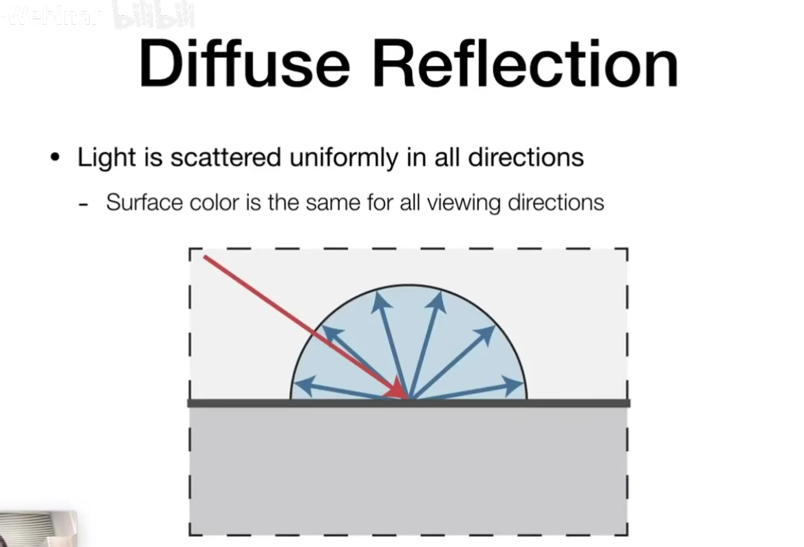

### Lambertian(Diffuse) Shading

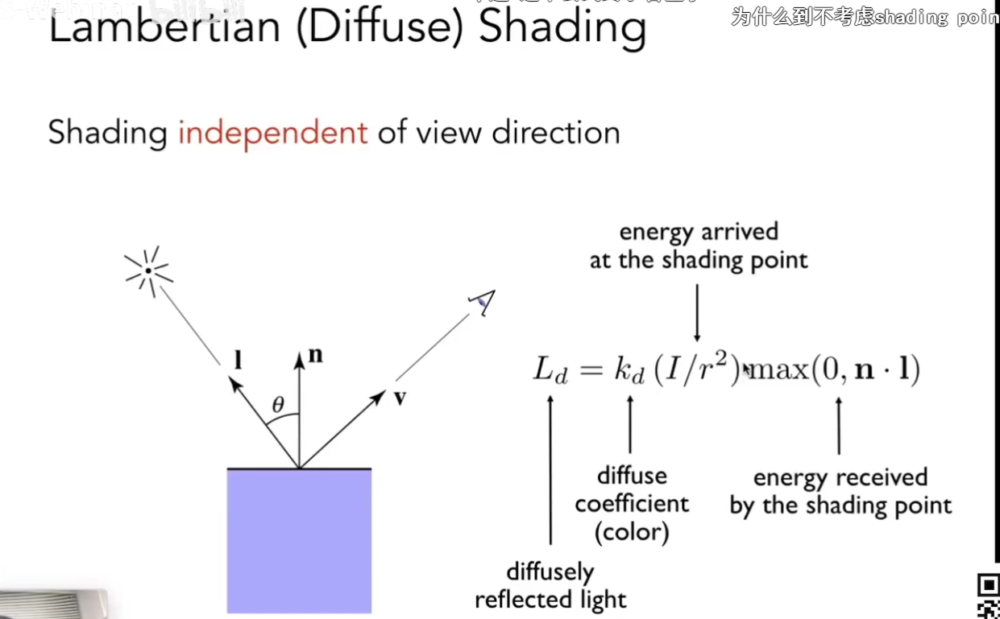

Ld = kd*(I/r^2)*max(0, n·l)

Shading independent of view direction.

## Shading_2

### Specular Term(Blinn-Phong)

Intensity depends on view direction.

### Ambient Term

Shading that does not depend on anything.

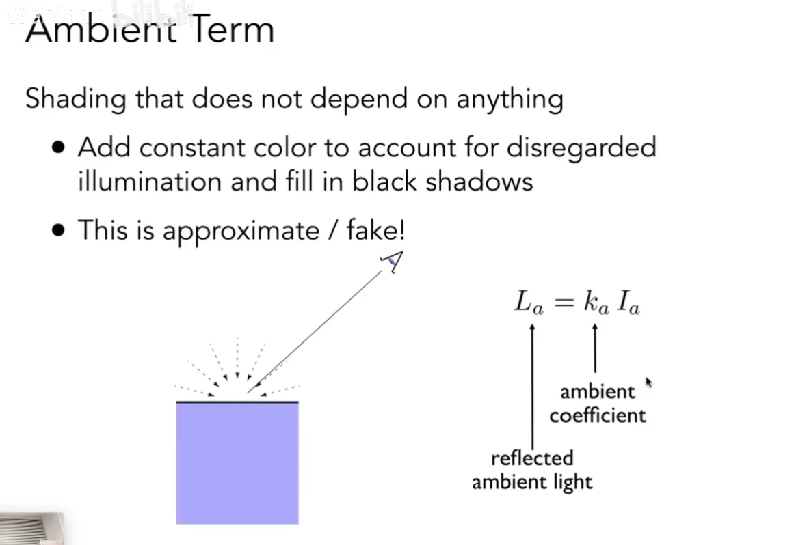

Ambient + Specular + Diffuse = Blinn_Phong Reflection

### Shading Frequencies着色频率

Flat shading 面/ Gouraud shading 顶点/ Phong shading像素

### Graphics(Real-time Rendering) Pipeline 实时渲染管线

### Texture Mapping纹理映射

### Interpolation Across Triangles: Barycentric coordinates 三角形内的插值：重心坐标

Interpolate Content: Texture coordinates, colors, normal vectors, ...

### Bilinear interpolation 双线性插值
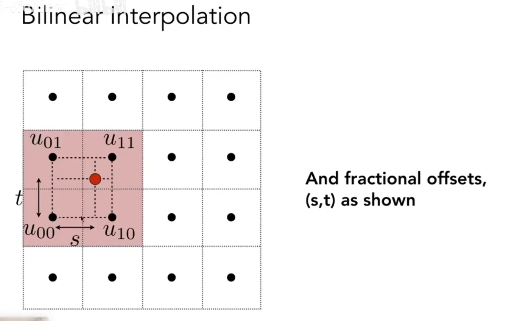

### Mipmap

Allowing(fast, approximate, square) range queries.(快，但是不准确，正方形范围查询)

级数求和，多了1/3的图片内存占用。

### Trilinear lerp
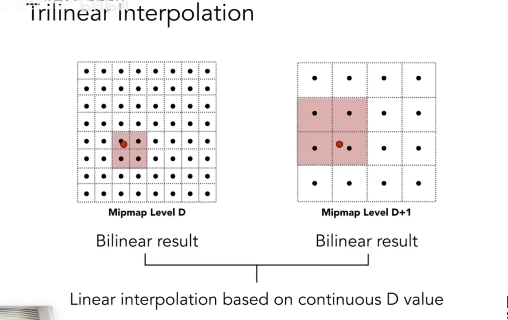

#### Mipmap的缺陷--Overblur
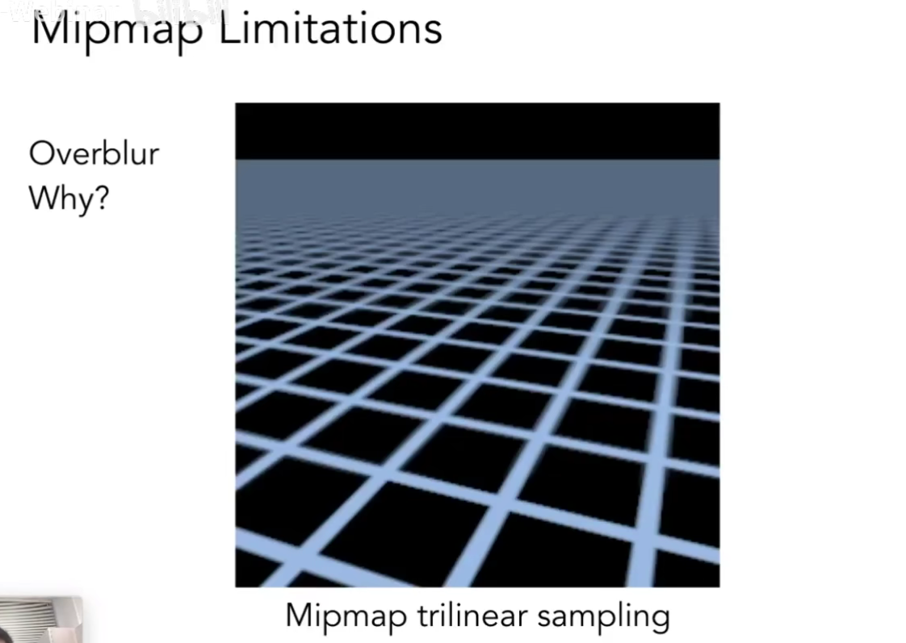

### Anisotroic Filtering 各向异性过滤

``
会多消耗3倍的存储空间

## Environment Map

Spherical Environment Map

将环境光记录在一个球体上，并且展开成一张环境贴图

### 3D Texture volumn rendering

### AO Texture

#EP: Geometry几何阶段#

## Implicit/ Explicit

## Distance Fuctions

giving minimum distance (coutld be signed distance) from anywhere to object.

## Point Cloud 点云

### Wavefront Object File(.obj)

## Bezier Curves 贝赛尔曲线

## Surfaces 

### Bezier Surface 贝塞尔曲面

### Catmull-Clark Subdivision

根据奇异点进行曲面细分

奇异点：度数不等于4的点

### Mesh Simplification

边坍缩 L2 Distance距离最小， 优先队列/最小堆

## Shadows

### Shadow mapping

2phase， 先从光源采深度图，再从相机视角采深度图，能被相机看到，但是光源看不到的地方就是shadow区域

shadow map分辨率会影响阴影质量，分辨率低，会导致阴影边缘锯齿，分辨率高会占用过多的内存和计算性能

### Soft shadow maps 软阴影(半阴影)

点光源不存在软阴影

#EP: Ray Tracing#

为什么要光追：光栅化没法很好的表现全局效果(soft shadows, glossy reflection, indirection illumination)

Ray tracing is accurate, but is very slow.

Rasterization: real-time, ray tracing: offline.

## Whitted-Style Ray Tracing

### Ray-Intersection with Box

Axis-Aligned Bounding Box(AABB)

光追加速--光线不跟包围盒有交点，则包围盒内的物体都无需处理光线交点。

## Uniform Spatial Partitions(Grids) 光线追踪加速结构 

### Spatial Partitions 

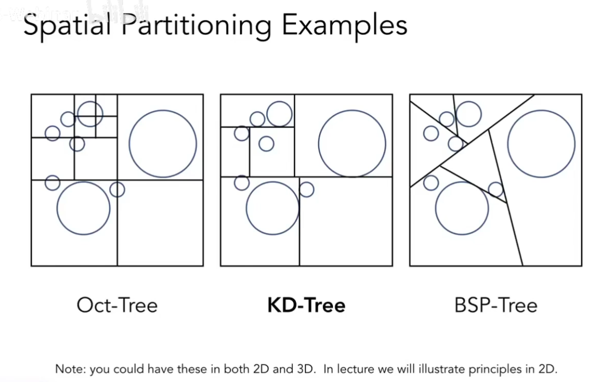

### Object Partitions & Bounding Volume Hierarchy(BVH)

不按照空间划分，而是按照物体划分，求包围盒。 

BVH的包围盒不是空间上的严格隔离，是可以相交的。
KD-Tree的包围盒在空间上是相互不相交的。

#### Building BVHs

1.根据空间较长的轴划分。
Always choose the longest axis in node.

2.取中间物体所在的位置进行划分
Split node at location of median object.

## Basic radiometry 辐射度量学

Radiant flux, intensity, irradiance, radiance.

Perform lighting calculations in a physically correct manner.

### Radiant energy and Flux(Power)

#### Measurement of lights

Radiant Intensity

Ω = A/r^2  立体角= 面积/半径的平方

Inensity: 光源在任意一个方向上的强度。

Irradiance

Radiance

### Bidirectional Reflectance Distribution Function(BRDF)

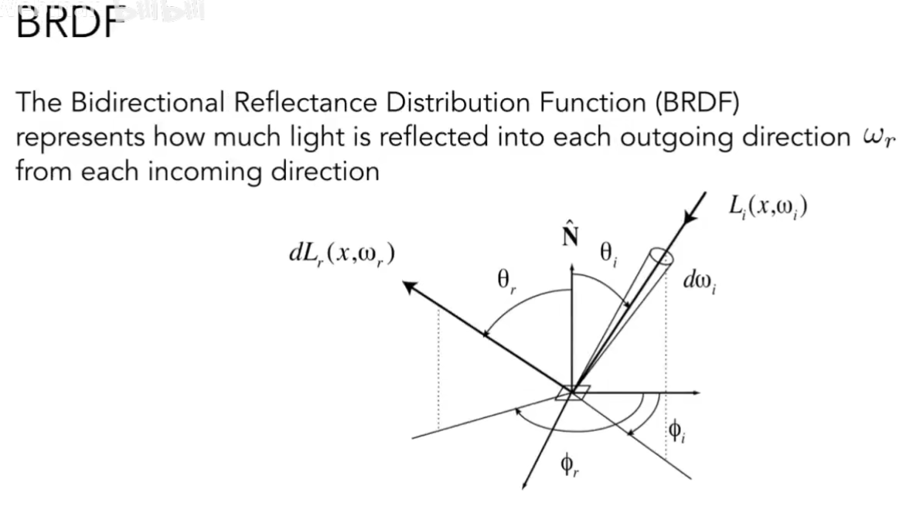

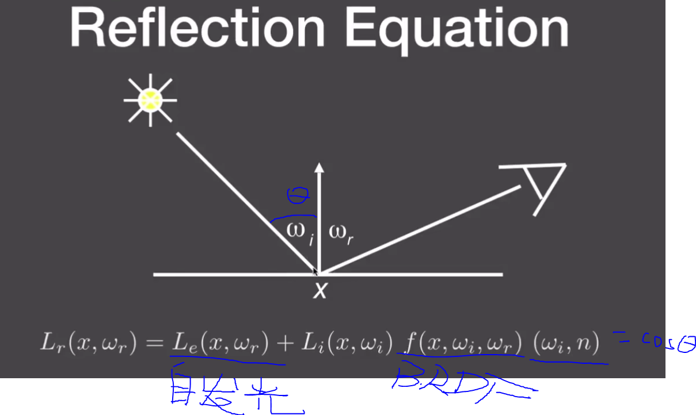

L = E + KL ==> L = (1-K)^-1 * E ==> L = E + KE + K^2*E + K^3*E + ...

E: 自发光, KE: 直接光照， K^2E: 间接光照, 高阶KE: 全局光照

### Monte Carlo Integration 蒙特卡洛积分

### Path Tracing 路径追踪

N=1的蒙特卡洛积分就是路径追踪

路径追踪只能处理面光源，无法解决点光源问题

将dw在半球面上的立体角积分，转变为dA在光源上的面积积分。

PDF 概率分布函数， RR 俄罗斯轮盘解决概率问题.
 
蒙特卡洛积分解决非显示表达式的积分问题。

Radiance -> Color ====>  Gamma校正

#EP: Material and Apperance#

## Diffuse/Lambert Material

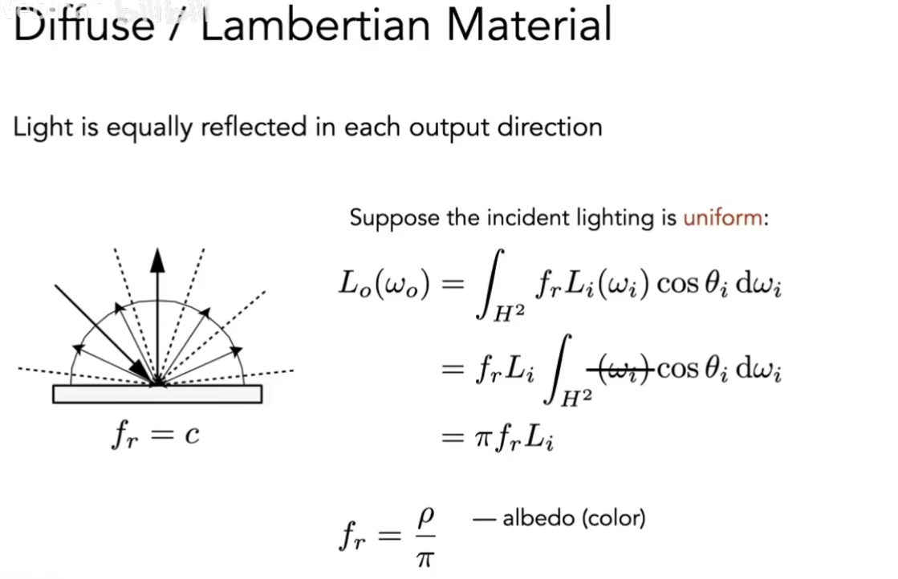 

漫反射BRDF

BSDF = BTDF + BRDF 反射 + 折射 = 散射

## Fresnel Reflection/ Term

菲涅尔项： 阐述光线入射方向和法线的角度与反射率的关系

极化现象， Reff = 1/2 * (Rs + Rp)

求解菲涅尔项: Schlick's approxiation

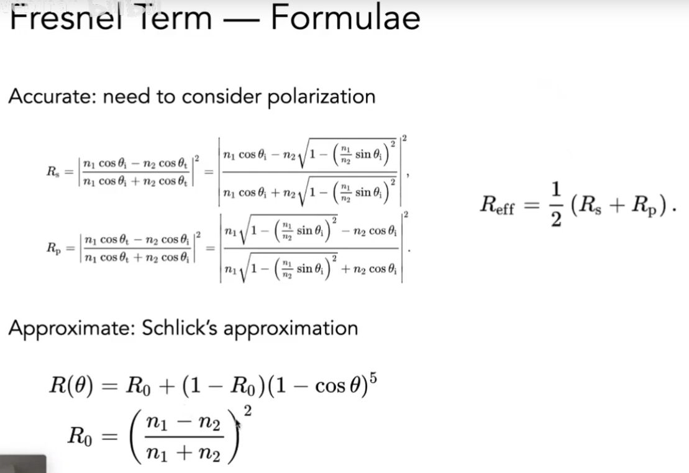

## Microfacet Material 微表面材质

### Microfacet Theory

从远处看，表面是一个粗糙的平面。 (看到的是材质、外观)

从近处看，可以看到凹凸不平的表面，并且每一个表面的微元都是完全镜面反射的物体。（看到的是几何）

Rough surface
Macroscale: flat & rough
Microscale: bumpy & specular

### Microfacet BRDF

研究微表面的法线分布，用法线分布来描述物体表面的粗糙程度，法线分布集中，物体就越平滑，分布不集中，就越粗糙(漫反射就越严重)

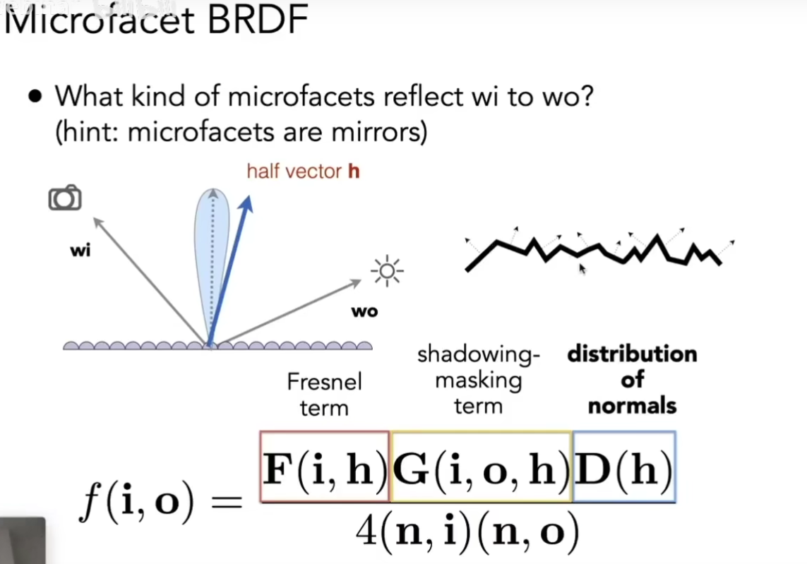

### Normal Distribution Function(NDF)

Various models to describe it.
- Beckmann, GGX, etc.

#### Beckmann NDF

#### GGX(or Trowbridge-Reitz)

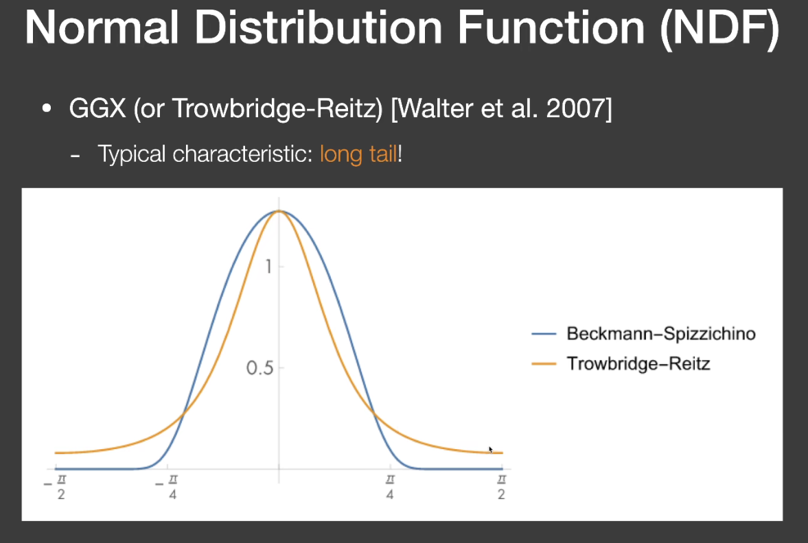

相较于Backmann, GGX在高光边缘有一个非常柔和的过度效果，看起来更加真实。

#### Shadowing-Masking Term

Or, the geometry term G.

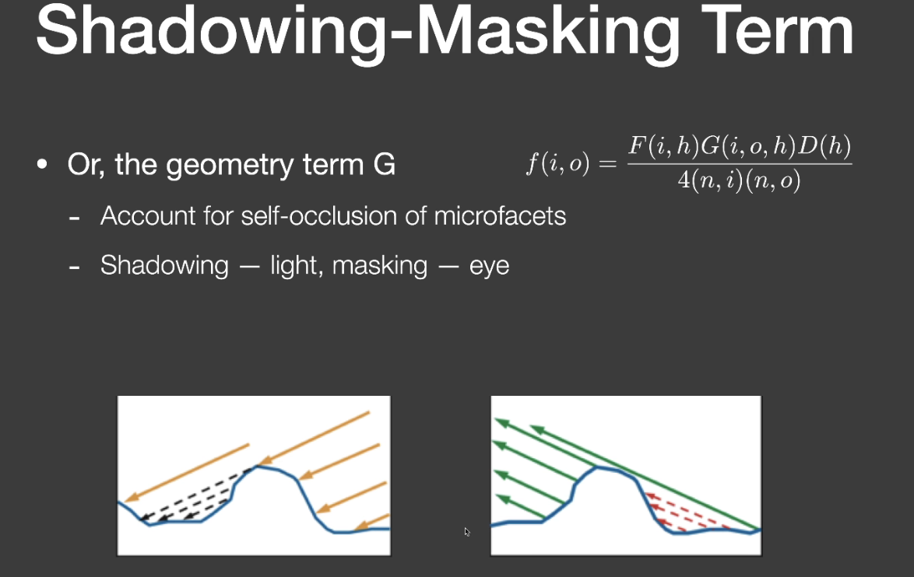

Kulla-Conty Approx.

补充因为微平面遮挡损失的能量 

## Isotropic / Anisotropic Materials (BRDFs) 各向同性/各向异性材质

## Advanced Appearance Modeling

### Kajiya-Kay Model

### Marschner Model 

# EP: Advanced Topic in Rendering #

## Biased / Unbiased Monte Carlo Estimators 

有偏/无偏蒙特卡洛估计

## Marschner model

## Granular Material

## Surface Model 表面模型

Translucent Material: Jade， 玉石，次表面散射

### Subsurface Scattering

 BSSRDF

Dipole Approximation

Approximate light diffusion by introducing two point sources.

### Cloth 布料

Render as surface.

Render as Participating Media.

Render as Actual Fibers.

#EP： Camera, Liences

## FOV(Field of View)

#EP: Animation动画#

## Keyframe animation

## Mass Spring System 质点弹簧系统

布料

## FEM（Finite Element Method) Instead of Springs 有限元方法

## Particle Systems 粒子系统

## Forward Kinematics

## Inverse Kinematics

梯度下降解ik问题

## Rigging

## Blend Shapes 

## Motion Capture 动作捕捉

## Fulid Simulation- A Simple Position-Based Method

Assuming water is composed of small rigid-body sepheres.

Assuming the water cannot be compressed.

梯度下降

