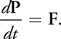

# GPU Gems-3

[ref]: https://developer.nvidia.com/gpugems/gpugems3

## Chapter 1. 使用GPU生成复杂的程序地形

本文使用GPU在交互帧率下快速生成大块的复杂程序化地形。

### Marching Cubes和密度函数

密度函数(density function):用来描述地形表面，输入为空间坐标，若结果为正则该点在地形中，若为负则在空气或水中，为0则为地形表面。

Marching Cubes算法： 将地形块细分成32x32x32的体素单元，在体素内生成正确的地形多边形。算法输入为八个顶点的密度值，如果八个密度值都为正或都为负，则该体素单元都在地形内或地形外，其他情况下则会在地形表面生成1-5个多边形。


### Geometry Shader


## Chapter 2. Animated Crowd Rendering

[ref]: https://developer.nvidia.com/gpugems/gpugems3/part-i-geometry/chapter-2-animated-crowd-rendering

### A Brief Review of Instancing

The term "instancing" refers to rendering a mesh multiple times in different locations, with different parameters. 

### Details of the Technique

Skinning Instance,没有使用传统方法，在shader constants中存储动画帧。
而是把所有动画的所有帧全部编码进一张贴图，随后在顶点着色阶段查询贴图获取骨骼矩阵。
这样就可以存储多个动画，并且每个不同的character都可以渲染出不同的动作。

We encode the per-instance parameters into a constant buffer and index into that array using the SV_InstanceID.

Finally, to avoid work animating characters in the far distance, we implement an LOD system with lower-resolution polygonal mesh subsections. The decision of which LOD to use is made per frame on a per-instance basis.

```fake code
[CPU]

Perform game logic (animation time, AI, etc.).
Determine an LOD group for each instance and populate LOD lists.
For each LOD:
    For each submesh:
        Populate instance data buffers for each instanced draw call.
        For each buffer:
            - Call DrawInstanced() on the submesh.
            
[GPU]

Vertex Shader:

Load per-instance data from constants using SV_InstanceID.
Load bone matrix of appropriate animation and frame.
Perform palette skinning.

Pixel Shader:

Apply per-instance coloration as passed down from vertex shader.
(Optional) Read a custom texture per instance from a texture array.
```

## Chapter 3. Blend Shapes

### How it works?

A blend shape is simply the per-vertex difference between a reference, or neutral, pose and the intended pose.


## Chapter 29. Real-Time Rigid Body Simulation

[ref]: https://developer.nvidia.com/gpugems/gpugems3/part-v-physics-simulation/chapter-29-real-time-rigid-body-simulation-gpus

### 介绍

刚体的运动是通过将运动分为两部分来计算的：平移和旋转，如图 29-2所示。平移描述了质心的运动，而旋转描述了刚体如何围绕质心旋转。详细的解释可以在 Baraff 1997 中找到。


1. 平移

质心的运动很容易理解，因为它与粒子的运动相同。当力F作用在刚体上时，该力会导致其线性动量P发生变化。更准确地说，P的时间导数等于F：



我们使用以下公式从P和刚体的质量M获得质心的速度v：


--------------------


