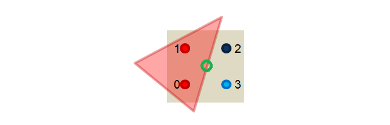

# 图形学

## MVP矩阵变换

### MVP矩阵变换

模型矩阵(Model), 观察矩阵(View),投影矩阵(Projection)

局部空间(Local Space)、世界空间(World Space)、观察空间(View Space)、裁剪空间(Clip Space)、屏幕空间(Screen Space)

1. 模型变换(modeling transformation), 将模型空间转换到世界空间

M矩阵求法： 按照 **缩放——旋转——平移** 的顺序进行矩阵变换


2. 观察变换(View Transformation)， 将世界空间转换到观察空间

观察空间： 以摄像机为中心的坐标系。

V矩阵求法： 由于摄像机的变换是在世界空间中先旋转后平移得到的，所以需要先反向进行平移变换，再反向进行旋转变换。


3. 裁剪变换(Projection Transformation)

观察空间 --> 裁剪空间

P矩阵不是真正的投影，只是为投影做准备。 裁剪空间的目的是帮助判断顶点是否可见，一般用于遮挡剔除。

4. 正交投影和透视投影


## Neox Cocos UI合批算法

通过计算UI在屏幕空间上的包围盒(矩形)的遮挡关系来进行绘制顺序的重排，达到减少批次的效果。算法原理比较直接：

1.对于一次绘制，向后查找到渲染状态完全一致的第一个批次(材质完全相同)。

2.对于找到的潜在可以合批的批次，计算这个批次与第一个批次之前的所有批次是否存在遮挡，如果有任何一个绘制有可能遮挡则不能合批，返回第一步继续查找下一个可能可以合批的批次。如果没有遮挡，则进行合批。

3.重复以上过程直到所有批次全部被处理。

算法的复杂度是O(n^2)到O(n^3),当dp数量变多的时候，性能会明显下降。

## Blinn Phong光照模型

Phong公式

```
color = ambient + diffuse + specular

最终颜色 = 直射光颜色 * 反射光颜色 * pow(max(0, dot(反射光方向, 视野方向)), 光泽度(gloss)) + 漫反射颜色 + 环境光颜色
```

Blinn Phong公式

```
color = ambient + diffuse + specular

最终颜色 = 直射光颜色 * 反射光颜色 * pow(max(0, dot(法线方向, 视野与光线中间向量)), 光泽度(gloss)) + 漫反射颜色 + 环境光颜色
```

在Phong模型中，必须计算V·R的值，其中R为反射光线的单位向量，V为视线方向的单位向量，但是在BlinnPhong模型中，用N·H的值来取代V·R。BlinnPhong光照模型公式：

Phong模型会出现光照截断或者过度不自然的现象。这是由于反射光方向和视线方向夹角小于90，才会使镜面反射的值为非零。

BlinnPhong使用视线与反射光线的中间向量与法线的点乘进行计算，这样做在任何情况下镜面反射都不会小于0。从而解决Phong模型面临的问题。

## 环境光遮蔽Ambient Occlusion

## 屏幕空间环境光遮蔽 Screen Space Ambient Occlusion

便于实时计算，降低ao性能消耗

## unity shader

基础语法基本掌握, vs ps语法定义，但是对于unity内置函数、内置变量这块，还需要通过多实践使用来掌握

## Q:为什么纹理图的尺寸一般是2的幂次

1、图片的纹理像素在Unity3D中需要遵循2的N次方，一般是由显卡限制决定的，只识别2的N次方。

非2的N次方的图片会转化为2的N次方图片（500 x 500 → 512 x 512）,是因为转化过程比较慢，由运行程序转换十分耗时，所以Unity3D提前将资源转化为符合标准的图片。

2、ios pvrtc的原因，有些GPU不支持NPOT，遇到NPOT会有一个转换POT的过程，浪费性能，

因此，建议都是用POT。

## SSAA, MSAA, FXAA

常用抗锯齿三种方案，目前主流的游戏一般是采用MSAA+FXAA的方式(csgo)。

SSAA对于资源的精度要求过高，MSAA是对SSAA的优化，降低了资源精度，也损失了一定的AA效果。

FXAA的原理很简单，通过对需要AA区域进行模糊从而实现AA的效果。

[注]:目前主流的编辑器中，延迟渲染模式下面无法开启MSAA,是受限于性能。延迟渲染一般要输出3-4个RT(depth, normal, color, specular),按照4xMSAA来计算,那么就是原先4倍的内存和带宽消耗，得不偿失。所以一般延迟渲染模式下面使用的是TAA，FXAA或者边缘检测处理技术

### SSAA
传统超采样，target render 600*800, 我们先将场景渲染到1200*1600的buffer上，然后基于这个结果采样到600*800，暴力但有效，性能很耗

### MSAA
在光栅化阶段，判断一个三角形是否被像素覆盖的时候会计算多个覆盖样本（Coverage sample），但是在pixel shader着色阶段计算像素颜色的时候每个像素还是只计算一次。例如下图是4xMSAA，三角形只覆盖了4个coverage sample中的2个。所以这个三角形需要生成一个fragment在pixel shader里着色，只不过生成的fragment还是在像素中央（位置，法线等信息插值到像素中央）然后只运行一次pixel shader，最后得到的结果在resolve阶段会乘以0.5，因为这个三角形只cover了一半的sample。现代所有GPU都在硬件上实现了这个算法，而且在shading的运算量远大于光栅化的今天，这个方法远比SSAA快很多。



MSAA的一个问题就是和现在大街小巷都是的deferred shading框架并不是那么兼容。因为用deferred shading的时候场景都先被光栅化到GBuffer上去了，不直接做shading。

### TAA, FXAA

因为MSAA这个问题现代引擎里都用的是Post Processing AA这一类技术。这一类东西包括FXAA，TXAA等，不依赖于任何硬件，完全用图像处理的方法来搞。有可能会依赖于一些其他的信息例如motion vector buffer或者前一贞的变换矩阵来找到上一贞像素对应的位置，然后再做一些hack去blur或者blend上一贞的颜色等。通常非常hacky，FXAA的发明人原来是我们组的，他自己都不知道这个为什么会work- -”


## NavMesh寻路算法

## 静态合批，动态合批和gpu instance

[ref]: https://zhuanlan.zhihu.com/p/98642798

[IMP]: **合批处理是针对CPU向GPU提交数据的优化，GPU Instance是针对GPU绘制的优化处理。**

优先级关系：静态批处理>GPU Instance>动态批处理。

### 静态合批

静态合批采用了以空间换时间的策略来提升渲染效率。

静态合批并不减少Draw call的数量([tip]这里好像有点争议，unity5.x之后frame debugger中显示draw call是减少了的)，但是由于我们预先把所有的子模型的顶点变换到了世界空间下，并且这些子模型共享材质，所以在多次Draw call调用之间并没有渲染状态的切换，渲染API会缓存绘制命令，起到了渲染优化的目的。另外，在运行时所有的顶点位置处理不再需要进行计算，节约了计算资源。

缺点:

1.打包之后体积增大，应用运行时所占用的内存体积也会增大。（如果静态合批前一些物体共享了相同的mesh网格，在内存中每一个物体都会对应一个该mesh网格的复制品。）

2.需要额外的内存来存储合并的几何体。

3.注意如果多个GameObject在静态批处理之前共享相同的几何体，则会在编辑器或运行时为每个GameObject创建几何体的副本，这会增大内存的开销。例如，在密集的森林级别将树标记为静态可能会产生严重的内存影响。

4.静态合批在大多数平台上的限制是64k顶点和64k索引

5.包含模型空间的顶点动画的shader无法参与合批，因为合批之后模型空间会丢失。

6.如果场景中包含了除了平行光以外的其他光源，并且在shader中定义了额外的pass来处理它们，这些额外的pass部分是不会被批处理的。

### 动态合批

原理:

[ref]: https://zhuanlan.zhihu.com/p/34499251

在使用相同材质球、相同Mesh(预设体的实例会自动地使用相同的网格模型和材质)的情况下，Unity会在运行时对于正在视野中的符合要求的所有对象使用Constant Buffer[5]将其位置、缩放、uv偏移、lightmapindex等相关信息保存在显存中的“统一/常量缓冲器”[6]中，然后从中抽取一个对象作为实例送入渲染流程，当在执行DrawCall操作后，从显存中取出实例的部分共享信息与从GPU常量缓冲器中取出对应对象的相关信息一并传递到下一渲染阶段，与此同时，不同的着色器阶段可以从缓存区中直接获取到需要的常量，不用设置两次常量。比起以上两种批处理，GPU Instancing可以规避合并Mesh导致的内存与性能上升的问题，但是由于场景中所有符合该合批条件的渲染物体的信息每帧都要被重新创建，放入“统一/常量缓冲区”中，而碍于缓存区的大小限制，每一个Constant Buffer的大小要严格限制（不得大于64k）。


动态合批是专门为优化场景中共享*同一材质*的动态GameObject的渲染设计的。目标是以最小的代价合并小型网格模型，减少Drawcall。

动态合批的原理也很简单，在进行场景绘制之前将所有的共享同一材质的模型的顶点信息变换到世界空间中，然后通过一次Draw call绘制多个模型，达到合批的目的。模型顶点变换的操作是由CPU完成的，所以这会带来一些CPU的性能消耗。

限制：

1，900个顶点属性以下的模型。

2，如果两个模型缩放大小不同，不能被合批的，即模型之间的缩放必须一致。

3，合并网格的材质球的实例必须相同。即材质球属性不能被区分对待，材质球对象实例必须是同一个。

4，如果他们有Lightmap数据，必须相同的lightmap才有机会合批。

5，使用多个pass的Shader是绝对不会被合批。因为Multi-pass Shader通常会导致一个物体要连续绘制多次，并切换渲染状态。这会打破其跟其他物体进行Dynamic batching的机会。

6，延迟渲染是无法被合批。

### 共享材质

无论是动态批处理还是静态批处理，都要求模型之前需要共享同一个材质。

但是不同的模型之间总会需要有不同的渲染属性，比如不同的纹理、颜色等。这个时候，我们需要一些策略来尽可能地合并材质。

如果两个材质之间只有使用的纹理不同，我们可以把这些纹理合并到一张更大的纹理中，这张更大的纹理被称为一张图集(atlas)。一旦使用了同一张纹理，我们就可以使用同一个材质，再使用不同的采样坐标对纹理进行采样就行。

处理纹理不同外，不同的物体在材质上可能还有颜色不同、浮点属性不同这些微小的调整。这时我们可以通过对VBO(vertex buffer object)数据进行控制，存储对应的颜色、顶点属性数据，实现共享材质的效果。

Renderer.sharedMaterial的修改会应用到所有使用该材质的物体上面。Renderer.material会创建一个材质的复制品，从而破坏批处理在该物体上的应用，这反而不是我们希望看到的。

#### 关于批处理的注意事项

1.尽可能选择静态合批处理，但需要时刻小心对于内存的消耗，且需要注意经过静态合批的物体不可以再被移动。

2.如果无法进行静态批处理，需要使用动态批处理的话，要让物体少并且尽可能让这些物体包含少量的顶点属性和顶点数目。

### GPU Instancing

[ref]: https://zhuanlan.zhihu.com/p/34499251

(动态、静态)合批优化的是cpu向gpu提供的数据，instancing优化的是gpu的绘制。

instancing通过对一个模型采样，在不同位置上绘制rt，来实现性能优化。

static batch, dynamic batch之外的一种降低draw call的方式，官方给出的介绍：

```
Use GPU Instancing to draw (or render) multiple copies of the same Mesh at once, using a small number of draw calls. It is useful for drawing objects such as buildings, trees and grass, or other things that appear repeatedly in a Scene.

GPU Instancing only renders identical Meshes with each draw call, but each instance can have different parameters (for example, color or scale) to add variation and reduce the appearance of repetition.

GPU Instancing can reduce the number of draw calls used per Scene. This significantly improves the rendering performance of your project.
```

官方manual:在材质部分打开"enable instancing"从而开启gpu instancing(只支持standard surface shader)

但是这里有一个限制,lightmap没法开启，骨骼动画没法开启。并且开启了instancing的材质没法参与静态合批。

在网上看到有通过脚本自行实现gpu instancing的方法，可以实现lightmap和骨骼动画等的gpu instancing。

[补充]: 在unity shader中添加

```
# pragma multi_compile_instancing#
```

[comment]: <>(具体实现没细看,找时间了解一下)

# 图形学

## 光照

## ShadowMap 阴影

### Cascade ShadowMap 级联阴影

给不同位置的shadow以不同的分辨率(距离相机较近的地方分辨率高，较远的地方分辨率低)

做远距离阴影大多用这套，按照相机的距离，分配纹理空间，可以缓解相机和灯光空间像素不匹配导致的阴影失真。CSM是动态阴影技术，每帧需要渲染多张shadowmap，缺点是大量的物体需要每帧渲染，部分动态静态。大视距用到8级cascades的前4级每帧更新，后面4级一般采用轮流更新的方式，确保每8帧所有cascades都能至少更新一次。

CSM通常都把地形排查在外，即使分帧更新cascade，大地型的渲染填充率还是非常高。原神的地形不是真的地形而是石头山呀的模型，可以避开这个问题。

### 软阴影

### 渲染路径(render path)

#### 前向渲染路径(forward render)

对于前向渲染，一个unity shader通常会定义一个base pass和一个additional pass。一个base pass仅会被执行一次，一个additional pass会根据影响该物体的其他逐像素光源的数目被多次调用(每个逐像素光源都会执行一次additional pass)。

1.base pass
支持阴影渲染,可以在pass中访问访问光照纹理(lightmap),环境光和自发光只需要计算一次，无需叠加，所以是在base pass中计算

2.additional pass
默认情况下没有阴影效果，需要在pass中使用

```
#pragma multi_compile_fwdadd_fullshadows
```

替代

```python
#prgama multi_compile_fwdadd
```

为点光源和聚光灯开启阴影效果。

#### 延迟渲染路径(deffered render)

延迟渲染主要包含了2个pass，第一个pass不进行光照计算，仅仅利用深度缓冲，计算可见片元，存储到G-buffer中(depth, normal, light specular, albedo等)。在第2个pass中，利用G-buffer中的信息，进行光照计算

[注] g-buffer不存position信息，这里可以根据depth + 屏幕像素坐标反推出来

[缺点]
1.无法支持真正的抗锯齿技术(SSAA, MSAA)
2.无法处理半透明物体
3.对于显卡有一定的要求， 支持MRT， shader mode >= 3.0, 深度渲染纹理和双面模板缓冲

[tip]
延迟渲染的效率不依赖与场景的复杂度(光照类型、数量等)，而是和使用的屏幕空间的大小有关系。

移动端一般不会采用延迟渲染：
1.无法硬件AA（MSAA, SSAA等），一般只会采用FXAA+TAA这种优化方式
2.无法处理透明物体渲染(目前的主流引擎不支持)，理论上srp可以自己实现
3.移动端游戏一般光源数量不是特别多，采用延迟渲染的方式对于性能太耗(主要是G-buffer)。(n *pass* pixel_num )

但是在非移动平台，多光源场景下，延迟渲染比前向渲染有着更好的性能效果。

且延迟渲染可以结合SSAO，效果比较好。（[todo]:待看）

#### G缓冲（G-Buffer）

默认的G-buffer RT包含了如下几个渲染纹理(render texture, RT)：

1.RT0: ARGB32, RGB通道用于存储漫反射颜色，A通道未使用
2.RT1: ARGB32, RGB通道用于存储高光反射颜色， A通道用于存储高光反射的指数部分
3.RT2: ARGB2101010, RGB通道用于存储法线， A通道未使用
4.RT3: ARGB32(非HDR)或ARGBHalf(HDR),用于存储自发光+lightmap+反射探针(reflection probes)
5.深度缓冲和模板缓冲

### Ramp贴图

一般用在卡通渲染上面，给模型一个有分界的渐变过渡。先计算一个半兰伯特（也可以是phong, blinn-phong），然后将ramp的uv.x映射到半兰伯特上，生成ramp贴图。通常实现明暗变化。

### 高级纹理

#### 立方体纹理(skybox、环境映射)

采样方式：以立方体中心为原点，通过vec3方向跟立方体求交集，交点即为采样点。

### 反射、菲涅尔反射

### 折射

通过折射实现镜面雨滴：<https://www.youtube.com/watch?v=0flY11lVCwY>

## 动画

### 顶点动画

1.广告牌技术

根据视角方向来旋转一个被纹理着色的多边形(通常就是简单的四边形)，通常哟宏宇渲染烟雾、云朵、闪光效果等。

[注]
模型空间下进行的顶点动画，会被批处理破坏动画效果。因为批处理会破坏模型空间，导致顶点动画失效。通常可以通过subshader的disablebatching标签来取消批处理。

在处理顶点动画阴影的时候，在ShadowCasterPass中，也需要对阴影顶点做和模型顶点动画相同的offset偏移，保证在模型顶点动画播放的情况下，阴影也能正确的显示。

## 后处理

### 边缘检测

利用边缘检测算子对图像进行卷积操作的结果。

#### 卷积和卷积核，边缘检测算子

Sobel算子，由于阴影和纹理会影响边缘检测的效果，我们通常会在屏幕的深度纹理和法线纹理上进行边缘检测

【Roberts算子】
只计算左上角和右下角的差值，乘以右上角和左下角的差值，作为凭据边缘的依据。

### 高斯模糊

模糊的普通方式：

1.均值模糊:卷积后得到的像素值是其邻域内各个像素值的平均值。

2.中值模糊：邻域内对所有像素排序后的中值替换掉原先颜色。

[高斯方程]

Bloom效果实现原理：
根据一个阈值提取出图像中较亮的区域，把它们存储在一张rt中，利用高斯模糊对这张渲染纹理进行模糊处理，模拟光线扩散的效果，最后将其和原图像进行混合，得到最终的效果。

[运动模糊 motion blur]
方式一：利用累计缓存混合多张连续的图像后，取平均值作为最后的运动模糊图像(性能消耗很大， rt*n)

该方式还可以在保存之前的渲染结果的情形下，把当前的渲染图像叠加到之前的渲染图像中，从而产生一种运动轨迹的视觉效果。相比较于累计缓存，性能稍好但结果可能会略微有些影响。

方式二：速度缓存，该缓存中存储了各个像素当前的运动速度，利用该值来决定模糊的方向和大小

通过深度纹理在片元着色器中为每个像素计算器在世界空间下的位置，使用前一帧中的位置和当前帧的位置计算差值得到像素速度，使用该速度对它的邻域像素进行采用，相加后取平均值，从而实现在当前帧的运动模糊效果。

【注】
当前的两种方式适用于场景静止、摄像机快速运动的情况，如果面临一个物体快速运动而相机静止的场景，会发现不会产生任何的运动模糊。这种情况下可以通过模型运动法线反方向拖尾实现运动模糊。

[Tip]
我们可以在unity中缓存任何纹理，通过使用unity的着色器替换(shader replacement)功能，即调用Camera.RenderWithShader(shader, replacementTag)函数，把整个场景重新渲染一遍得到。

#### 全局雾效果

由深度纹理重建每个像素在世界空间下的位置，使用一个基于高度的公式计算雾效的混合系数，最后使用该系数来混合雾的颜色和原屏幕的颜色

### 非真实渲染 Non-Photorealistic Rendering, NPR

#### 轮廓线渲染 outline

在《Real Time Rendering》中，作者将这些方法分成了五种类型、
1.基于观察角度和表面法线的轮廓线渲染。这种方法使用视角方向和表面法线的点乘结果来得到轮廓线信息。这种方法建大快速，可以在一个pass中得到渲染结果，但局限性很大，很多模型渲染出来的描边效果都不尽如人意。

2.过程式集合轮廓线渲染。这种方法的核心是使用两个pass渲染。第一个pass渲染背面的面片，并使用某些技术让它的轮廓可见(比如使用轮廓线颜色来给整个背面着色，并沿着边缘法线方向外扩一定距离)。第二个pass再渲染正面的面片。这种方法快速有效，并且适用于绝大多数表面平滑的模型，它的缺点是不适合立方体这样平整的模型，同时两个pass会带来性能的消耗和合批上的问题。

3.基于图像处理的轮廓线渲染。(基于深度、法线纹理，利用卷积算子进行边缘检测)。局限在于深度和法线变化很小的轮廓无法被检测出来，比如桌子上的纸张。

4.基于轮廓边检测的渲染。先检测出精准的轮廓边，通过检查和这条边相邻的两个三角面片是否满足: (n0*v > 0) != (n1*v>0)。(n0和n1分表表示两个相邻三角面片的法向， v是从视角到该边上任意顶点的方向。本质就是检查两个相邻三角面片是否一个朝正、一个朝背面。)该方法的缺点在于实现相对复杂，同时会有动画连贯性的问题，在帧与帧之间可能会出现跳跃性。

5.混合上述方法。先找到精准的轮廓边，把模型和轮廓边渲染到纹理中，使用图像识别的方法识别出轮廓线，在图像空间下进行风格化渲染。

【注】
顶点法线外扩无法处理内凹的模型，可能发生背面面片遮挡正面面片的现象。为了尽可能防止出现这样的情况，在扩张背面顶点之前，首先对顶点法线的z分量进行处理，使他们等于一个定值，然后把法线归一化后再对顶点进行扩张。这样的好处在于或战后的背面更加扁平化，降低了遮挡正面面片的可能性。

#### 素描风格渲染

基于microsoft SIGGRAPH2001 Tonal Art Map

### 噪声

### unity中的渲染优化技术

#### 影响性能的主要因素

1. CPU

<1> 过多的draw call
<2> 复杂的脚本或者物理模拟
[优化]
使用批处理技术减少draw call数量
优化脚本逻辑和物理模拟复杂度

2.GPU

<1> 顶点处理
    a. 过多的顶点
    b. 过多的逐顶点计算

<2> 片元处理
    a.过多的片元(可能是由分辨率导致的，也可能是由于overdraw造成的)
    b.过多的逐片元计算

[优化]
减少需要处理的顶点数目:
1.优化几何体
2.使用模型的LOD技术
3.使用遮挡剔除技术

减少需要处理的片元数目：
1.控制绘制顺序
2.警惕透明物体
3.减少实时光照

减少计算复杂度：
1.使用shader的LOD技术
2.代码优化

3.带宽

<1> 使用了尺寸很大且未压缩的纹理
<2> 分辨率过高的帧缓存

[优化]
1、较少纹理大小
2.利用分辨率进行缩放

#### God Ray和LUT(Lookup Texture)

一些常用的trick，模拟多光源和复杂光线效果，优化性能的方式

LUT在运行时刻，使用光源方向、视角方向、发现方向等参数，对LUT采样得到光照结果。这样可以让我们使用更出色的光照模型，比如更复杂的BRDF模型，还可以利用查找纹理的大小来进一步优化性能，(主要npc采用大分辨率的LUT，次要npc采用小分辨率的LUT)

### 降低带宽

#### 减少纹理大小

1.多级渐远纹理(mipmaps)

增大了内存消耗，但提高了性能，降低了带宽消耗

2.纹理压缩

### 减少计算复杂度

1.shader的LOD技术
跟模型的LOD类似，shader的LOD可以控制使用shader等级，只有LOD值小于某个设定的值，该shader才会被使用，使用了那些超过设定值shader的物体将不会被渲染。

2.代码优化

### 基于物理着色: 双向反射分布函数BRDF

<https://zhuanlan.zhihu.com/p/21376124>

### PBS(PBR)基于物理的着色(渲染)

PBS并不意味着游戏画面需要追求和照片一样真实的效果。PBS的优点在于，我们只需要一个万能的shader就可以渲染相当一大部分类型的材质，而不是使用传统的做法为每种材质写一个特定的shader。同时，PBS可以保证在各种光照条件下，材质都可以自然地和光源进行交互，而不需要我们反复地调整材质参数。

PBS的代价，需要更复杂的光照配合，比如大量使用光照探针和反射探针等。PBS也需要开启HDR以及一些必不可少的屏幕特效，例如抗锯齿、Bloom和色调映射，如果这些对于当前游戏来说需要消耗过多的心梗，那么PBS久不适合当前的游戏，我们还是需要使用传统的shader来渲染游戏。

PBS对美术的要求也是一项挑战，美术资源的制作过程和使用传统的shader有很大的不同，普通的法线纹理+高光反射纹理的组合不再适用，我们需要创建更细腻复杂的纹理集，包括金属值纹理、高光反射纹理、粗糙度纹理、遮挡纹理，游戏还需要使用额外的细节纹理来给材质添加更多的细节。

### Image Based lighting(IBL)

IBL是一种伪装全局光照的方法，使用该方法可以获得较好的视觉效果并且可以达到实时渲染的目的。


