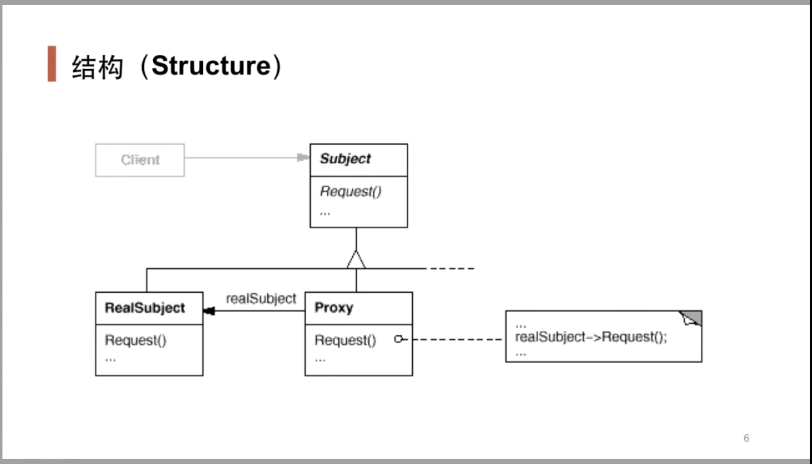

# 设计模式

## Singleton(单例模式)
保证一个类只有一个实例，并且提供一个全局访问点

场景： 重量级的对象，不需要多个实例，如线程池，数据库连接池

## Template Method(模板方法)

利用虚函数，晚绑定替代早绑定

## Strategy(策略模式)

定义了算法族，分别封装起来，让他们之间可以相互替换，此模式让算法的变化独立于使用算法的客户。(此处的算法可以理解为行为)

## Observers/Event(观察者模式)

一个对象的状态发生改变，所有的依赖对象都将得到通知

## Abstract Factory(抽象工厂模式)

解决"一系列相互依赖的对象"的创建工作

## Proxy(代理模式)

有些对象由于某种原因（比如对象创建的开销很大，或者某些操作需要安全控制，或者需要进程外的访问等），直接访问会给使用者或者系统结构带来很多麻烦。

在不失去透明操作对象的同事来管理/控制这些对象特有的复杂性，增加一层间接层是软件开发的常见方式。

定义：为其他对象提供一种代理以控制（隔离，使用接口）对这个对象的访问

## Iterator(迭代器模式)

提供一种方法顺序访问一个聚合对象中的各个元素，而又不暴露（稳定）该对象内部的实现方式。

现代C++用编译时多态替代运行时多态，保证了性能

