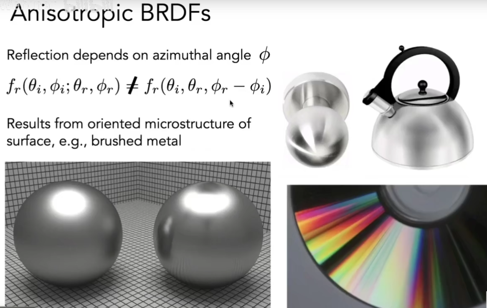
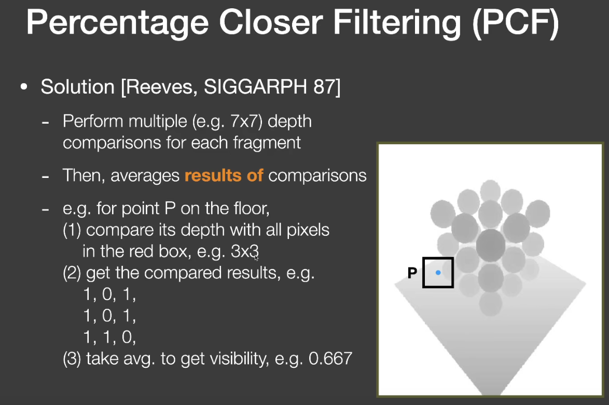
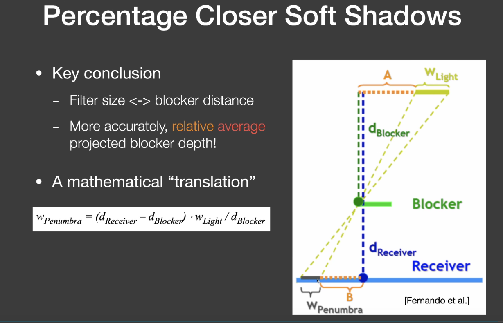
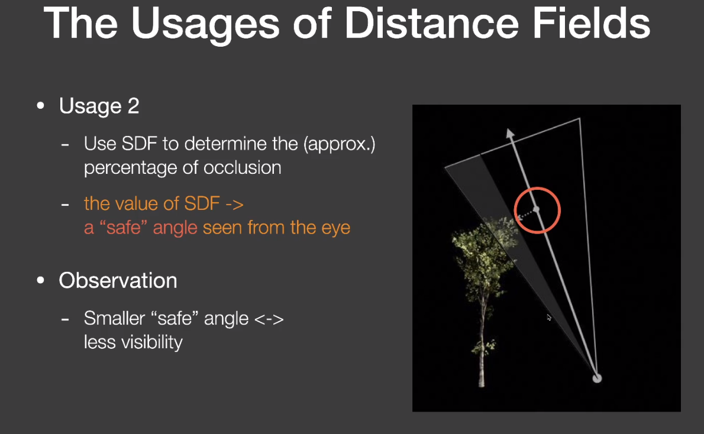
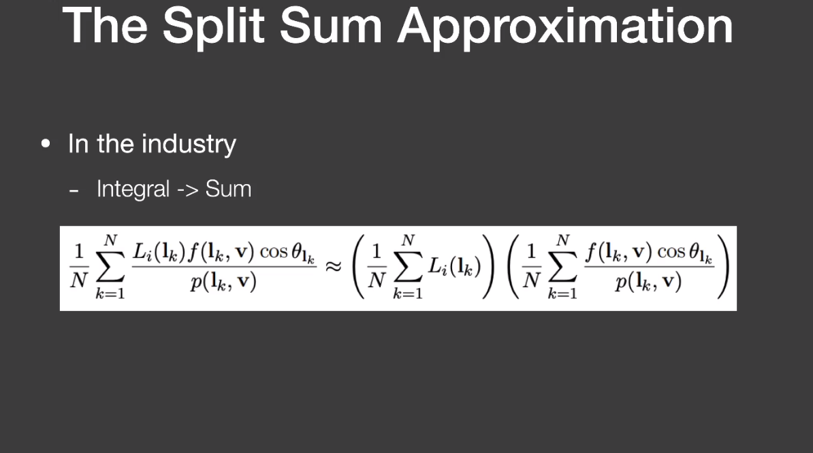
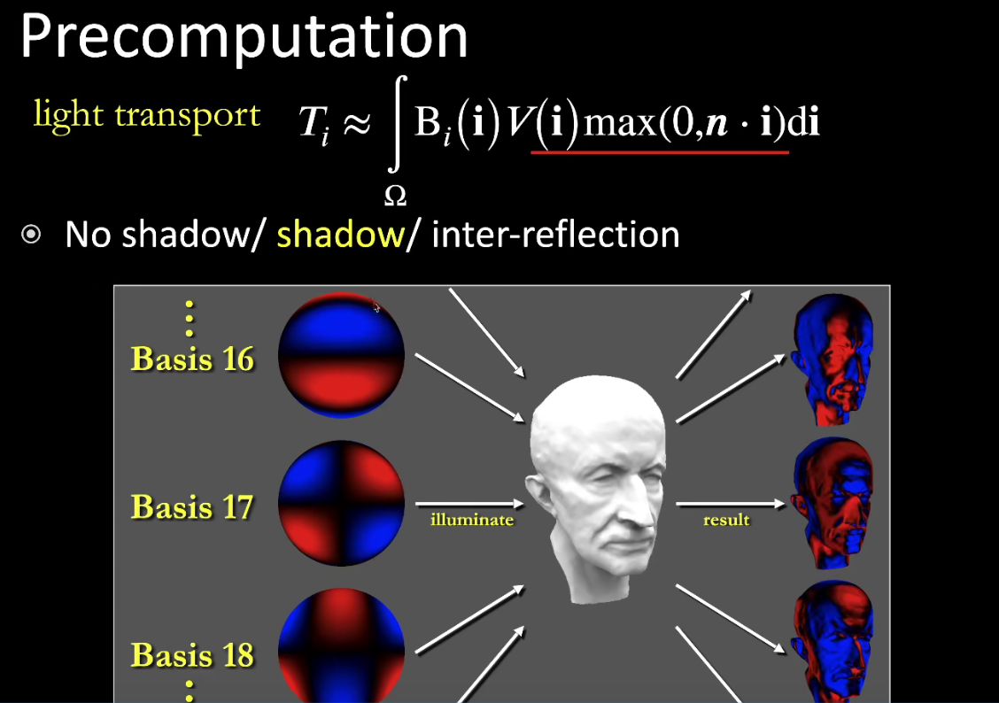
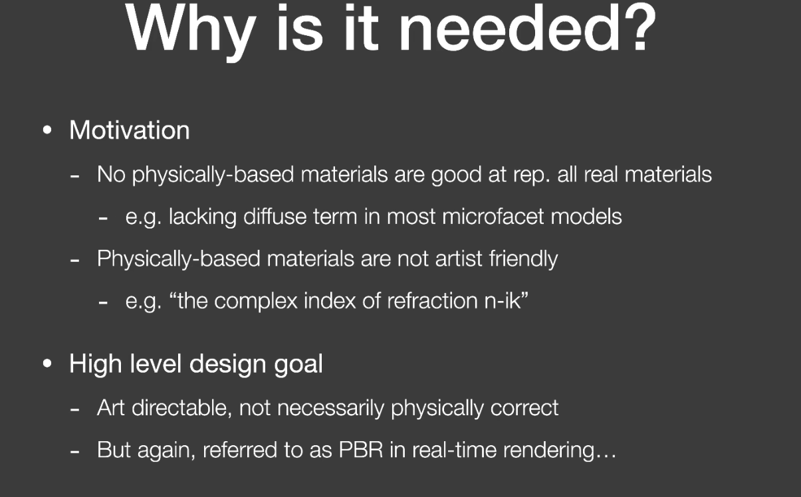
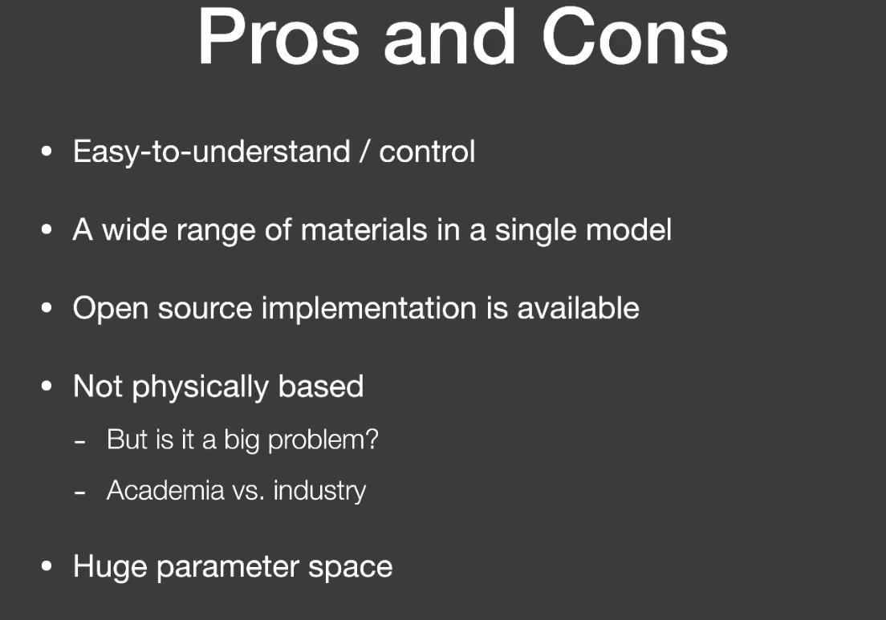

# Python

## 装饰器

最近想提高一下代码质量，发现高阶python编程的第一个建议就是善用装饰器，所以就过来研究一下装饰器相关的东西了。之前也看过很多遍，但总是看完就会，就觉得很好用，到用的时候又总是容易忘，然后又懒得去查，然后就懒得再用了。

这次长记性了，把一些常用的和不常用的装饰器用法都记录下来，下次使用的时候直接查一下markdown日志，也强迫自己多用，这样才能慢慢提高代码质量。

### 装饰器的理解

装饰器wrapper本质是重写func，返回一个包含原函数func功能的新的函数对象，但函数的名称、参数什么的都不会发生变化。对装饰器的理解能够加深python一切皆对象的理念。

```python
def deco():
    pass
@deco
def func():
   pass
```

等价于:

```python
def func():
    pass

def deco():
    pass

func = deco(func)
```

在给func套上装饰器@deco之后，原先的func就消失了，func被deco(func)取代。如果希望保留原先func这样一个对象的话，有一种方式，在装饰器返回的对象中添加一个成员函数，用来存储你想要保存的原函数func对象:

```python
def deco(func):
    def inner():
        pass
    inner._f = func
    return inner

@deco
def func():
    pass
```

### 常用装饰器

最普通的装饰器，看代码就行

```python
def wrapper(func):
    def inner():
        print "before inner func()."
        func()
        print "after inner func()."
    inner._f = func # 将func函数保存在wrapper内，保证需要的时候，可以通过func._f()来调用
    return inner


@wrapper
def foo():
    print "hello world."
```

### 上下文装饰器(contextlib decorator)

```python
#todo: 这个看过，也理解了一些内容，但是实际上一次都没用过。等真正遇到使用场景再来填这个坑吧
```

## 魔术方法(magic methods)

## 一些奇怪的小技巧

### 字符串反向处理

将字符串a进行反转

```python
a = '!dlrow olleH'

b = a[::-1]
# result:  b = 'Hello world!'
```

### 智能开箱

一种比较酷的解压缩列表的方法

```python3(python2不支持这种方式)
a, *b, c = [1,2,3,4,5]

a = 1
b = [2, 3, 4]
c = 5
```

### 各种推导式

#### 列表推导式

使用[]生成list

```fake_code
variable = [out_exp_res for out_exp in input_list if out_exp == 2]
```

例子:

```python
list1 = [i for i in range(30) if i % 3 == 1]


def double(i):
    return 2 * i
list2 = [double(i) for i in range(20) if i % 3 == 0]
```

#### 字典推导

```python
d = {x: x % 2 == 0 for x in range(1, 11) }
```

## subprocess-子进程管理

### run()

### Popen()

今天在处理messiah-feature-hub的时候遇到一个问题，在程序自更新阶段出现软件卡死/在重新启动新进程失败的情况。代码断在了subprocess的Popen调用阶段。

## metaclass-元类

__metaclass__ = xxx

作用：在创建类的过程中实现一些自定义的操作(保证类对象是一个Singleton单例，用来给创建的类对象、函数方法包装装饰器等等),先讲讲class是啥，是一个对象，怎么创建的，由type创建的，type是一个class，metaclass是跟type类似的，创建一个类的类，metaclass一般会直接继承自type,或者重写__init__()和__call__(),__new__()，来实现创建类的方法。（改写__init__还是改写__new__取决于具体需求，如果需要在class对象创建的时候进行处理，则改写__new__，如果在对象属性初始化的时候处理，则改写__init__即可）

metaclass本身来说并不复杂，复杂的是用metaclass来做的一些事情：利用metaclass来做类对象的内部审查，操纵继承或者修改类似于__dict__的变量之类的操作.

其本身本质非常简单:

1. 拦截一个类对象的创建
2. 修改类对象
3. 返回一个修改之后的类对象

```python
from functools import wraps

def hook_convert_to_expr(func):
    @wraps(func)
    def _wrapper(self, *args, **kwargs):
        r = func(self, *args, **kwargs)
        if r.__class__.__name__ == 'EAGetValue':
            from custom.pub.game_trigger.GameTrigger import GameTriggerArgFactory
            sub_type_cls = GameTriggerArgFactory.sub_arg_parser[self.arg_type]
            for key in dir(sub_type_cls):
                if getattr(sub_type_cls, key, None) == self.sub_type:
                    r.val_desc = key
                    break
        return r
    return _wrapper

class upmetaclass(type):
    def __new__(cls, name, bases, attrs):
        if 'convert_to_expr' in attrs:
            attrs['convert_to_expr'] = hook_convert_to_expr(attrs['convert_to_expr'])
        return super(upmetaclass, cls).__new__(cls, name, bases, attrs)
```

## magic methods-魔法方法

### __getattribute__

## Collections - 容器类

### Counter()- Dict子类，用于计数

```python
from collections import Counter
temp_dict = {1:3, 5:4, 2:2}
ct = Counter(temp_dict)
print ct.most_common
print [lambda num: num,_ in ct.most_common()]
```

## Lambda表达式

Lambda表达式实际上就是一个匿名函数，它的主要作用就是优化代码结构，让代码看起来更加整洁，

```python
lambda x: x+10
```

等价于

```python
def anonymous_func(x):
    return x+10
```

==========================================================================================================

# C++

重新刷一遍《C++ Prime Plus》

## constexpr

C++11的改善——常量表达式，允许程序利用编译时的计算能力。

常量表达式主要是允许一些计算发生在编译时，即发生在代码编译而不是运行的时候。这是很大的优化：假如有些事情可以在编译时做，它将只做一次，而不是每次程序运行时。需要计算一个编译时已知的常量，比如特定值的sine或cosin？确实你亦可以使用库函数sin或cos，但那样你必须花费运行时的开销。使用constexpr，你可以创建一个编译时的函数，它将为你计算出你需要的数值。用户的电脑将不需要做这些工作。

### constexpr函数的限制

1.函数中只能有一个return语句

2.只能调用其他constexpr函数

3.只能使用全局constrexpr变量

[注] 递归并不受限制，但只允许一个返回语句。(三元运算符)

```c++
//计算n的阶乘
constexpr int factorial (int n)
{
    return n > 0 ? n * factorial( n - 1 ) : 1;
}
```

## 基础数据类型

### 占用空间大小

16bit 编译器：
char == 1 Byte;
short int == 2 Byte;
int == 2 Byte;
unsigned int == 2 Byte;
long == 4 Byte;
unsigned long == 4 Byte;
long long == 8 Byte;
float == 4 Byte;
double == 8 Byte.

32bit 编译器：
char == 1 Byte;
short int == 2 Byte;
int == 4 Byte;
unsigned int == 4 Byte;
long == 4 Byte;
unsigned long == 4 Byte;
long long == 8 Byte;
float == 4 Byte;
double == 8 Byte.

64bit 编译器：
char == 1 Byte;
short int == 2 Byte;
int == 4 Byte;
unsigned int == 4 Byte;
long == 4 Byte;
unsigned long == 4 Byte;
long long == 8 Byte;
float == 4 Byte;
double == 8 Byte.

指针变量所占字节
指针变量所占字节数是根据编译器的寻址空间决定宽度的：

16 bit编译器寻址空间为16 bit，所以指针变量宽度为2 Byte;
32 bit编译器寻址空间为32 bit，所以指针变量宽度为4 Byte;
64 bit编译器寻址空间为64 bit，所以指针变量宽度为8 Byte.
以上32bit & 64bit编译器均是在vs2017上测试所得

虚函数虚表占用4个字节, 空类只占1个字节。

## 内存管理

### 内存区域

内核空间、栈区、堆区、全局变量区、代码区、保留区

堆: new 分配空间, delete 释放空间

栈: {}内定义的变量，出了括号自动清理

全局变量区: .ddta非0值和.bss未初始化会存放在全局变量的两个地方

代码区： .text函数代码

保留区: 0地址开始的c库


## 智能指针

### unique_ptr

### shared_ptr, weak_ptr


## 数组

存储多个同类型值的数据格式，数组的通用格式:

```c++
typeName arrayName [arraySize]
# arraySize必须是整型常数(如8，10)或者const值，也可以是常量表达式(8 * sizeof(int)),其所有的值在编译的时候都是已知的。
```

### 数组的初始化

只有在定义数组的时候才能使用数组初始化，此后就不能再使用了，也不能将一个数组赋值给另一个数组。只能使用下标分别给数组元素进行赋值。

```cpp
int card[4] = {3, 6, 8, 10};

int hand[4];

这两种方式都是ok的。

hand[4] = {5,6,7,8};  //错误！
hand = cards;         //错误!
```

初始化数组的时候，可以提供少于数组元素数目的值，这样编译器会自动把其他的元素设置为0.

如果初始化数组的时候方括号内([])为空，C++编译器将计算元素的个数。

```c++
short things[] = {1, 2, 3, 4}; 
```

[c++11]
列表初始化新增了一些功能

1.初始化数组的时候，可以省略等号(=):

```c++
double earnings[4] {1.2e4, 1/6e4, 1.1e4, 1.7e4};    //ok with c++11
```

2.可以不再大括号内包含任何东西，这将把所有元素都设置为0：

```c++
unsigned int counts[10] = {};
float balances[100] {};
```

3.列表初始化不允许缩窄转换

## 类大小的计算 -- sizeof

### 总结

1.空类的大小为1个字节

2.一个类中，虚函数本身、成员函数(包括静态和非静态)和静态数据成员都不占用类对象的存储空间。

3，对于包含虚函数的类，不管有多少个虚函数，只有一个虚指针,vptr的大小。

4.普通竭诚，派生类继承了所有基类的函数与成员，要按照字节对齐来计算大小。

5.虚函数继承，不管是单继承还是多继承，都是继承了基类的vptr。(32位系统4字节，64位系统8字节)

6.虚继承，继承基类的vptr。

## const关键字

## 类和结构的区别

c++中类和结构只有一个区别:

**类的成员默认是private,结构的成员是public**

## inline

在c/c++中，为了解决一些频繁调用的小函数大量消耗栈空间的问题，特别的引入了inline修饰符，表示为内联函数。

在系统下，栈空间是有限的，加入频繁大量的使用就会造成因栈空间不足而导致程序出错的问题。

inline以代码膨胀(复制)为代价，省去了函数调用的开销，从而提高了函数的执行效率。

[注]下列情况不宜使用inline:
1.函数体内的代码比较长，使用内联将导致内存消耗比较搞高。

2.如果函数体内出现循环，那么执行函数体内代码的时间要比函数调用的开销要大。

## lambda表达式

```refrence
https://docs.microsoft.com/zh-cn/cpp/cpp/lambda-expressions-in-cpp?view=msvc-160
```

C++11以及更高的版本中，lambda表达式是一种定义匿名函数对象的简便方法，在调用的位置或作为参数传递给函数的位置。Lambda通常用于封装传递给算法或异步方法的少量代码行。

```cpp  --在sort中使用lambda表达式定义cmp函数--
auto cmp = [](string left, string right) -> bool {
    return left + right > right + left;
};

sort(str.begin(), str.end(), cmp);

```
### 基础
Lambda 表达式的基本语法如下：

```c++
[捕获列表](参数列表) mutable(可选) 异常属性 -> 返回类型 {
// 函数体
}
```

上面的语法规则除了 [捕获列表] 内的东西外，其他部分都很好理解，只是一般函数的函数名被略去， 返回值使用了一个 -> 的形式进行（我们在上一节前面的尾返回类型已经提到过这种写法了）。

所谓捕获列表，其实可以理解为参数的一种类型，Lambda 表达式内部函数体在默认情况下是不能够使用函数体外部的变量的， 这时候捕获列表可以起到传递外部数据的作用。根据传递的行为，捕获列表也分为以下几种：

1. 值捕获
与参数传值类似，值捕获的前提是变量可以拷贝，不同之处则在于，被捕获的变量在 Lambda 表达式被创建时拷贝， 而非调用时才拷贝：

```cpp
void lambda_value_capture() {
    int value = 1;
    auto copy_value = [value] {
        return value;
    };
    value = 100;
    auto stored_value = copy_value();
    std::cout << "stored_value = " << stored_value << std::endl;
    // 这时, stored_value == 1, 而 value == 100.
    // 因为 copy_value 在创建时就保存了一份 value 的拷贝
}
```

2. 引用捕获

与引用传参类似，引用捕获保存的是引用，值会发生变化。

```cpp
void lambda_reference_capture() {
    int value = 1;
    auto copy_value = [&value] {
        return value;
    };
    value = 100;
    auto stored_value = copy_value();
    std::cout << "stored_value = " << stored_value << std::endl;
    // 这时, stored_value == 100, value == 100.
    // 因为 copy_value 保存的是引用
}
```

3. 隐式捕获

手动书写捕获列表有时候是非常复杂的，这种机械性的工作可以交给编译器来处理，这时候可以在捕获列表中写一个 & 或 = 向编译器声明采用引用捕获或者值捕获.

总结一下，捕获提供了 Lambda 表达式对外部值进行使用的功能，捕获列表的最常用的四种形式可以是：
[] 空捕获列表
[name1, name2, ...] 捕获一系列变量
[&] 引用捕获, 让编译器自行推导引用列表
[=] 值捕获, 让编译器自行推导值捕获列表

4. 表达式捕获

上面提到的值捕获、引用捕获都是已经在外层作用域声明的变量，因此这些捕获方式捕获的均为左值，而不能捕获右值。

C++14 给与了我们方便，允许捕获的成员用任意的表达式进行初始化，这就允许了右值的捕获， 被声明的捕获变量类型会根据表达式进行判断，判断方式与使用 auto 本质上是相同的：

```cpp
#include <iostream>
#include <memory>  // std::make_unique
#include <utility> // std::move

void lambda_expression_capture() {
    auto important = std::make_unique<int>(1);
    auto add = [v1 = 1, v2 = std::move(important)](int x, int y) -> int {
        return x+y+v1+(*v2);
    };
    std::cout << add(3,4) << std::endl;
}
```

在上面的代码中，important 是一个独占指针，是不能够被 "=" 值捕获到，这时候我们可以将其转移为右值，在表达式中初始化。

### 泛型Lambda

上一节中我们提到了 auto 关键字不能够用在参数表里，这是因为这样的写法会与模板的功能产生冲突。 但是 Lambda 表达式并不是普通函数，所以 Lambda 表达式并不能够模板化。 这就为我们造成了一定程度上的麻烦：参数表不能够泛化，必须明确参数表类型。

幸运的是，这种麻烦只存在于 C++11 中，从 C++14 开始， Lambda 函数的形式参数可以使用 auto 关键字来产生意义上的泛型：

```cpp
auto add = [](auto x, auto y) {
    return x+y;
};

add(1, 2);
add(1.1, 2.2);
```

## new和malloc的区别

1.new和delete是操作符，可以重载，只能在C++中使用

malloc、free是函数，可以覆盖，C、C++中都可以使用

2.new可以调用对象的构造函数，对应的delete调用相应的析构函数

malloc仅仅分配内存，free仅仅回收内存，并不执行构造和析构函数

3.new、delete返回的是某种数据类型的指针

malloc、free返回的是void指针，需要强制类型转换后使用。

## ++i和i++

++i先自增1， 再返回

i++先返回i，再自增1

## C++程序编译的内存分配

C，C++程序编译时内存分为5大存储区：堆、栈、全局静态区、文字常量区、程序代码区

1.静态存储区分配
内存在程序编译的时候就已经分配好了，这块内存在程序的整个运行期间都存在。速度快、不容易出错，因为有系统会善后。例如全局变量,static变量，常量字符串等

2.

## Stack Overflow Special(编译器分支预测)- 为什么有序的c++/java array执行要比无序的快得多

<https://stackoverflow.com/questions/11227809/why-is-processing-a-sorted-array-faster-than-processing-an-unsorted-array>

==========================================================================================================

# Python Web

<https://zhuanlan.zhihu.com/p/25038203>

# Python爬虫

# Python 程序实现

# 程序化生成世界

## 育碧FarCry5 GDC分享

## Python那点小事

### any/all

### sum, zip/map

### 工具：Process Explorer

检测程序调用dll顺序以及依赖关系

# 图形学

## MVP矩阵变换

### MVP矩阵

模型矩阵(Model), 观察矩阵(View),投影矩阵(Projection)

局部空间(Local Space)、世界空间(World Space)、观察空间(View Space)、裁剪空间(Clip Space)、屏幕空间(Screen Space)

### 正交投影

## Neox Cocos UI合批算法

通过计算UI在屏幕空间上的包围盒(矩形)的遮挡关系来进行绘制顺序的重排，达到减少批次的效果。算法原理比较直接：

1.对于一次绘制，向后查找到渲染状态完全一致的第一个批次(材质完全相同)。

2.对于找到的潜在可以合批的批次，计算这个批次与第一个批次之前的所有批次是否存在遮挡，如果有任何一个绘制有可能遮挡则不能合批，返回第一步继续查找下一个可能可以合批的批次。如果没有遮挡，则进行合批。

3.重复以上过程直到所有批次全部被处理。

算法的复杂度是O(n^2)到O(n^3),当dp数量变多的时候，性能会明显下降。

## Blinn Phong光照模型

Phong公式

```
color = ambient + diffuse + specular

最终颜色 = 直射光颜色 * 反射光颜色 * pow(max(0, dot(反射光方向, 视野方向)), 光泽度(gloss)) + 漫反射颜色 + 环境光颜色
```

Blinn Phong公式

```
color = ambient + diffuse + specular

最终颜色 = 直射光颜色 * 反射光颜色 * pow(max(0, dot(法线方向, 视野与光线中间向量)), 光泽度(gloss)) + 漫反射颜色 + 环境光颜色
```

在Phong模型中，必须计算V·R的值，其中R为反射光线的单位向量，V为视线方向的单位向量，但是在BlinnPhong模型中，用N·H的值来取代V·R。BlinnPhong光照模型公式：

Phong模型会出现光照截断或者过度不自然的现象。这是由于反射光方向和视线方向夹角小于90，才会使镜面反射的值为非零。

BlinnPhong使用视线与反射光线的中间向量与法线的点乘进行计算，这样做在任何情况下镜面反射都不会小于0。从而解决Phong模型面临的问题。

## 环境光遮蔽Ambient Occlusion

## 屏幕空间环境光遮蔽 Screen Space Ambient Occlusion

便于实时计算，降低ao性能消耗

## unity shader

基础语法基本掌握, vs ps语法定义，但是对于unity内置函数、内置变量这块，还需要通过多实践使用来掌握

## Q:为什么纹理图的尺寸一般是2的幂次

1、图片的纹理像素在Unity3D中需要遵循2的N次方，一般是由显卡限制决定的，只识别2的N次方。

非2的N次方的图片会转化为2的N次方图片（500 x 500 → 512 x 512）,是因为转化过程比较慢，由运行程序转换十分耗时，所以Unity3D提前将资源转化为符合标准的图片。

2、ios pvrtc的原因，有些GPU不支持NPOT，遇到NPOT会有一个转换POT的过程，浪费性能，

因此，建议都是用POT。

## SSAA, MSAA, FXAA

常用抗锯齿三种方案，目前主流的游戏一般是采用MSAA+FXAA的方式(csgo)。

SSAA对于资源的精度要求过高，MSAA是对SSAA的优化，降低了资源精度，也损失了一定的AA效果。

FXAA的原理很简单，通过对需要AA区域进行模糊从而实现AA的效果。

[注]:目前主流的编辑器中，延迟渲染模式下面无法开启MSAA,是受限于性能。延迟渲染一般要输出3-4个RT(depth, normal, color, specular),按照4xMSAA来计算,那么就是原先4倍的内存和带宽消耗，得不偿失。所以一般延迟渲染模式下面使用的是TAA，FXAA或者边缘检测处理技术

## NavMesh寻路算法

## 静态合批，动态合批和gpu instance

[ref]: https://zhuanlan.zhihu.com/p/98642798

[IMP]: **合批处理是针对CPU向GPU提交数据的优化，GPU Instance是针对GPU绘制的优化处理。**

优先级关系：静态批处理>GPU Instance>动态批处理。

### 静态合批

静态合批采用了以空间换时间的策略来提升渲染效率。

静态合批并不减少Draw call的数量([tip]这里好像有点争议，unity5.x之后frame debugger中显示draw call是减少了的)，但是由于我们预先把所有的子模型的顶点变换到了世界空间下，并且这些子模型共享材质，所以在多次Draw call调用之间并没有渲染状态的切换，渲染API会缓存绘制命令，起到了渲染优化的目的。另外，在运行时所有的顶点位置处理不再需要进行计算，节约了计算资源。

缺点:

1.打包之后体积增大，应用运行时所占用的内存体积也会增大。（如果静态合批前一些物体共享了相同的mesh网格，在内存中每一个物体都会对应一个该mesh网格的复制品。）

2.需要额外的内存来存储合并的几何体。

3.注意如果多个GameObject在静态批处理之前共享相同的几何体，则会在编辑器或运行时为每个GameObject创建几何体的副本，这会增大内存的开销。例如，在密集的森林级别将树标记为静态可能会产生严重的内存影响。

4.静态合批在大多数平台上的限制是64k顶点和64k索引

5.包含模型空间的顶点动画的shader无法参与合批，因为合批之后模型空间会丢失。

6.如果场景中包含了除了平行光以外的其他光源，并且在shader中定义了额外的pass来处理它们，这些额外的pass部分是不会被批处理的。

### 动态合批

动态合批是专门为优化场景中共享*同一材质*的动态GameObject的渲染设计的。目标是以最小的代价合并小型网格模型，减少Drawcall。

动态合批的原理也很简单，在进行场景绘制之前将所有的共享同一材质的模型的顶点信息变换到世界空间中，然后通过一次Draw call绘制多个模型，达到合批的目的。模型顶点变换的操作是由CPU完成的，所以这会带来一些CPU的性能消耗。

限制：

1，900个顶点属性以下的模型。

2，如果两个模型缩放大小不同，不能被合批的，即模型之间的缩放必须一致。

3，合并网格的材质球的实例必须相同。即材质球属性不能被区分对待，材质球对象实例必须是同一个。

4，如果他们有Lightmap数据，必须相同的lightmap才有机会合批。

5，使用多个pass的Shader是绝对不会被合批。因为Multi-pass Shader通常会导致一个物体要连续绘制多次，并切换渲染状态。这会打破其跟其他物体进行Dynamic batching的机会。

6，延迟渲染是无法被合批。

### 共享材质

无论是动态批处理还是静态批处理，都要求模型之前需要共享同一个材质。

但是不同的模型之间总会需要有不同的渲染属性，比如不同的纹理、颜色等。这个时候，我们需要一些策略来尽可能地合并材质。

如果两个材质之间只有使用的纹理不同，我们可以把这些纹理合并到一张更大的纹理中，这张更大的纹理被称为一张图集(atlas)。一旦使用了同一张纹理，我们就可以使用同一个材质，再使用不同的采样坐标对纹理进行采样就行。

处理纹理不同外，不同的物体在材质上可能还有颜色不同、浮点属性不同这些微小的调整。这时我们可以通过对VBO(vertex buffer object)数据进行控制，存储对应的颜色、顶点属性数据，实现共享材质的效果。

Renderer.sharedMaterial的修改会应用到所有使用该材质的物体上面。Renderer.material会创建一个材质的复制品，从而破坏批处理在该物体上的应用，这反而不是我们希望看到的。

#### 关于批处理的注意事项

1.尽可能选择静态合批处理，但需要时刻小心对于内存的消耗，且需要注意经过静态合批的物体不可以再被移动。

2.如果无法进行静态批处理，需要使用动态批处理的话，要让物体少并且尽可能让这些物体包含少量的顶点属性和顶点数目。

### GPU Instancing

[ref]: https://zhuanlan.zhihu.com/p/34499251

(动态、静态)合批优化的是cpu向gpu提供的数据，instancing优化的是gpu的绘制。

instancing通过对一个模型采样，在不同位置上绘制rt，来实现性能优化。

static batch, dynamic batch之外的一种降低draw call的方式，官方给出的介绍：

```
Use GPU Instancing to draw (or render) multiple copies of the same Mesh at once, using a small number of draw calls. It is useful for drawing objects such as buildings, trees and grass, or other things that appear repeatedly in a Scene.

GPU Instancing only renders identical Meshes with each draw call, but each instance can have different parameters (for example, color or scale) to add variation and reduce the appearance of repetition.

GPU Instancing can reduce the number of draw calls used per Scene. This significantly improves the rendering performance of your project.
```

官方manual:在材质部分打开"enable instancing"从而开启gpu instancing(只支持standard surface shader)

但是这里有一个限制,lightmap没法开启，骨骼动画没法开启。并且开启了instancing的材质没法参与静态合批。

在网上看到有通过脚本自行实现gpu instancing的方法，可以实现lightmap和骨骼动画等的gpu instancing。

[补充]: 在unity shader中添加

```
# pragma multi_compile_instancing
```

[comment]: <>(具体实现没细看,找时间了解一下)

# Unity

## Update和FixedUpdate

update渲染帧，每两帧之间的执行时间不能保证完全一致。fixedupdate物理帧，保证两帧之间的执行间隔完全一致。

实验证明，update和fixedupdate都是在同一个线程里面执行的(其实整个unity的脚本都是在同一个线程中运行的)，所以如果update或者fixedupdate卡了，都会互相影响对方的执行。

# ECS

跟OOP最大的区别是面向对象和面向数据。

OOP在游戏中的概念可以抽象为Gameobject+Component的方式，而ECS可以理解为面向数据库编程。

## unity ECS

DOTS: ECS, Job System, Burst

## 光照

## ShadowMap 阴影

### Cascade ShadowMap 级联阴影

给不同位置的shadow以不同的分辨率(距离相机较近的地方分辨率高，较远的地方分辨率低)

做远距离阴影大多用这套，按照相机的距离，分配纹理空间，可以缓解相机和灯光空间像素不匹配导致的阴影失真。CSM是动态阴影技术，每帧需要渲染多张shadowmap，缺点是大量的物体需要每帧渲染，部分动态静态。大视距用到8级cascades的前4级每帧更新，后面4级一般采用轮流更新的方式，确保每8帧所有cascades都能至少更新一次。

CSM通常都把地形排查在外，即使分帧更新cascade，大地型的渲染填充率还是非常高。原神的地形不是真的地形而是石头山呀的模型，可以避开这个问题。

### 软阴影

### 渲染路径(render path)

#### 前向渲染路径(forward render)

对于前向渲染，一个unity shader通常会定义一个base pass和一个additional pass。一个base pass仅会被执行一次，一个additional pass会根据影响该物体的其他逐像素光源的数目被多次调用(每个逐像素光源都会执行一次additional pass)。

1.base pass
支持阴影渲染,可以在pass中访问访问光照纹理(lightmap),环境光和自发光只需要计算一次，无需叠加，所以是在base pass中计算

2.additional pass
默认情况下没有阴影效果，需要在pass中使用

```
#pragma multi_compile_fwdadd_fullshadows
```

替代

```python
#prgama multi_compile_fwdadd
```

为点光源和聚光灯开启阴影效果。

#### 延迟渲染路径(deffered render)

延迟渲染主要包含了2个pass，第一个pass不进行光照计算，仅仅利用深度缓冲，计算可见片元，存储到G-buffer中(depth, normal, light specular, albedo等)。在第2个pass中，利用G-buffer中的信息，进行光照计算

[注] g-buffer不存position信息，这里可以根据depth + 屏幕像素坐标反推出来

[缺点]
1.无法支持真正的抗锯齿技术(SSAA, MSAA)
2.无法处理半透明物体
3.对于显卡有一定的要求， 支持MRT， shader mode >= 3.0, 深度渲染纹理和双面模板缓冲

[tip]
延迟渲染的效率不依赖与场景的复杂度(光照类型、数量等)，而是和使用的屏幕空间的大小有关系。

移动端一般不会采用延迟渲染：
1.无法硬件AA（MSAA, SSAA等），一般只会采用FXAA+TAA这种优化方式
2.无法处理透明物体渲染(目前的主流引擎不支持)，理论上srp可以自己实现
3.移动端游戏一般光源数量不是特别多，采用延迟渲染的方式对于性能太耗(主要是G-buffer)。(n *pass* pixel_num )

但是在非移动平台，多光源场景下，延迟渲染比前向渲染有着更好的性能效果。

且延迟渲染可以结合SSAO，效果比较好。（[todo]:待看）

#### G缓冲（G-Buffer）

默认的G-buffer RT包含了如下几个渲染纹理(render texture, RT)：

1.RT0: ARGB32, RGB通道用于存储漫反射颜色，A通道未使用
2.RT1: ARGB32, RGB通道用于存储高光反射颜色， A通道用于存储高光反射的指数部分
3.RT2: ARGB2101010, RGB通道用于存储法线， A通道未使用
4.RT3: ARGB32(非HDR)或ARGBHalf(HDR),用于存储自发光+lightmap+反射探针(reflection probes)
5.深度缓冲和模板缓冲

### Ramp贴图

一般用在卡通渲染上面，给模型一个有分界的渐变过渡。先计算一个半兰伯特（也可以是phong, blinn-phong），然后将ramp的uv.x映射到半兰伯特上，生成ramp贴图。通常实现明暗变化。

### 高级纹理

#### 立方体纹理(skybox、环境映射)

采样方式：以立方体中心为原点，通过vec3方向跟立方体求交集，交点即为采样点。

### 反射、菲涅尔反射

### 折射

通过折射实现镜面雨滴：<https://www.youtube.com/watch?v=0flY11lVCwY>

## 动画

### 顶点动画

1.广告牌技术

根据视角方向来旋转一个被纹理着色的多边形(通常就是简单的四边形)，通常哟宏宇渲染烟雾、云朵、闪光效果等。

[注]
模型空间下进行的顶点动画，会被批处理破坏动画效果。因为批处理会破坏模型空间，导致顶点动画失效。通常可以通过subshader的disablebatching标签来取消批处理。

在处理顶点动画阴影的时候，在ShadowCasterPass中，也需要对阴影顶点做和模型顶点动画相同的offset偏移，保证在模型顶点动画播放的情况下，阴影也能正确的显示。

## 后处理

### 边缘检测

利用边缘检测算子对图像进行卷积操作的结果。

#### 卷积和卷积核，边缘检测算子

Sobel算子，由于阴影和纹理会影响边缘检测的效果，我们通常会在屏幕的深度纹理和法线纹理上进行边缘检测

【Roberts算子】
只计算左上角和右下角的差值，乘以右上角和左下角的差值，作为凭据边缘的依据。

### 高斯模糊

模糊的普通方式：

1.均值模糊:卷积后得到的像素值是其邻域内各个像素值的平均值。

2.中值模糊：邻域内对所有像素排序后的中值替换掉原先颜色。

[高斯方程]

Bloom效果实现原理：
根据一个阈值提取出图像中较亮的区域，把它们存储在一张rt中，利用高斯模糊对这张渲染纹理进行模糊处理，模拟光线扩散的效果，最后将其和原图像进行混合，得到最终的效果。

[运动模糊 motion blur]
方式一：利用累计缓存混合多张连续的图像后，取平均值作为最后的运动模糊图像(性能消耗很大， rt*n)

该方式还可以在保存之前的渲染结果的情形下，把当前的渲染图像叠加到之前的渲染图像中，从而产生一种运动轨迹的视觉效果。相比较于累计缓存，性能稍好但结果可能会略微有些影响。

方式二：速度缓存，该缓存中存储了各个像素当前的运动速度，利用该值来决定模糊的方向和大小

通过深度纹理在片元着色器中为每个像素计算器在世界空间下的位置，使用前一帧中的位置和当前帧的位置计算差值得到像素速度，使用该速度对它的邻域像素进行采用，相加后取平均值，从而实现在当前帧的运动模糊效果。

【注】
当前的两种方式适用于场景静止、摄像机快速运动的情况，如果面临一个物体快速运动而相机静止的场景，会发现不会产生任何的运动模糊。这种情况下可以通过模型运动法线反方向拖尾实现运动模糊。

[Tip]
我们可以在unity中缓存任何纹理，通过使用unity的着色器替换(shader replacement)功能，即调用Camera.RenderWithShader(shader, replacementTag)函数，把整个场景重新渲染一遍得到。

#### 全局雾效果

由深度纹理重建每个像素在世界空间下的位置，使用一个基于高度的公式计算雾效的混合系数，最后使用该系数来混合雾的颜色和原屏幕的颜色

### 非真实渲染 Non-Photorealistic Rendering, NPR

#### 轮廓线渲染 outline

在《Real Time Rendering》中，作者将这些方法分成了五种类型、
1.基于观察角度和表面法线的轮廓线渲染。这种方法使用视角方向和表面法线的点乘结果来得到轮廓线信息。这种方法建大快速，可以在一个pass中得到渲染结果，但局限性很大，很多模型渲染出来的描边效果都不尽如人意。

2.过程式集合轮廓线渲染。这种方法的核心是使用两个pass渲染。第一个pass渲染背面的面片，并使用某些技术让它的轮廓可见(比如使用轮廓线颜色来给整个背面着色，并沿着边缘法线方向外扩一定距离)。第二个pass再渲染正面的面片。这种方法快速有效，并且适用于绝大多数表面平滑的模型，它的缺点是不适合立方体这样平整的模型，同时两个pass会带来性能的消耗和合批上的问题。

3.基于图像处理的轮廓线渲染。(基于深度、法线纹理，利用卷积算子进行边缘检测)。局限在于深度和法线变化很小的轮廓无法被检测出来，比如桌子上的纸张。

4.基于轮廓边检测的渲染。先检测出精准的轮廓边，通过检查和这条边相邻的两个三角面片是否满足: (n0*v > 0) != (n1*v>0)。(n0和n1分表表示两个相邻三角面片的法向， v是从视角到该边上任意顶点的方向。本质就是检查两个相邻三角面片是否一个朝正、一个朝背面。)该方法的缺点在于实现相对复杂，同时会有动画连贯性的问题，在帧与帧之间可能会出现跳跃性。

5.混合上述方法。先找到精准的轮廓边，把模型和轮廓边渲染到纹理中，使用图像识别的方法识别出轮廓线，在图像空间下进行风格化渲染。

【注】
顶点法线外扩无法处理内凹的模型，可能发生背面面片遮挡正面面片的现象。为了尽可能防止出现这样的情况，在扩张背面顶点之前，首先对顶点法线的z分量进行处理，使他们等于一个定值，然后把法线归一化后再对顶点进行扩张。这样的好处在于或战后的背面更加扁平化，降低了遮挡正面面片的可能性。

#### 素描风格渲染

基于microsoft SIGGRAPH2001 Tonal Art Map

### 噪声

### unity中的渲染优化技术

#### 影响性能的主要因素

1. CPU

<1> 过多的draw call
<2> 复杂的脚本或者物理模拟
[优化]
使用批处理技术减少draw call数量
优化脚本逻辑和物理模拟复杂度

2.GPU

<1> 顶点处理
    a. 过多的顶点
    b. 过多的逐顶点计算

<2> 片元处理
    a.过多的片元(可能是由分辨率导致的，也可能是由于overdraw造成的)
    b.过多的逐片元计算

[优化]
减少需要处理的顶点数目:
1.优化几何体
2.使用模型的LOD技术
3.使用遮挡剔除技术

减少需要处理的片元数目：
1.控制绘制顺序
2.警惕透明物体
3.减少实时光照

减少计算复杂度：
1.使用shader的LOD技术
2.代码优化

3.带宽

<1> 使用了尺寸很大且未压缩的纹理
<2> 分辨率过高的帧缓存

[优化]
1、较少纹理大小
2.利用分辨率进行缩放

#### God Ray和LUT(Lookup Texture)

一些常用的trick，模拟多光源和复杂光线效果，优化性能的方式

LUT在运行时刻，使用光源方向、视角方向、发现方向等参数，对LUT采样得到光照结果。这样可以让我们使用更出色的光照模型，比如更复杂的BRDF模型，还可以利用查找纹理的大小来进一步优化性能，(主要npc采用大分辨率的LUT，次要npc采用小分辨率的LUT)

### 降低带宽

#### 减少纹理大小

1.多级渐远纹理(mipmaps)

增大了内存消耗，但提高了性能，降低了带宽消耗

2.纹理压缩

### 减少计算复杂度

1.shader的LOD技术
跟模型的LOD类似，shader的LOD可以控制使用shader等级，只有LOD值小于某个设定的值，该shader才会被使用，使用了那些超过设定值shader的物体将不会被渲染。

2.代码优化

### 基于物理着色: 双向反射分布函数BRDF

<https://zhuanlan.zhihu.com/p/21376124>

### PBS(PBR)基于物理的着色(渲染)

PBS并不意味着游戏画面需要追求和照片一样真实的效果。PBS的优点在于，我们只需要一个万能的shader就可以渲染相当一大部分类型的材质，而不是使用传统的做法为每种材质写一个特定的shader。同时，PBS可以保证在各种光照条件下，材质都可以自然地和光源进行交互，而不需要我们反复地调整材质参数。

PBS的代价，需要更复杂的光照配合，比如大量使用光照探针和反射探针等。PBS也需要开启HDR以及一些必不可少的屏幕特效，例如抗锯齿、Bloom和色调映射，如果这些对于当前游戏来说需要消耗过多的心梗，那么PBS久不适合当前的游戏，我们还是需要使用传统的shader来渲染游戏。

PBS对美术的要求也是一项挑战，美术资源的制作过程和使用传统的shader有很大的不同，普通的法线纹理+高光反射纹理的组合不再适用，我们需要创建更细腻复杂的纹理集，包括金属值纹理、高光反射纹理、粗糙度纹理、遮挡纹理，游戏还需要使用额外的细节纹理来给材质添加更多的细节。

### Image Based lighting(IBL)

IBL是一种伪装全局光照的方法，使用该方法可以获得较好的视觉效果并且可以达到实时渲染的目的。

# 《Redis设计与实现》

## 字符串--SDS(Simple Dynamic String)

Redis使用的字符串其实是基于C语言的字符串，字符串以'\0'结尾。

### 空间预分配

1.如果对于SDS修改之后,SDS的长度小于1MB,那么预分配的free空间长度=已使用的buf空间长度

2.如果对于SDS修改之后，SDS的长度大于1MB，那么会预分配1MB的free空间

通过预分配冗余空间的方式，减少字符串修改、拼接带来的空间重分配的性能影响。

### 惰性空间释放

未使用的空间不会立即被释放，而是会将空间长度存储在free属性中，等待未来使用。

## 链表

双端、无环、带表头指针和表尾指针、带链表长度计数器、多态

## 跳跃表

跳跃表(skiplist)是一种有序的数据结构，他通过在每个节点中维持多个指向其他节点的指针，从而达到快速访问节点的目的。

节点查找复杂度平均O(logN)，最坏O(N)。大多数情况下，跳表的效率可以跟平衡树相媲美，并且因为跳表的实现要比平衡树简单，所以很多程序都使用跳表来替代平衡树。

Redis只在两个地方用到了跳跃表，一个是实现有序集合键，另外一个是在集群节点中用作内部数据结构，除此之外，跳跃表在Redis中没有其他用途。

### zskiplist和zskiplistNode

#### zskiplistNode

1.层：层用来存储前进指针和跨度。节点层的数量越多，访问其他节点的速度就越快，但消耗的内存空间也就更大。每次创建一个新的跳跃表节点的时候，程序都会根据幂次定律随机生成一个介于1和32之间的值作为level数组的大小，这个大小就是层的高度。

2.前进指针： 指向表尾方向，用于从表头向表尾方向访问节点。

3.跨度： 用于记录两个节点之间的距离。 两个节点之间的跨度越大，他们相距的就越远。指向NULL的所有前进指针的跨度都为0.

4.后退指针：反向遍历跳跃表

5.分值和成员： 跳跃表中所有节点按照分值从小到大排序， 成员对象是一个指针，指向一个字符串对象，字符串对象保存着一个SDS值。

#### zskiplist

zskiplist结构用来持有zskiplistNode,方便对于整个跳跃表进行处理，比如快速访问跳跃表的表头节点和表尾节点，或者快速地获取跳跃表节点的数量等信息。

# 算法

## 二叉树的遍历

### 深度优先遍历 DFS

```algorithm-cpp
void dfs(TreeNode* node){
    if (!node) return;
    dfs(node -> left);
    dfs(node -> right);
}
```

### 广度优先遍历

```algorithm-cpp
void bfs(TreeNode* root) {
    queue<TreeNode* > q;
    q.push(root);
    while (!q.empty()){
        TreeNode* node = q.pop();
        if (node -> left) q.push(node -> left);
        if (node -> right) q.push(node -> right);
    }
}
```

# GAMES101-现代计算机图形学

# EP: Raster #

## 采样所带来的的问题：(Aliasing Artifacts)

1.锯齿 2.摩尔纹(手机拍显示器屏幕) 3.Wagon wheel effect - sampling in time
原因： Signals are changing too fast(high frequency), but sampled too slowly

## 反走样思路

1. Pre-Filter/Blur before sampling采样前先做一次模糊(滤波) FXAA

Convolve ==> Sampling

MSAA(Multi-Sample Anti-Aliasing)
核心在于通过过采样模糊光栅化三角形的像素，解决的主要是信号模糊的操作。

这是MSAA跟SSAA的最大区别！

### MileStones

1.FXAA (Fast Approximate AA)
图像的后期处理，先得到一个有锯齿的图，然后找到锯齿边界，再通过一种方式将锯齿边界替换为没有锯齿的边界(非常高效)

2.TAA (Temporal AA)
时序AA，找上一帧的信息，复用上一帧像素的值来进行AA（主要针对静态物体）

### Super resolution / super sampling

From low resolution to high resolution

Essentially still "not enough samples" problem

DLSS(Deep Learning Super Sampling)

## 频域(Frequency Domain)

### 滤波

傅里叶变换，

高通滤波--过滤低频信号，得到高频信号图像：代表着图片像素的边界 (边缘图像检测，sober算子)

低通滤波--过滤高频信号，留下低频信号图像： 图像会变得非常模糊 (高斯模糊)

Filtering = Convolution = (Averaging)
滤波 = 卷积 = 平均

### Convolution 卷积

卷积定理：时域的卷积等于频域的乘积

Box Filter(低通滤波，均值滤波)

### Sampling 采样 = Repeating Frequency Contents 重复频域内容

# EP: Shading着色 #

画家算法

Z-Buffer解决画家算法无法解决的绘制顺序问题

## Shading_1

### 定义

The darkening or coloring of an illustration or diagram with parallel lines or a block of color. -- Merriam-Webster Dictionary

在图形学中:
The process of applying a material to an object.
对不同的物体应用不同的材质。

## Blinn-Phong Reflection Model

Specular , Diffuse, Ambient


### Diffuse Reflection

Light is scattered uniformly in all directions
入射光线被均匀地从所有方向反射出去


### Lambertian(Diffuse) Shading


Ld = kd*(I/r^2)*max(0, n·l)

Shading independent of view direction.

## Shading_2

### Specular Term(Blinn-Phong)

Intensity depends on view direction.

### Ambient Term

Shading that does not depend on anything.


Ambient + Specular + Diffuse = Blinn_Phong Reflection

### Shading Frequencies着色频率

Flat shading 面/ Gouraud shading 顶点/ Phong shading像素

### Graphics(Real-time Rendering) Pipeline 实时渲染管线


### Texture Mapping纹理映射

### Interpolation Across Triangles: Barycentric coordinates 三角形内的插值：重心坐标

Interpolate Content: Texture coordinates, colors, normal vectors, ...

### Bilinear interpolation 双线性插值


### Mipmap

Allowing(fast, approximate, square) range queries.(快，但是不准确，正方形范围查询)


级数求和，多了1/3的图片内存占用。

### Trilinear lerp


#### Mipmap的缺陷--Overblur


### Anisotroic Filtering 各向异性过滤

``
会多消耗3倍的存储空间

## Environment Map

Spherical Environment Map

将环境光记录在一个球体上，并且展开成一张环境贴图

### 3D Texture volumn rendering

### AO Texture

#EP: Geometry几何阶段#

## Implicit/ Explicit

## Distance Fuctions

giving minimum distance (coutld be signed distance) from anywhere to object.

## Point Cloud 点云

### Wavefront Object File(.obj)


## Bezier Curves 贝赛尔曲线


## Surfaces 

### Bezier Surface 贝塞尔曲面

### Catmull-Clark Subdivision

根据奇异点进行曲面细分

奇异点：度数不等于4的点

### Mesh Simplification

边坍缩 L2 Distance距离最小， 优先队列/最小堆

## Shadows

### Shadow mapping

2phase， 先从光源采深度图，再从相机视角采深度图，能被相机看到，但是光源看不到的地方就是shadow区域

shadow map分辨率会影响阴影质量，分辨率低，会导致阴影边缘锯齿，分辨率高会占用过多的内存和计算性能

### Soft shadow maps 软阴影(半阴影)


点光源不存在软阴影

#EP: Ray Tracing#

为什么要光追：光栅化没法很好的表现全局效果(soft shadows, glossy reflection, indirection illumination)

Ray tracing is accurate, but is very slow.

Rasterization: real-time, ray tracing: offline.

## Whitted-Style Ray Tracing

### Ray-Intersection with Box

Axis-Aligned Bounding Box(AABB)

光追加速--光线不跟包围盒有交点，则包围盒内的物体都无需处理光线交点。

## Uniform Spatial Partitions(Grids) 光线追踪加速结构 

### Spatial Partitions 


### Object Partitions & Bounding Volume Hierarchy(BVH)

不按照空间划分，而是按照物体划分，求包围盒。 

BVH的包围盒不是空间上的严格隔离，是可以相交的。
KD-Tree的包围盒在空间上是相互不相交的。

#### Building BVHs

1.根据空间较长的轴划分。
Always choose the longest axis in node.

2.取中间物体所在的位置进行划分
Split node at location of median object.

## Basic radiometry 辐射度量学

Radiant flux, intensity, irradiance, radiance.

Perform lighting calculations in a physically correct manner.

### Radiant energy and Flux(Power)


#### Measurement of lights


Radiant Intensity


Ω = A/r^2  立体角= 面积/半径的平方

Inensity: 光源在任意一个方向上的强度。


Irradiance


Radiance


### Bidirectional Reflectance Distribution Function(BRDF)


L = E + KL ==> L = (1-K)^-1 * E ==> L = E + KE + K^2*E + K^3*E + ...

E: 自发光, KE: 直接光照， K^2E: 间接光照, 高阶KE: 全局光照


### Monte Carlo Integration 蒙特卡洛积分


### Path Tracing 路径追踪

N=1的蒙特卡洛积分就是路径追踪

路径追踪只能处理面光源，无法解决点光源问题

将dw在半球面上的立体角积分，转变为dA在光源上的面积积分。

PDF 概率分布函数， RR 俄罗斯轮盘解决概率问题.
 
蒙特卡洛积分解决非显示表达式的积分问题。

Radiance -> Color ====>  Gamma校正

#EP: Material and Apperance#

## Diffuse/Lambert Material

 

漫反射BRDF

BSDF = BTDF + BRDF 反射 + 折射 = 散射

## Fresnel Reflection/ Term

菲涅尔项： 阐述光线入射方向和法线的角度与反射率的关系

极化现象， Reff = 1/2 * (Rs + Rp)


求解菲涅尔项: Schlick's approxiation


## Microfacet Material 微表面材质

### Microfacet Theory

从远处看，表面是一个粗糙的平面。 (看到的是材质、外观)

从近处看，可以看到凹凸不平的表面，并且每一个表面的微元都是完全镜面反射的物体。（看到的是几何）

Rough surface
Macroscale: flat & rough
Microscale: bumpy & specular

### Microfacet BRDF

研究微表面的法线分布，用法线分布来描述物体表面的粗糙程度，法线分布集中，物体就越平滑，分布不集中，就越粗糙(漫反射就越严重)


### Normal Distribution Function(NDF)

Various models to describe it.
- Beckmann, GGX, etc.

#### Beckmann NDF


#### GGX(or Trowbridge-Reitz)


相较于Backmann, GGX在高光边缘有一个非常柔和的过度效果，看起来更加真实。

#### Shadowing-Masking Term

Or, the geometry term G.


Kulla-Conty Approx.


补充因为微平面遮挡损失的能量 


## Isotropic / Anisotropic Materials (BRDFs) 各向同性/各向异性材质




## Advanced Appearance Modeling

### Kajiya-Kay Model

### Marschner Model 

# EP: Advanced Topic in Rendering #

## Biased / Unbiased Monte Carlo Estimators 

有偏/无偏蒙特卡洛估计

## Marschner model

## Granular Material

## Surface Model 表面模型

Translucent Material: Jade， 玉石，次表面散射

### Subsurface Scattering

 BSSRDF

Dipole Approximation

Approximate light diffusion by introducing two point sources.

### Cloth 布料

Render as surface.

Render as Participating Media.

Render as Actual Fibers.


#EP： Camera, Liences

## FOV(Field of View)


#EP: Animation动画#

## Keyframe animation

## Mass Spring System 质点弹簧系统

布料

## FEM（Finite Element Method) Instead of Springs 有限元方法

## Particle Systems 粒子系统

## Forward Kinematics

## Inverse Kinematics

梯度下降解ik问题

## Rigging

## Blend Shapes 

## Motion Capture 动作捕捉

## Fulid Simulation- A Simple Position-Based Method

Assuming water is composed of small rigid-body sepheres.

Assuming the water cannot be compressed.

梯度下降

# GAMES202-高质量实时渲染

## EP2

### Graphics Pipeline 渲染管线


应用程序: 输入顶点和法线数据

顶点处理: 通过MVP和viewport变化，将顶点放置在屏幕空间中

三角形遍历： 将顶点连接成三角形，放置在屏幕空间中

光栅化： 将三角形划分成一个个片元并输出到屏幕空间中

片元处理： 片元着色

帧缓冲区处理： 输出图像

### OpenGL

Languages does not matter.

Cross platform.

Alternatives(DirectX, Vulkan, etc.)


## EP3 Real Time Shadows

### Shadow Mapping

A 2-Pass Algorithm
- The light pass generates the SM
- The camera pass uses the SM(recall last lecture)

A image-space algorithm
- Pro: no knowledge of scene's geometry is required
- Con: causing self occlusion and aliasing issues


### The math behind shadow mapping


### Percentage closer soft shadows(PCSS)






### Variance Soft Shadow Mapping (VSSM)

Fast blocker search(step 1) and filtering(step 3).

Key Idea:
Quick compute the mean and variance of depths in an area.

Mean(average)
- Hardware MIPMAPing.
- Summed Area Tables(SAT)

Variance
- Var(X) = E(X^2) - E^2(X)


In this section, t must be larger than mean.(t在均值右边，不等式才有效)

由于降噪技术的成熟，目前PCSS技术在工业界应用实际上是比VSSM要多.(TAA等)

### Summed-Area Table(SAT)


### Moment Shadow Mapping


### Distance field


Usage:

1. Ray Marching(sphere tracing) to perform ray-SDF intersection.


SDF适用于运动物体，但是不适用于形变物体。

2. Use SDF to determine the (approx.) percentage of occlusion.



Pros:
- Fast*
- High quality

Cons:
- Need precomputation
- Need heavy storage*
- Artifact?

SDF生成的物体表面非常不好贴纹理

## EP5： Real-time Environment Mapping 环境光照

An image representing distant lighting form all directions.

Spherical map vs. Cube map.

Informally named Image-Based Lighting (IBL)

How to use it to shade a point(without shadows)?

General solution - Monte Carlo integration
- Numerical
- Large amount of samples required

Problem - can be slow
- In general, sampling is not preferred in shaders*



### Spherical Harmonics

A set of 2D basis functions Bi(w) defined on the sphere.

Analogous to Fourier series in 1D.


3阶SH基本上可以完美表达环境光diffuse效果

SH非常适合来描述低频光照


### Precomputed Radiance Transfer(PRT)

Handles shadows and global illumination!




由于V(i)的存在，场景中的物体必须是静态的，才能基于预计算。

由于SH的特殊性质，我们允许光源旋转。任意一个SH的旋转，都可以由同阶的SH线性组合得到。


### SH for glossy transport

## EP: Real-time PBR


### Shading Microfacet Models using Linearly Transformed Cosines(LTC)

### Disney's Principle BRDF

解决微表面模型难以处理的BRDF (多层材质)





### Non-Photorealistic Rendering(非真实渲染NPR)

== (fast and reliable) stylization 快速且可靠的风格化

#### Outline Rendering 描边

#### Color blocks

#### Strokes Surface Stylezation


--------------------


# 设计模式

## Template Method(模板方法)

利用虚函数，晚绑定替代早绑定

## Strategy(策略模式)

## Observers/Event(观察者模式)

一个对象的状态发生改变，所有的依赖对象都将得到通知


