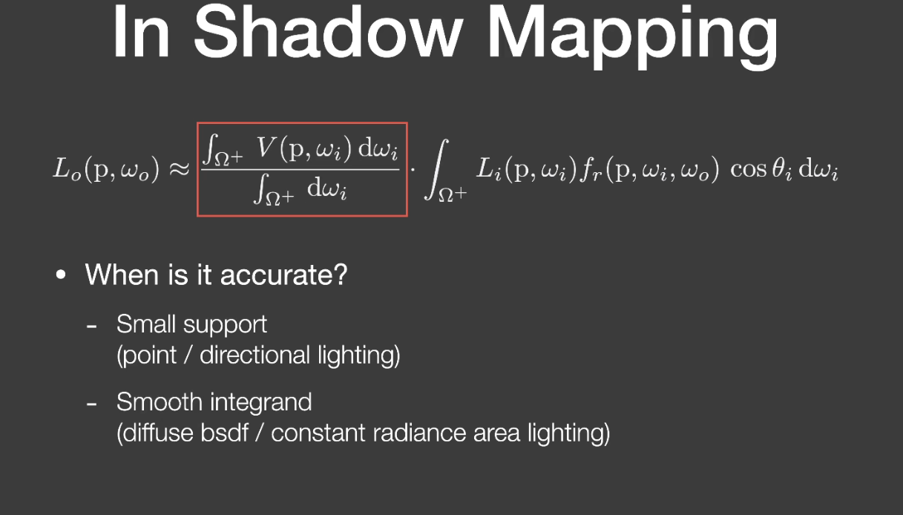
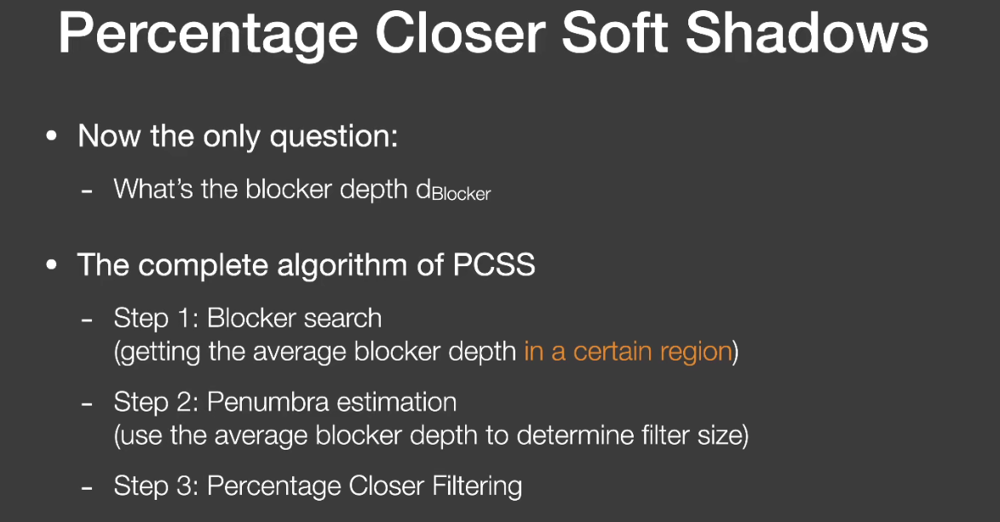
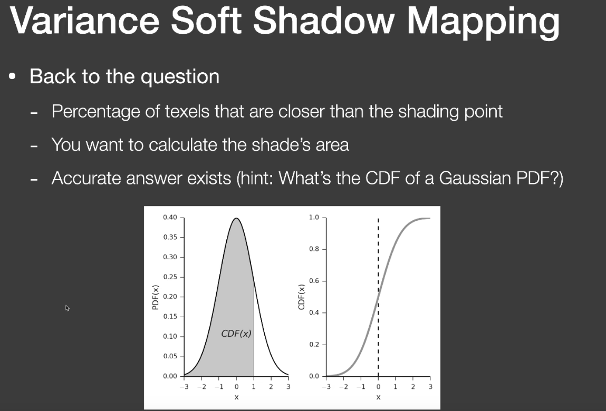
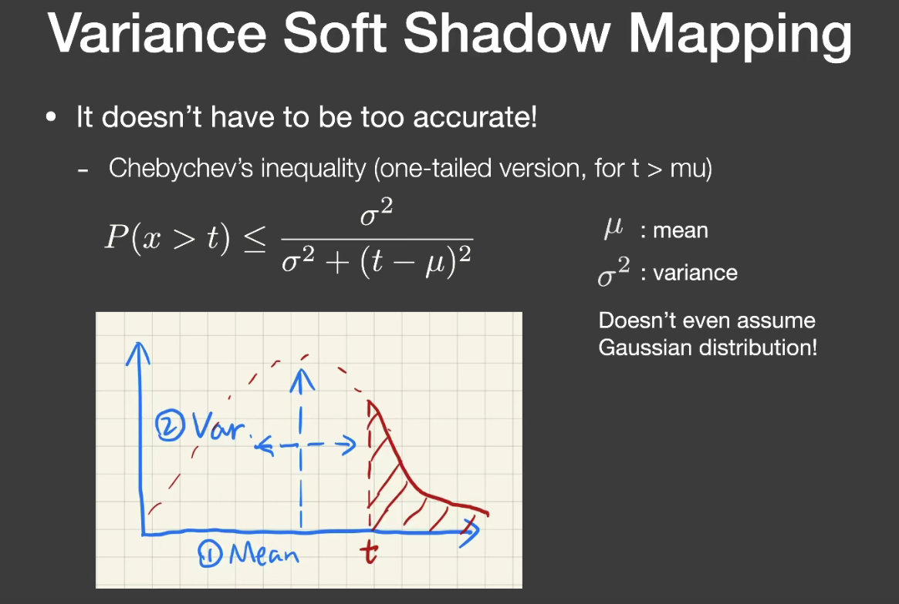
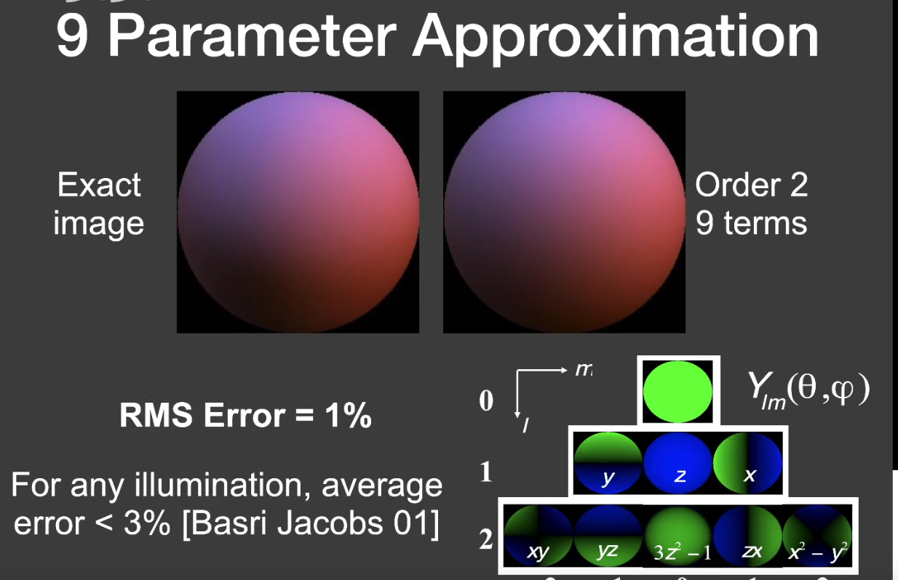
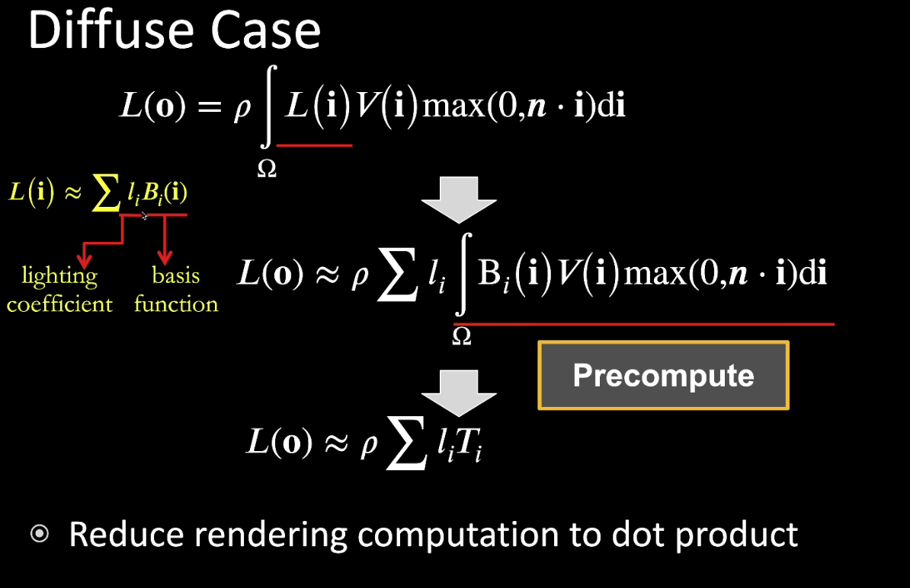

[TOC]

# Python

## 装饰器

最近想提高一下代码质量，发现高阶python编程的第一个建议就是善用装饰器，所以就过来研究一下装饰器相关的东西了。之前也看过很多遍，但总是看完就会，就觉得很好用，到用的时候又总是容易忘，然后又懒得去查，然后就懒得再用了。

这次长记性了，把一些常用的和不常用的装饰器用法都记录下来，下次使用的时候直接查一下markdown日志，也强迫自己多用，这样才能慢慢提高代码质量。

### 装饰器的理解

装饰器wrapper本质是重写func，返回一个包含原函数func功能的新的函数对象，但函数的名称、参数什么的都不会发生变化。对装饰器的理解能够加深python一切皆对象的理念。

```python
def deco():
    pass


@deco
def func():
    pass
```

等价于:

```python
def func():
    pass


def deco():
    pass


func = deco(func)
```

在给func套上装饰器@deco之后，原先的func就消失了，func被deco(func)
取代。如果希望保留原先func这样一个对象的话，有一种方式，在装饰器返回的对象中添加一个成员函数，用来存储你想要保存的原函数func对象:

```python
def deco(func):
    def inner():
        pass

    inner._f = func
    return inner


@deco
def func():
    pass
```

### 常用装饰器

最普通的装饰器，看代码就行

```python
def wrapper(func):
    def inner():
        print
        "before inner func()."
        func()
        print
        "after inner func()."

    inner._f = func  # 将func函数保存在wrapper内，保证需要的时候，可以通过func._f()来调用
    return inner


@wrapper
def foo():
    print
    "hello world."
```

### 上下文装饰器(contextlib decorator)

```python
# todo: 这个看过，也理解了一些内容，但是实际上一次都没用过。等真正遇到使用场景再来填这个坑吧
```

## 魔术方法(magic methods)

## 一些奇怪的小技巧

### 字符串反向处理

将字符串a进行反转

```python
a = '!dlrow olleH'

b = a[::-1]
# result:  b = 'Hello world!'#
```

### 智能开箱

一种比较酷的解压缩列表的方法

```python3(python2不支持这种方式)
a, *b, c = [1,2,3,4,5]

a = 1
b = [2, 3, 4]
c = 5
```

### 各种推导式

#### 列表推导式

使用[]生成list

```fake_code
variable = [out_exp_res for out_exp in input_list if out_exp == 2]
```

例子:

```python
list1 = [i for i in range(30) if i % 3 == 1]


def double(i):
    return 2 * i


list2 = [double(i) for i in range(20) if i % 3 == 0]
```

#### 字典推导

```python
d = {x: x % 2 == 0 for x in range(1, 11)}
```

## subprocess-子进程管理

### run()

### Popen()

今天在处理messiah-feature-hub的时候遇到一个问题，在程序自更新阶段出现软件卡死/在重新启动新进程失败的情况。代码断在了subprocess的Popen调用阶段。

## metaclass-元类

__metaclass__ = xxx

作用：在创建类的过程中实现一些自定义的操作(保证类对象是一个Singleton单例，用来给创建的类对象、函数方法包装装饰器等等)
,先讲讲class是啥，是一个对象，怎么创建的，由type创建的，type是一个class，metaclass是跟type类似的，创建一个类的类，metaclass一般会直接继承自type,或者重写__init__()
和__call__(),__new__()
，来实现创建类的方法。（改写__init__还是改写__new__取决于具体需求，如果需要在class对象创建的时候进行处理，则改写__new__
，如果在对象属性初始化的时候处理，则改写__init__即可）

metaclass本身来说并不复杂，复杂的是用metaclass来做的一些事情：利用metaclass来做类对象的内部审查，操纵继承或者修改类似于__dict__的变量之类的操作.

其本身本质非常简单:

1. 拦截一个类对象的创建
2. 修改类对象
3. 返回一个修改之后的类对象

```python
from functools import wraps


def hook_convert_to_expr(func):
    @wraps(func)
    def _wrapper(self, *args, **kwargs):
        r = func(self, *args, **kwargs)
        if r.__class__.__name__ == 'EAGetValue':
            from custom.pub.game_trigger.GameTrigger import GameTriggerArgFactory
            sub_type_cls = GameTriggerArgFactory.sub_arg_parser[self.arg_type]
            for key in dir(sub_type_cls):
                if getattr(sub_type_cls, key, None) == self.sub_type:
                    r.val_desc = key
                    break
        return r

    return _wrapper


class upmetaclass(type):
    def __new__(cls, name, bases, attrs):
        if 'convert_to_expr' in attrs:
            attrs['convert_to_expr'] = hook_convert_to_expr(attrs['convert_to_expr'])
        return super(upmetaclass, cls).__new__(cls, name, bases, attrs)
```

## magic methods-魔法方法

### __getattribute__

## Collections - 容器类

### Counter()- Dict子类，用于计数

```python
from collections import Counter

temp_dict = {1: 3, 5: 4, 2: 2}
ct = Counter(temp_dict)
print
ct.most_common
print[lambda num: num, _ in ct.most_common()]
```

## Lambda表达式

Lambda表达式实际上就是一个匿名函数，它的主要作用就是优化代码结构，让代码看起来更加整洁，

```python
lambda x: x + 10
```

等价于

```python
def anonymous_func(x):
    return x + 10
```

==========================================================================================================

# C++

```gcc compiler online
在线C++编译器，实时跑demo函数
https://www.onlinegdb.com/online_c_compiler
https://wandbox.org/
```

重新刷一遍《C++ Prime Plus》

## constexpr

C++11的改善——常量表达式，允许程序利用编译时的计算能力。

常量表达式主要是允许一些计算发生在编译时，即发生在代码编译而不是运行的时候。这是很大的优化：假如有些事情可以在编译时做，它将只做一次，而不是每次程序运行时。需要计算一个编译时已知的常量，比如特定值的sine或cosin？确实你亦可以使用库函数sin或cos，但那样你必须花费运行时的开销。使用constexpr，你可以创建一个编译时的函数，它将为你计算出你需要的数值。用户的电脑将不需要做这些工作。

### constexpr函数的限制

1.函数中只能有一个return语句

2.只能调用其他constexpr函数

3.只能使用全局constrexpr变量

[注] 递归并不受限制，但只允许一个返回语句。(三元运算符)

```c++
//计算n的阶乘
constexpr int factorial (int n)
{
    return n > 0 ? n * factorial( n - 1 ) : 1;
}
```

## 基础数据类型

### 占用空间大小

16bit 编译器：
char == 1 Byte;
short int == 2 Byte;
int == 2 Byte;
unsigned int == 2 Byte;
long == 4 Byte;
unsigned long == 4 Byte;
long long == 8 Byte;
float == 4 Byte;
double == 8 Byte.

32bit 编译器：
char == 1 Byte;
short int == 2 Byte;
int == 4 Byte;
unsigned int == 4 Byte;
long == 4 Byte;
unsigned long == 4 Byte;
long long == 8 Byte;
float == 4 Byte;
double == 8 Byte.

64bit 编译器：
char == 1 Byte;
short int == 2 Byte;
int == 4 Byte;
unsigned int == 4 Byte;
long == 4 Byte;
unsigned long == 4 Byte;
long long == 8 Byte;
float == 4 Byte;
double == 8 Byte.

指针变量所占字节
指针变量所占字节数是根据编译器的寻址空间决定宽度的：

16 bit编译器寻址空间为16 bit，所以指针变量宽度为2 Byte;
32 bit编译器寻址空间为32 bit，所以指针变量宽度为4 Byte;
64 bit编译器寻址空间为64 bit，所以指针变量宽度为8 Byte.
以上32bit & 64bit编译器均是在vs2017上测试所得

虚函数虚表占用4个字节, 空类只占1个字节。

## 内存管理

### 内存区域

内核空间、栈区、堆区、全局变量区、代码区、保留区

堆: new 分配空间, delete 释放空间

栈: {}内定义的变量，出了括号自动清理

全局变量区: .ddta非0值和.bss未初始化会存放在全局变量的两个地方

代码区： .text函数代码

保留区: 0地址开始的c库


## 智能指针

### unique_ptr

### shared_ptr, weak_ptr

## 数组

存储多个同类型值的数据格式，数组的通用格式:

```c++
typeName arrayName [arraySize]
-- arraySize必须是整型常数(如8，10)或者const值，也可以是常量表达式(8 * sizeof(int)),其所有的值在编译的时候都是已知的。
```

### 数组的初始化

只有在定义数组的时候才能使用数组初始化，此后就不能再使用了，也不能将一个数组赋值给另一个数组。只能使用下标分别给数组元素进行赋值。

```cpp
int card[4] = {3, 6, 8, 10};

int hand[4];

这两种方式都是ok的。

hand[4] = {5,6,7,8};  //错误！
hand = cards;         //错误!
```

初始化数组的时候，可以提供少于数组元素数目的值，这样编译器会自动把其他的元素设置为0.

如果初始化数组的时候方括号内([])为空，C++编译器将计算元素的个数。

```c++
short things[] = {1, 2, 3, 4}; 
```

[c++11]
列表初始化新增了一些功能

1.初始化数组的时候，可以省略等号(=):

```c++
double earnings[4] {1.2e4, 1/6e4, 1.1e4, 1.7e4};    //ok with c++11
```

2.可以不再大括号内包含任何东西，这将把所有元素都设置为0：

```c++
unsigned int counts[10] = {};
float balances[100] {};
```

3.列表初始化不允许缩窄转换

## 类大小的计算 -- sizeof

### 总结

1.空类的大小为1个字节

2.一个类中，虚函数本身、成员函数(包括静态和非静态)和静态数据成员都不占用类对象的存储空间。

3，对于包含虚函数的类，不管有多少个虚函数，只有一个虚指针,vptr的大小。

4.普通竭诚，派生类继承了所有基类的函数与成员，要按照字节对齐来计算大小。

5.虚函数继承，不管是单继承还是多继承，都是继承了基类的vptr。(32位系统4字节，64位系统8字节)

6.虚继承，继承基类的vptr。

## const关键字

## 类和结构的区别

c++中类和结构只有一个区别:

**类的成员默认是private,结构的成员是public**

## inline

在c/c++中，为了解决一些频繁调用的小函数大量消耗栈空间的问题，特别的引入了inline修饰符，表示为内联函数。

在系统下，栈空间是有限的，加入频繁大量的使用就会造成因栈空间不足而导致程序出错的问题。

inline以代码膨胀(复制)为代价，省去了函数调用的开销，从而提高了函数的执行效率。

[注]下列情况不宜使用inline:
1.函数体内的代码比较长，使用内联将导致内存消耗比较搞高。

2.如果函数体内出现循环，那么执行函数体内代码的时间要比函数调用的开销要大。

## lambda表达式

```refrence
https://docs.microsoft.com/zh-cn/cpp/cpp/lambda-expressions-in-cpp?view=msvc-160
```

C++11以及更高的版本中，lambda表达式是一种定义匿名函数对象的简便方法，在调用的位置或作为参数传递给函数的位置。Lambda通常用于封装传递给算法或异步方法的少量代码行。

```cpp  --在sort中使用lambda表达式定义cmp函数--
auto cmp = [](string left, string right) -> bool {
    return left + right > right + left;
};

sort(str.begin(), str.end(), cmp);

```

### 基础

Lambda 表达式的基本语法如下：

```c++
[捕获列表](参数列表) mutable(可选) 异常属性 -> 返回类型 {
// 函数体
}
```

上面的语法规则除了 [捕获列表] 内的东西外，其他部分都很好理解，只是一般函数的函数名被略去， 返回值使用了一个 ->
的形式进行（我们在上一节前面的尾返回类型已经提到过这种写法了）。

所谓捕获列表，其实可以理解为参数的一种类型，Lambda 表达式内部函数体在默认情况下是不能够使用函数体外部的变量的，
这时候捕获列表可以起到传递外部数据的作用。根据传递的行为，捕获列表也分为以下几种：

1. 值捕获
   与参数传值类似，值捕获的前提是变量可以拷贝，不同之处则在于，被捕获的变量在 Lambda 表达式被创建时拷贝， 而非调用时才拷贝：

```cpp
void lambda_value_capture() {
    int value = 1;
    auto copy_value = [value] {
        return value;
    };
    value = 100;
    auto stored_value = copy_value();
    std::cout << "stored_value = " << stored_value << std::endl;
    // 这时, stored_value == 1, 而 value == 100.
    // 因为 copy_value 在创建时就保存了一份 value 的拷贝
}
```

2. 引用捕获

与引用传参类似，引用捕获保存的是引用，值会发生变化。

```cpp
void lambda_reference_capture() {
    int value = 1;
    auto copy_value = [&value] {
        return value;
    };
    value = 100;
    auto stored_value = copy_value();
    std::cout << "stored_value = " << stored_value << std::endl;
    // 这时, stored_value == 100, value == 100.
    // 因为 copy_value 保存的是引用
}
```

3. 隐式捕获

手动书写捕获列表有时候是非常复杂的，这种机械性的工作可以交给编译器来处理，这时候可以在捕获列表中写一个 & 或 =
向编译器声明采用引用捕获或者值捕获.

总结一下，捕获提供了 Lambda 表达式对外部值进行使用的功能，捕获列表的最常用的四种形式可以是：
[] 空捕获列表
[name1, name2, ...] 捕获一系列变量
[&] 引用捕获, 让编译器自行推导引用列表
[=] 值捕获, 让编译器自行推导值捕获列表

4. 表达式捕获

上面提到的值捕获、引用捕获都是已经在外层作用域声明的变量，因此这些捕获方式捕获的均为左值，而不能捕获右值。

C++14 给与了我们方便，允许捕获的成员用任意的表达式进行初始化，这就允许了右值的捕获， 被声明的捕获变量类型会根据表达式进行判断，判断方式与使用
auto 本质上是相同的：

```cpp
#include <iostream>
#include <memory>  // std::make_unique
#include <utility> // std::move

void lambda_expression_capture() {
    auto important = std::make_unique<int>(1);
    auto add = [v1 = 1, v2 = std::move(important)](int x, int y) -> int {
        return x+y+v1+(*v2);
    };
    std::cout << add(3,4) << std::endl;
}
```

在上面的代码中，important 是一个独占指针，是不能够被 "=" 值捕获到，这时候我们可以将其转移为右值，在表达式中初始化。

### 泛型Lambda

上一节中我们提到了 auto 关键字不能够用在参数表里，这是因为这样的写法会与模板的功能产生冲突。 但是 Lambda 表达式并不是普通函数，所以
Lambda 表达式并不能够模板化。 这就为我们造成了一定程度上的麻烦：参数表不能够泛化，必须明确参数表类型。

幸运的是，这种麻烦只存在于 C++11 中，从 C++14 开始， Lambda 函数的形式参数可以使用 auto 关键字来产生意义上的泛型：

```cpp
auto add = [](auto x, auto y) {
    return x+y;
};

add(1, 2);
add(1.1, 2.2);
```

## new和malloc的区别

1.new和delete是操作符，可以重载，只能在C++中使用

malloc、free是函数，可以覆盖，C、C++中都可以使用

2.new可以调用对象的构造函数，对应的delete调用相应的析构函数

malloc仅仅分配内存，free仅仅回收内存，并不执行构造和析构函数

3.new、delete返回的是某种数据类型的指针

malloc、free返回的是void指针，需要强制类型转换后使用。

## ++i和i++

++i先自增1， 再返回

i++先返回i，再自增1

## C++程序编译的内存分配

C，C++程序编译时内存分为5大存储区：堆、栈、全局静态区、文字常量区、程序代码区

1.静态存储区分配
内存在程序编译的时候就已经分配好了，这块内存在程序的整个运行期间都存在。速度快、不容易出错，因为有系统会善后。例如全局变量,static变量，常量字符串等

2.

## Stack Overflow Special(编译器分支预测)- 为什么有序的c++/java array执行要比无序的快得多

<https://stackoverflow.com/questions/11227809/why-is-processing-a-sorted-array-faster-than-processing-an-unsorted-array>

==========================================================================================================

# Python Web

<https://zhuanlan.zhihu.com/p/25038203>

# 程序化生成世界

## 育碧FarCry5 GDC分享

## Python那点小事

### any/all

### sum, zip/map

### 工具：Process Explorer

检测程序调用dll顺序以及依赖关系

# 图形学

## MVP矩阵变换

### MVP矩阵

模型矩阵(Model), 观察矩阵(View),投影矩阵(Projection)

局部空间(Local Space)、世界空间(World Space)、观察空间(View Space)、裁剪空间(Clip Space)、屏幕空间(Screen Space)

### 正交投影

## Neox Cocos UI合批算法

通过计算UI在屏幕空间上的包围盒(矩形)的遮挡关系来进行绘制顺序的重排，达到减少批次的效果。算法原理比较直接：

1.对于一次绘制，向后查找到渲染状态完全一致的第一个批次(材质完全相同)。

2.对于找到的潜在可以合批的批次，计算这个批次与第一个批次之前的所有批次是否存在遮挡，如果有任何一个绘制有可能遮挡则不能合批，返回第一步继续查找下一个可能可以合批的批次。如果没有遮挡，则进行合批。

3.重复以上过程直到所有批次全部被处理。

算法的复杂度是O(n^2)到O(n^3),当dp数量变多的时候，性能会明显下降。

## Blinn Phong光照模型

Phong公式

```
color = ambient + diffuse + specular

最终颜色 = 直射光颜色 * 反射光颜色 * pow(max(0, dot(反射光方向, 视野方向)), 光泽度(gloss)) + 漫反射颜色 + 环境光颜色
```

Blinn Phong公式

```
color = ambient + diffuse + specular

最终颜色 = 直射光颜色 * 反射光颜色 * pow(max(0, dot(法线方向, 视野与光线中间向量)), 光泽度(gloss)) + 漫反射颜色 + 环境光颜色
```

在Phong模型中，必须计算V·R的值，其中R为反射光线的单位向量，V为视线方向的单位向量，但是在BlinnPhong模型中，用N·H的值来取代V·R。BlinnPhong光照模型公式：

Phong模型会出现光照截断或者过度不自然的现象。这是由于反射光方向和视线方向夹角小于90，才会使镜面反射的值为非零。

BlinnPhong使用视线与反射光线的中间向量与法线的点乘进行计算，这样做在任何情况下镜面反射都不会小于0。从而解决Phong模型面临的问题。

BlinnPhong模型最大的问题在于能量不守恒，没法应用在Ray-Tracing中。其次，BlinnPhong模型没法表达复杂模型的细节(
塑料感非常严重)。


## 环境光遮蔽Ambient Occlusion

## 屏幕空间环境光遮蔽 Screen Space Ambient Occlusion

便于实时计算，降低ao性能消耗

## unity shader

基础语法基本掌握, vs ps语法定义，但是对于unity内置函数、内置变量这块，还需要通过多实践使用来掌握

## Q:为什么纹理图的尺寸一般是2的幂次

1、图片的纹理像素在Unity3D中需要遵循2的N次方，一般是由显卡限制决定的，只识别2的N次方。

非2的N次方的图片会转化为2的N次方图片（500 x 500 → 512 x 512）,是因为转化过程比较慢，由运行程序转换十分耗时，所以Unity3D提前将资源转化为符合标准的图片。

2、ios pvrtc的原因，有些GPU不支持NPOT，遇到NPOT会有一个转换POT的过程，浪费性能，

因此，建议都是用POT。

## SSAA, MSAA, FXAA

常用抗锯齿三种方案，目前主流的游戏一般是采用MSAA+FXAA的方式(csgo)。

SSAA对于资源的精度要求过高，MSAA是对SSAA的优化，降低了资源精度，也损失了一定的AA效果。

FXAA的原理很简单，通过对需要AA区域进行模糊从而实现AA的效果。

[注]:目前主流的编辑器中，延迟渲染模式下面无法开启MSAA,是受限于性能。延迟渲染一般要输出3-4个RT(depth, normal, color,
specular),按照4xMSAA来计算,那么就是原先4倍的内存和带宽消耗，得不偿失。所以一般延迟渲染模式下面使用的是TAA，FXAA或者边缘检测处理技术

### SSAA

传统超采样，target render 600*800, 我们先将场景渲染到1200*1600的buffer上，然后基于这个结果采样到600*800，暴力但有效，性能很耗

### MSAA

在光栅化阶段，判断一个三角形是否被像素覆盖的时候会计算多个覆盖样本（Coverage sample），但是在pixel
shader着色阶段计算像素颜色的时候每个像素还是只计算一次。例如下图是4xMSAA，三角形只覆盖了4个coverage
sample中的2个。所以这个三角形需要生成一个fragment在pixel shader里着色，只不过生成的fragment还是在像素中央（位置，法线等信息插值到像素中央）然后只运行一次pixel
shader，最后得到的结果在resolve阶段会乘以0.5，因为这个三角形只cover了一半的sample。现代所有GPU都在硬件上实现了这个算法，而且在shading的运算量远大于光栅化的今天，这个方法远比SSAA快很多。


MSAA的一个问题就是和现在大街小巷都是的deferred shading框架并不是那么兼容。因为用deferred
shading的时候场景都先被光栅化到GBuffer上去了，不直接做shading。

### TAA, FXAA

因为MSAA这个问题现代引擎里都用的是Post Processing AA这一类技术。这一类东西包括FXAA，TXAA等，不依赖于任何硬件，完全用图像处理的方法来搞。有可能会依赖于一些其他的信息例如motion
vector
buffer或者前一贞的变换矩阵来找到上一贞像素对应的位置，然后再做一些hack去blur或者blend上一贞的颜色等。通常非常hacky，FXAA的发明人原来是我们组的，他自己都不知道这个为什么会work- -”

## NavMesh寻路算法

## 静态合批，动态合批和gpu instance

[ref]: https://zhuanlan.zhihu.com/p/98642798

[IMP]: **合批处理是针对CPU向GPU提交数据的优化，GPU Instance是针对GPU绘制的优化处理。**

优先级关系：静态批处理>GPU Instance>动态批处理。

### 静态合批

静态合批采用了以空间换时间的策略来提升渲染效率。

静态合批并不减少Draw call的数量([tip]这里好像有点争议，unity5.x之后frame debugger中显示draw call是减少了的)
，但是由于我们预先把所有的子模型的顶点变换到了世界空间下，并且这些子模型共享材质，所以在多次Draw
call调用之间并没有渲染状态的切换，渲染API会缓存绘制命令，起到了渲染优化的目的。另外，在运行时所有的顶点位置处理不再需要进行计算，节约了计算资源。

缺点:

1.打包之后体积增大，应用运行时所占用的内存体积也会增大。（如果静态合批前一些物体共享了相同的mesh网格，在内存中每一个物体都会对应一个该mesh网格的复制品。）

2.需要额外的内存来存储合并的几何体。

3.注意如果多个GameObject在静态批处理之前共享相同的几何体，则会在编辑器或运行时为每个GameObject创建几何体的副本，这会增大内存的开销。例如，在密集的森林级别将树标记为静态可能会产生严重的内存影响。

4.静态合批在大多数平台上的限制是64k顶点和64k索引

5.包含模型空间的顶点动画的shader无法参与合批，因为合批之后模型空间会丢失。

6.如果场景中包含了除了平行光以外的其他光源，并且在shader中定义了额外的pass来处理它们，这些额外的pass部分是不会被批处理的。

### 动态合批

原理:

[ref]: https://zhuanlan.zhihu.com/p/34499251

在使用相同材质球、相同Mesh(预设体的实例会自动地使用相同的网格模型和材质)的情况下，Unity会在运行时对于正在视野中的符合要求的所有对象使用Constant
Buffer[5]将其位置、缩放、uv偏移、lightmapindex等相关信息保存在显存中的“统一/常量缓冲器”[6]
中，然后从中抽取一个对象作为实例送入渲染流程，当在执行DrawCall操作后，从显存中取出实例的部分共享信息与从GPU常量缓冲器中取出对应对象的相关信息一并传递到下一渲染阶段，与此同时，不同的着色器阶段可以从缓存区中直接获取到需要的常量，不用设置两次常量。比起以上两种批处理，GPU
Instancing可以规避合并Mesh导致的内存与性能上升的问题，但是由于场景中所有符合该合批条件的渲染物体的信息每帧都要被重新创建，放入“统一/常量缓冲区”中，而碍于缓存区的大小限制，每一个Constant
Buffer的大小要严格限制（不得大于64k）。

动态合批是专门为优化场景中共享*同一材质*的动态GameObject的渲染设计的。目标是以最小的代价合并小型网格模型，减少Drawcall。

动态合批的原理也很简单，在进行场景绘制之前将所有的共享同一材质的模型的顶点信息变换到世界空间中，然后通过一次Draw
call绘制多个模型，达到合批的目的。模型顶点变换的操作是由CPU完成的，所以这会带来一些CPU的性能消耗。

限制：

1，900个顶点属性以下的模型。

2，如果两个模型缩放大小不同，不能被合批的，即模型之间的缩放必须一致。

3，合并网格的材质球的实例必须相同。即材质球属性不能被区分对待，材质球对象实例必须是同一个。

4，如果他们有Lightmap数据，必须相同的lightmap才有机会合批。

5，使用多个pass的Shader是绝对不会被合批。因为Multi-pass Shader通常会导致一个物体要连续绘制多次，并切换渲染状态。这会打破其跟其他物体进行Dynamic
batching的机会。

6，延迟渲染是无法被合批。

### 共享材质

无论是动态批处理还是静态批处理，都要求模型之前需要共享同一个材质。

但是不同的模型之间总会需要有不同的渲染属性，比如不同的纹理、颜色等。这个时候，我们需要一些策略来尽可能地合并材质。

如果两个材质之间只有使用的纹理不同，我们可以把这些纹理合并到一张更大的纹理中，这张更大的纹理被称为一张图集(atlas)
。一旦使用了同一张纹理，我们就可以使用同一个材质，再使用不同的采样坐标对纹理进行采样就行。

处理纹理不同外，不同的物体在材质上可能还有颜色不同、浮点属性不同这些微小的调整。这时我们可以通过对VBO(vertex buffer object)
数据进行控制，存储对应的颜色、顶点属性数据，实现共享材质的效果。

Renderer.sharedMaterial的修改会应用到所有使用该材质的物体上面。Renderer.material会创建一个材质的复制品，从而破坏批处理在该物体上的应用，这反而不是我们希望看到的。

#### 关于批处理的注意事项

1.尽可能选择静态合批处理，但需要时刻小心对于内存的消耗，且需要注意经过静态合批的物体不可以再被移动。

2.如果无法进行静态批处理，需要使用动态批处理的话，要让物体少并且尽可能让这些物体包含少量的顶点属性和顶点数目。

### GPU Instancing

[ref]: https://zhuanlan.zhihu.com/p/34499251

(动态、静态)合批优化的是cpu向gpu提供的数据，instancing优化的是gpu的绘制。

instancing通过对一个模型采样，在不同位置上绘制rt，来实现性能优化。

static batch, dynamic batch之外的一种降低draw call的方式，官方给出的介绍：

```
Use GPU Instancing to draw (or render) multiple copies of the same Mesh at once, using a small number of draw calls. It is useful for drawing objects such as buildings, trees and grass, or other things that appear repeatedly in a Scene.

GPU Instancing only renders identical Meshes with each draw call, but each instance can have different parameters (for example, color or scale) to add variation and reduce the appearance of repetition.

GPU Instancing can reduce the number of draw calls used per Scene. This significantly improves the rendering performance of your project.
```

官方manual:在材质部分打开"enable instancing"从而开启gpu instancing(只支持standard surface shader)

但是这里有一个限制,lightmap没法开启，骨骼动画没法开启。并且开启了instancing的材质没法参与静态合批。

在网上看到有通过脚本自行实现gpu instancing的方法，可以实现lightmap和骨骼动画等的gpu instancing。

[补充]: 在unity shader中添加

```
# pragma multi_compile_instancing#
```

[comment]: <>(具体实现没细看,找时间了解一下)

# Unity

## Update和FixedUpdate

update渲染帧，每两帧之间的执行时间不能保证完全一致。fixedupdate物理帧，保证两帧之间的执行间隔完全一致。

实验证明，update和fixedupdate都是在同一个线程里面执行的(其实整个unity的脚本都是在同一个线程中运行的)
，所以如果update或者fixedupdate卡了，都会互相影响对方的执行。

# ECS

跟OOP最大的区别是面向对象和面向数据。

OOP在游戏中的概念可以抽象为Gameobject+Component的方式，而ECS可以理解为面向数据库编程。

## unity ECS

DOTS: ECS, Job System, Burst

# 图形学

## 光照

## ShadowMap 阴影

### Cascade ShadowMap 级联阴影

给不同位置的shadow以不同的分辨率(距离相机较近的地方分辨率高，较远的地方分辨率低)

做远距离阴影大多用这套，按照相机的距离，分配纹理空间，可以缓解相机和灯光空间像素不匹配导致的阴影失真。CSM是动态阴影技术，每帧需要渲染多张shadowmap，缺点是大量的物体需要每帧渲染，部分动态静态。大视距用到8级cascades的前4级每帧更新，后面4级一般采用轮流更新的方式，确保每8帧所有cascades都能至少更新一次。

CSM通常都把地形排查在外，即使分帧更新cascade，大地型的渲染填充率还是非常高。原神的地形不是真的地形而是石头山呀的模型，可以避开这个问题。

### 软阴影

### 渲染路径(render path)

#### 前向渲染路径(forward render)

对于前向渲染，一个unity shader通常会定义一个base pass和一个additional pass。一个base pass仅会被执行一次，一个additional
pass会根据影响该物体的其他逐像素光源的数目被多次调用(每个逐像素光源都会执行一次additional pass)。

1.base pass
支持阴影渲染,可以在pass中访问访问光照纹理(lightmap),环境光和自发光只需要计算一次，无需叠加，所以是在base pass中计算

2.additional pass
默认情况下没有阴影效果，需要在pass中使用

```
#pragma multi_compile_fwdadd_fullshadows
```

替代

```python
# prgama multi_compile_fwdadd
```

为点光源和聚光灯开启阴影效果。

#### 延迟渲染路径(deffered render)

延迟渲染主要包含了2个pass，第一个pass不进行光照计算，仅仅利用深度缓冲，计算可见片元，存储到G-buffer中(depth, normal, light
specular, albedo等)。在第2个pass中，利用G-buffer中的信息，进行光照计算

[注] g-buffer不存position信息，这里可以根据depth + 屏幕像素坐标反推出来

[缺点]
1.无法支持真正的抗锯齿技术(SSAA, MSAA)
2.无法处理半透明物体
3.对于显卡有一定的要求， 支持MRT， shader mode >= 3.0, 深度渲染纹理和双面模板缓冲

[tip]
延迟渲染的效率不依赖与场景的复杂度(光照类型、数量等)，而是和使用的屏幕空间的大小有关系。

移动端一般不会采用延迟渲染：
1.无法硬件AA（MSAA, SSAA等），一般只会采用FXAA+TAA这种优化方式
2.无法处理透明物体渲染(目前的主流引擎不支持)，理论上srp可以自己实现
3.移动端游戏一般光源数量不是特别多，采用延迟渲染的方式对于性能太耗(主要是G-buffer)。(n *pass* pixel_num )

但是在非移动平台，多光源场景下，延迟渲染比前向渲染有着更好的性能效果。

且延迟渲染可以结合SSAO，效果比较好。（[todo]:待看）

#### G缓冲（G-Buffer）

默认的G-buffer RT包含了如下几个渲染纹理(render texture, RT)：

1.RT0: ARGB32, RGB通道用于存储漫反射颜色，A通道未使用
2.RT1: ARGB32, RGB通道用于存储高光反射颜色， A通道用于存储高光反射的指数部分
3.RT2: ARGB2101010, RGB通道用于存储法线， A通道未使用
4.RT3: ARGB32(非HDR)或ARGBHalf(HDR),用于存储自发光+lightmap+反射探针(reflection probes)
5.深度缓冲和模板缓冲

### Ramp贴图

一般用在卡通渲染上面，给模型一个有分界的渐变过渡。先计算一个半兰伯特（也可以是phong,
blinn-phong），然后将ramp的uv.x映射到半兰伯特上，生成ramp贴图。通常实现明暗变化。

### 高级纹理

#### 立方体纹理(skybox、环境映射)

采样方式：以立方体中心为原点，通过vec3方向跟立方体求交集，交点即为采样点。

### 反射、菲涅尔反射

### 折射

通过折射实现镜面雨滴：<https://www.youtube.com/watch?v=0flY11lVCwY>

## 动画

### 顶点动画

1.广告牌技术

根据视角方向来旋转一个被纹理着色的多边形(通常就是简单的四边形)，通常哟宏宇渲染烟雾、云朵、闪光效果等。

[注]
模型空间下进行的顶点动画，会被批处理破坏动画效果。因为批处理会破坏模型空间，导致顶点动画失效。通常可以通过subshader的disablebatching标签来取消批处理。

在处理顶点动画阴影的时候，在ShadowCasterPass中，也需要对阴影顶点做和模型顶点动画相同的offset偏移，保证在模型顶点动画播放的情况下，阴影也能正确的显示。

## 后处理

### 边缘检测

利用边缘检测算子对图像进行卷积操作的结果。

#### 卷积和卷积核，边缘检测算子

Sobel算子，由于阴影和纹理会影响边缘检测的效果，我们通常会在屏幕的深度纹理和法线纹理上进行边缘检测

【Roberts算子】
只计算左上角和右下角的差值，乘以右上角和左下角的差值，作为凭据边缘的依据。

### 高斯模糊

模糊的普通方式：

1.均值模糊:卷积后得到的像素值是其邻域内各个像素值的平均值。

2.中值模糊：邻域内对所有像素排序后的中值替换掉原先颜色。

[高斯方程]

Bloom效果实现原理：
根据一个阈值提取出图像中较亮的区域，把它们存储在一张rt中，利用高斯模糊对这张渲染纹理进行模糊处理，模拟光线扩散的效果，最后将其和原图像进行混合，得到最终的效果。

[运动模糊 motion blur]
方式一：利用累计缓存混合多张连续的图像后，取平均值作为最后的运动模糊图像(性能消耗很大， rt*n)

该方式还可以在保存之前的渲染结果的情形下，把当前的渲染图像叠加到之前的渲染图像中，从而产生一种运动轨迹的视觉效果。相比较于累计缓存，性能稍好但结果可能会略微有些影响。

方式二：速度缓存，该缓存中存储了各个像素当前的运动速度，利用该值来决定模糊的方向和大小

通过深度纹理在片元着色器中为每个像素计算器在世界空间下的位置，使用前一帧中的位置和当前帧的位置计算差值得到像素速度，使用该速度对它的邻域像素进行采用，相加后取平均值，从而实现在当前帧的运动模糊效果。

【注】
当前的两种方式适用于场景静止、摄像机快速运动的情况，如果面临一个物体快速运动而相机静止的场景，会发现不会产生任何的运动模糊。这种情况下可以通过模型运动法线反方向拖尾实现运动模糊。

[Tip]
我们可以在unity中缓存任何纹理，通过使用unity的着色器替换(shader replacement)功能，即调用Camera.RenderWithShader(shader,
replacementTag)函数，把整个场景重新渲染一遍得到。

#### 全局雾效果

由深度纹理重建每个像素在世界空间下的位置，使用一个基于高度的公式计算雾效的混合系数，最后使用该系数来混合雾的颜色和原屏幕的颜色

### 非真实渲染 Non-Photorealistic Rendering, NPR

#### 轮廓线渲染 outline

在《Real Time Rendering》中，作者将这些方法分成了五种类型、
1.基于观察角度和表面法线的轮廓线渲染。这种方法使用视角方向和表面法线的点乘结果来得到轮廓线信息。这种方法建大快速，可以在一个pass中得到渲染结果，但局限性很大，很多模型渲染出来的描边效果都不尽如人意。

2.过程式集合轮廓线渲染。这种方法的核心是使用两个pass渲染。第一个pass渲染背面的面片，并使用某些技术让它的轮廓可见(
比如使用轮廓线颜色来给整个背面着色，并沿着边缘法线方向外扩一定距离)
。第二个pass再渲染正面的面片。这种方法快速有效，并且适用于绝大多数表面平滑的模型，它的缺点是不适合立方体这样平整的模型，同时两个pass会带来性能的消耗和合批上的问题。

3.基于图像处理的轮廓线渲染。(基于深度、法线纹理，利用卷积算子进行边缘检测)。局限在于深度和法线变化很小的轮廓无法被检测出来，比如桌子上的纸张。

4.基于轮廓边检测的渲染。先检测出精准的轮廓边，通过检查和这条边相邻的两个三角面片是否满足: (n0*v > 0) != (n1*v>0)。(
n0和n1分表表示两个相邻三角面片的法向，
v是从视角到该边上任意顶点的方向。本质就是检查两个相邻三角面片是否一个朝正、一个朝背面。)
该方法的缺点在于实现相对复杂，同时会有动画连贯性的问题，在帧与帧之间可能会出现跳跃性。

5.混合上述方法。先找到精准的轮廓边，把模型和轮廓边渲染到纹理中，使用图像识别的方法识别出轮廓线，在图像空间下进行风格化渲染。

【注】
顶点法线外扩无法处理内凹的模型，可能发生背面面片遮挡正面面片的现象。为了尽可能防止出现这样的情况，在扩张背面顶点之前，首先对顶点法线的z分量进行处理，使他们等于一个定值，然后把法线归一化后再对顶点进行扩张。这样的好处在于或战后的背面更加扁平化，降低了遮挡正面面片的可能性。

#### 素描风格渲染

基于microsoft SIGGRAPH2001 Tonal Art Map

### 噪声

### unity中的渲染优化技术

#### 影响性能的主要因素

1. CPU

<1> 过多的draw call
<2> 复杂的脚本或者物理模拟
[优化]
使用批处理技术减少draw call数量
优化脚本逻辑和物理模拟复杂度

2.GPU

<1> 顶点处理
a. 过多的顶点
b. 过多的逐顶点计算

<2> 片元处理
a.过多的片元(可能是由分辨率导致的，也可能是由于overdraw造成的)
b.过多的逐片元计算

[优化]
减少需要处理的顶点数目:
1.优化几何体
2.使用模型的LOD技术
3.使用遮挡剔除技术

减少需要处理的片元数目：
1.控制绘制顺序
2.警惕透明物体
3.减少实时光照

减少计算复杂度：
1.使用shader的LOD技术
2.代码优化

3.带宽

<1> 使用了尺寸很大且未压缩的纹理
<2> 分辨率过高的帧缓存

[优化]
1、较少纹理大小
2.利用分辨率进行缩放

#### God Ray和LUT(Lookup Texture)

一些常用的trick，模拟多光源和复杂光线效果，优化性能的方式

LUT在运行时刻，使用光源方向、视角方向、发现方向等参数，对LUT采样得到光照结果。这样可以让我们使用更出色的光照模型，比如更复杂的BRDF模型，还可以利用查找纹理的大小来进一步优化性能，(
主要npc采用大分辨率的LUT，次要npc采用小分辨率的LUT)

### 降低带宽

#### 减少纹理大小

1.多级渐远纹理(mipmaps)

增大了内存消耗，但提高了性能，降低了带宽消耗

2.纹理压缩

### 减少计算复杂度

1.shader的LOD技术
跟模型的LOD类似，shader的LOD可以控制使用shader等级，只有LOD值小于某个设定的值，该shader才会被使用，使用了那些超过设定值shader的物体将不会被渲染。

2.代码优化

### 基于物理着色: 双向反射分布函数BRDF

<https://zhuanlan.zhihu.com/p/21376124>

### PBS(PBR)基于物理的着色(渲染)

PBS并不意味着游戏画面需要追求和照片一样真实的效果。PBS的优点在于，我们只需要一个万能的shader就可以渲染相当一大部分类型的材质，而不是使用传统的做法为每种材质写一个特定的shader。同时，PBS可以保证在各种光照条件下，材质都可以自然地和光源进行交互，而不需要我们反复地调整材质参数。

PBS的代价，需要更复杂的光照配合，比如大量使用光照探针和反射探针等。PBS也需要开启HDR以及一些必不可少的屏幕特效，例如抗锯齿、Bloom和色调映射，如果这些对于当前游戏来说需要消耗过多的心梗，那么PBS久不适合当前的游戏，我们还是需要使用传统的shader来渲染游戏。

PBS对美术的要求也是一项挑战，美术资源的制作过程和使用传统的shader有很大的不同，普通的法线纹理+高光反射纹理的组合不再适用，我们需要创建更细腻复杂的纹理集，包括金属值纹理、高光反射纹理、粗糙度纹理、遮挡纹理，游戏还需要使用额外的细节纹理来给材质添加更多的细节。

### Image Based lighting(IBL)

IBL是一种伪装全局光照的方法，使用该方法可以获得较好的视觉效果并且可以达到实时渲染的目的。

# 《Redis设计与实现》

## 字符串--SDS(Simple Dynamic String)

Redis使用的字符串其实是基于C语言的字符串，字符串以'\0'结尾。

### 空间预分配

1.如果对于SDS修改之后,SDS的长度小于1MB,那么预分配的free空间长度=已使用的buf空间长度

2.如果对于SDS修改之后，SDS的长度大于1MB，那么会预分配1MB的free空间

通过预分配冗余空间的方式，减少字符串修改、拼接带来的空间重分配的性能影响。

### 惰性空间释放

未使用的空间不会立即被释放，而是会将空间长度存储在free属性中，等待未来使用。

## 链表

双端、无环、带表头指针和表尾指针、带链表长度计数器、多态

## 跳跃表

跳跃表(skiplist)是一种有序的数据结构，他通过在每个节点中维持多个指向其他节点的指针，从而达到快速访问节点的目的。

节点查找复杂度平均O(logN)，最坏O(N)。大多数情况下，跳表的效率可以跟平衡树相媲美，并且因为跳表的实现要比平衡树简单，所以很多程序都使用跳表来替代平衡树。

Redis只在两个地方用到了跳跃表，一个是实现有序集合键，另外一个是在集群节点中用作内部数据结构，除此之外，跳跃表在Redis中没有其他用途。

### zskiplist和zskiplistNode

#### zskiplistNode

1.层：层用来存储前进指针和跨度。节点层的数量越多，访问其他节点的速度就越快，但消耗的内存空间也就更大。每次创建一个新的跳跃表节点的时候，程序都会根据幂次定律随机生成一个介于1和32之间的值作为level数组的大小，这个大小就是层的高度。

2.前进指针： 指向表尾方向，用于从表头向表尾方向访问节点。

3.跨度： 用于记录两个节点之间的距离。 两个节点之间的跨度越大，他们相距的就越远。指向NULL的所有前进指针的跨度都为0.

4.后退指针：反向遍历跳跃表

5.分值和成员： 跳跃表中所有节点按照分值从小到大排序， 成员对象是一个指针，指向一个字符串对象，字符串对象保存着一个SDS值。

#### zskiplist

zskiplist结构用来持有zskiplistNode,方便对于整个跳跃表进行处理，比如快速访问跳跃表的表头节点和表尾节点，或者快速地获取跳跃表节点的数量等信息。

# 算法

## 二叉树的遍历

### 深度优先遍历 DFS

```algorithm-cpp
void dfs(TreeNode* node){
    if (!node) return;
    dfs(node -> left);
    dfs(node -> right);
}
```

### 广度优先遍历

```algorithm-cpp
void bfs(TreeNode* root) {
    queue<TreeNode* > q;
    q.push(root);
    while (!q.empty()){
        TreeNode* node = q.pop();
        if (node -> left) q.push(node -> left);
        if (node -> right) q.push(node -> right);
    }
}
```

# GAMES101-现代计算机图形学

# EP: Raster #

## 采样所带来的的问题：(Aliasing Artifacts)

1.锯齿 2.摩尔纹(手机拍显示器屏幕) 3.Wagon wheel effect - sampling in time
原因： Signals are changing too fast(high frequency), but sampled too slowly

## 反走样思路

1. Pre-Filter/Blur before sampling采样前先做一次模糊(滤波) FXAA

Convolve ==> Sampling

MSAA(Multi-Sample Anti-Aliasing)
核心在于通过过采样模糊光栅化三角形的像素，解决的主要是信号模糊的操作。

这是MSAA跟SSAA的最大区别！

### MileStones

1.FXAA (Fast Approximate AA)
图像的后期处理，先得到一个有锯齿的图，然后找到锯齿边界，再通过一种方式将锯齿边界替换为没有锯齿的边界(非常高效)

2.TAA (Temporal AA)
时序AA，找上一帧的信息，复用上一帧像素的值来进行AA（主要针对静态物体）

### Super resolution / super sampling

From low resolution to high resolution

Essentially still "not enough samples" problem

DLSS(Deep Learning Super Sampling)

## 频域(Frequency Domain)

### 滤波

傅里叶变换，

高通滤波--过滤低频信号，得到高频信号图像：代表着图片像素的边界 (边缘图像检测，sober算子)

低通滤波--过滤高频信号，留下低频信号图像： 图像会变得非常模糊 (高斯模糊)

Filtering = Convolution = (Averaging)
滤波 = 卷积 = 平均

### Convolution 卷积

卷积定理：时域的卷积等于频域的乘积

Box Filter(低通滤波，均值滤波)

### Sampling 采样 = Repeating Frequency Contents 重复频域内容

#EP: Shading着色#

画家算法

Z-Buffer解决画家算法无法解决的绘制顺序问题

## Shading_1

### 定义

The darkening or coloring of an illustration or diagram with parallel lines or a block of color. -- Merriam-Webster
Dictionary

在图形学中:
The process of applying a material to an object.
对不同的物体应用不同的材质。

## Blinn-Phong Reflection Model

Specular , Diffuse, Ambient


### Diffuse Reflection

Light is scattered uniformly in all directions
入射光线被均匀地从所有方向反射出去


### Lambertian(Diffuse) Shading


Ld = kd*(I/r^2)*max(0, n·l)

Shading independent of view direction.

## Shading_2

### Specular Term(Blinn-Phong)

Intensity depends on view direction.

### Ambient Term

Shading that does not depend on anything.


Ambient + Specular + Diffuse = Blinn_Phong Reflection

### Shading Frequencies着色频率

Flat shading 面/ Gouraud shading 顶点/ Phong shading像素

### Graphics(Real-time Rendering) Pipeline 实时渲染管线


### Texture Mapping纹理映射

### Interpolation Across Triangles: Barycentric coordinates 三角形内的插值：重心坐标

Interpolate Content: Texture coordinates, colors, normal vectors, ...

### Bilinear interpolation 双线性插值


### Mipmap

Allowing(fast, approximate, square) range queries.(快，但是不准确，正方形范围查询)


级数求和，多了1/3的图片内存占用。

### Trilinear lerp


#### Mipmap的缺陷--Overblur


### Anisotroic Filtering 各向异性过滤


``
会多消耗3倍的存储空间

## Environment Map

Spherical Environment Map

将环境光记录在一个球体上，并且展开成一张环境贴图

### 3D Texture volumn rendering

### AO Texture

#EP: Geometry几何阶段#

## Implicit/ Explicit

## Distance Fuctions

giving minimum distance (coutld be signed distance) from anywhere to object.

## Point Cloud 点云

### Wavefront Object File(.obj)


## Bezier Curves 贝赛尔曲线

## Surfaces

### Bezier Surface 贝塞尔曲面

### Catmull-Clark Subdivision

根据奇异点进行曲面细分

奇异点：度数不等于4的点

### Mesh Simplification

边坍缩 L2 Distance距离最小， 优先队列/最小堆

## Shadows

### Shadow mapping

2phase， 先从光源采深度图，再从相机视角采深度图，能被相机看到，但是光源看不到的地方就是shadow区域

shadow map分辨率会影响阴影质量，分辨率低，会导致阴影边缘锯齿，分辨率高会占用过多的内存和计算性能

### Soft shadow maps 软阴影(半阴影)


点光源不存在软阴影

#EP: Ray Tracing#

为什么要光追：光栅化没法很好的表现全局效果(soft shadows, glossy reflection, indirection illumination)

Ray tracing is accurate, but is very slow.

Rasterization: real-time, ray tracing: offline.

## Whitted-Style Ray Tracing

### Ray-Intersection with Box

Axis-Aligned Bounding Box(AABB)

光追加速--光线不跟包围盒有交点，则包围盒内的物体都无需处理光线交点。

## Uniform Spatial Partitions(Grids) 光线追踪加速结构

### Spatial Partitions


### Object Partitions & Bounding Volume Hierarchy(BVH)

不按照空间划分，而是按照物体划分，求包围盒。

BVH的包围盒不是空间上的严格隔离，是可以相交的。
KD-Tree的包围盒在空间上是相互不相交的。

#### Building BVHs

1.根据空间较长的轴划分。
Always choose the longest axis in node.

2.取中间物体所在的位置进行划分
Split node at location of median object.

## Basic radiometry 辐射度量学

Radiant flux, intensity, irradiance, radiance.

Perform lighting calculations in a physically correct manner.

### Radiant energy and Flux(Power)


#### Measurement of lights


Radiant Intensity


Ω = A/r^2 立体角= 面积/半径的平方

Inensity: 光源在任意一个方向上的强度。

Irradiance


Radiance


### Bidirectional Reflectance Distribution Function(BRDF)


L = E + KL ==> L = (1-K)^-1 * E ==> L = E + KE + K^2*E + K^3*E + ...

E: 自发光, KE: 直接光照， K^2E: 间接光照, 高阶KE: 全局光照

### Monte Carlo Integration 蒙特卡洛积分


### Path Tracing 路径追踪

N=1的蒙特卡洛积分就是路径追踪

路径追踪只能处理面光源，无法解决点光源问题

将dw在半球面上的立体角积分，转变为dA在光源上的面积积分。

PDF 概率分布函数， RR 俄罗斯轮盘解决概率问题.

蒙特卡洛积分解决非显示表达式的积分问题。

Radiance -> Color ====>  Gamma校正

#EP: Material and Apperance#

## Diffuse/Lambert Material


漫反射BRDF

BSDF = BTDF + BRDF 反射 + 折射 = 散射

## Fresnel Reflection/ Term

菲涅尔项： 阐述光线入射方向和法线的角度与反射率的关系

极化现象， Reff = 1/2 * (Rs + Rp)


求解菲涅尔项: Schlick's approxiation


## Microfacet Material 微表面材质

### Microfacet Theory

从远处看，表面是一个粗糙的平面。 (看到的是材质、外观)

从近处看，可以看到凹凸不平的表面，并且每一个表面的微元都是完全镜面反射的物体。（看到的是几何）

Rough surface
Macroscale: flat & rough
Microscale: bumpy & specular

### Microfacet BRDF

研究微表面的法线分布，用法线分布来描述物体表面的粗糙程度，法线分布集中，物体就越平滑，分布不集中，就越粗糙(漫反射就越严重)


### Normal Distribution Function(NDF)

Various models to describe it.

- Beckmann, GGX, etc.

#### Beckmann NDF


#### GGX(or Trowbridge-Reitz)


相较于Backmann, GGX在高光边缘有一个非常柔和的过度效果，看起来更加真实。

#### Shadowing-Masking Term

Or, the geometry term G.(Geometric attenuation term)


Kulla-Conty Approx.


补充因为微平面遮挡损失的能量

## Isotropic / Anisotropic Materials (BRDFs) 各向同性/各向异性材质


## Advanced Appearance Modeling

### Kajiya-Kay Model

### Marschner Model

# EP: Advanced Topic in Rendering #

## Biased / Unbiased Monte Carlo Estimators

有偏/无偏蒙特卡洛估计

## Marschner model

## Granular Material

## Surface Model 表面模型

Translucent Material: Jade， 玉石，次表面散射

### Subsurface Scattering

 BSSRDF

Dipole Approximation

Approximate light diffusion by introducing two point sources.

### Cloth 布料

Render as surface.

Render as Participating Media.

Render as Actual Fibers.

#EP： Camera, Liences

## FOV(Field of View)

#EP: Animation动画#

## Keyframe animation

## Mass Spring System 质点弹簧系统

布料

## FEM（Finite Element Method) Instead of Springs 有限元方法

## Particle Systems 粒子系统

## Forward Kinematics

## Inverse Kinematics

梯度下降解ik问题

## Rigging

## Blend Shapes

## Motion Capture 动作捕捉

## Fulid Simulation- A Simple Position-Based Method

Assuming water is composed of small rigid-body sepheres.

Assuming the water cannot be compressed.

梯度下降

# GAMES202-高质量实时渲染

## EP2

### Graphics Pipeline 渲染管线


应用程序: 输入顶点和法线数据

顶点处理: 通过MVP和viewport变化，将顶点放置在屏幕空间中

三角形遍历： 将顶点连接成三角形，放置在屏幕空间中

光栅化： 将三角形划分成一个个片元并输出到屏幕空间中

片元处理： 片元着色

帧缓冲区处理： 输出图像

### OpenGL

https://learnopengl-cn.readthedocs.io/zh/latest/ 很有用的OpenGL学习Url

Languages does not matter.

Cross platform.

Alternatives(DirectX, Vulkan, etc.)


## EP3 Real Time Shadows

### Shadow Mapping

A 2-Pass Algorithm

- The light pass generates the SM
- The camera pass uses the SM(recall last lecture)

A image-space algorithm

- Pro: no knowledge of scene's geometry is required
- Con: causing self occlusion and aliasing issues

### The math behind shadow mapping



### Percentage closer soft shadows(PCSS)




### Variance Soft Shadow Mapping (VSSM)

Fast blocker search(step 1) and filtering(step 3).

Key Idea:
Quick compute the mean and variance of depths in an area.

Mean(average)

- Hardware MIPMAPing.
- Summed Area Tables(SAT)

Variance

- Var(X) = E(X^2) - E^2(X)




In this section, t must be larger than mean.(t在均值右边，不等式才有效)

由于降噪技术的成熟，目前PCSS技术在工业界应用实际上是比VSSM要多.(TAA等)

### Summed-Area Table(SAT)


### Moment Shadow Mapping

### Distance field


Usage:

1. Ray Marching(sphere tracing) to perform ray-SDF intersection.


SDF适用于运动物体，但是不适用于形变物体。

2. Use SDF to determine the (approx.) percentage of occlusion.


Pros:

- Fast*
- High quality

Cons:

- Need precomputation
- Need heavy storage*
- Artifact?

SDF生成的物体表面非常不好贴纹理

## EP5： Real-time Environment Mapping 环境光照

An image representing distant lighting form all directions.

Spherical map vs. Cube map.

Informally named Image-Based Lighting (IBL)

How to use it to shade a point(without shadows)?

General solution - Monte Carlo integration

- Numerical
- Large amount of samples required

Problem - can be slow

- In general, sampling is not preferred in shaders*


### Spherical Harmonics

A set of 2D basis functions Bi(w) defined on the sphere.

Analogous to Fourier series in 1D.

3阶SH基本上可以完美表达环境光diffuse效果

SH非常适合来描述低频光照



### Precomputed Radiance Transfer(PRT)

Handles shadows and global illumination!





由于V(i)的存在，场景中的物体必须是静态的，才能基于预计算。

由于SH的特殊性质，我们允许光源旋转。任意一个SH的旋转，都可以由同阶的SH线性组合得到。

### SH for glossy transport

## EP: Real-time PBR

### Shading Microfacet Models using Linearly Transformed Cosines(LTC)

### Disney's Principle BRDF

解决微表面模型难以处理的BRDF (多层材质)


### Non-Photorealistic Rendering(非真实渲染NPR)

== (fast and reliable) stylization 快速且可靠的风格化

#### Outline Rendering 描边

#### Color blocks

#### Strokes Surface Stylezation


## EP: Real Time Ray Tracing(RTRT)

实质就是硬件path tracing，RTX的核心在于降噪


Goals(with 1 SPP)

- Quality(no overblur, no artifacts, keep all details...)

- Speed(<2ms to denoise one frame)

Core: Temporal

Key idea:

Suppose the previous frame is denoised and reuse it.

Use motion vectors to find previous locations

Essentially increased SPP

Temporal info is not always available

Failure case 1: switching scenes

Failure case 2: walking backwards in a hallway
(Screen space issue)

Failure case 3: suddenly appearing backgroud
(disocclusion)


-----------------

# GPU Gems-3

[ref]: https://developer.nvidia.com/gpugems/gpugems3

## Chapter 1. 使用GPU生成复杂的程序地形

本文使用GPU在交互帧率下快速生成大块的复杂程序化地形。

### Marching Cubes和密度函数

密度函数(density function):用来描述地形表面，输入为空间坐标，若结果为正则该点在地形中，若为负则在空气或水中，为0则为地形表面。

Marching Cubes算法：
将地形块细分成32x32x32的体素单元，在体素内生成正确的地形多边形。算法输入为八个顶点的密度值，如果八个密度值都为正或都为负，则该体素单元都在地形内或地形外，其他情况下则会在地形表面生成1-5个多边形。

### Geometry Shader

## Chapter 2. Animated Crowd Rendering

[ref]: https://developer.nvidia.com/gpugems/gpugems3/part-i-geometry/chapter-2-animated-crowd-rendering

### A Brief Review of Instancing

The term "instancing" refers to rendering a mesh multiple times in different locations, with different parameters.

### Details of the Technique

Skinning Instance,没有使用传统方法，在shader constants中存储动画帧。
而是把所有动画的所有帧全部编码进一张贴图，随后在顶点着色阶段查询贴图获取骨骼矩阵。
这样就可以存储多个动画，并且每个不同的character都可以渲染出不同的动作。

We encode the per-instance parameters into a constant buffer and index into that array using the SV_InstanceID.

Finally, to avoid work animating characters in the far distance, we implement an LOD system with lower-resolution
polygonal mesh subsections. The decision of which LOD to use is made per frame on a per-instance basis.

```fake code
[CPU]

Perform game logic (animation time, AI, etc.).
Determine an LOD group for each instance and populate LOD lists.
For each LOD:
    For each submesh:
        Populate instance data buffers for each instanced draw call.
        For each buffer:
            - Call DrawInstanced() on the submesh.
            
[GPU]

Vertex Shader:

Load per-instance data from constants using SV_InstanceID.
Load bone matrix of appropriate animation and frame.
Perform palette skinning.

Pixel Shader:

Apply per-instance coloration as passed down from vertex shader.
(Optional) Read a custom texture per instance from a texture array.
```

## Chapter 3. Blend Shapes

### How it works?

A blend shape is simply the per-vertex difference between a reference, or neutral, pose and the intended pose.

## Chapter 29. Real-Time Rigid Body Simulation

[ref]: https://developer.nvidia.com/gpugems/gpugems3/part-v-physics-simulation/chapter-29-real-time-rigid-body-simulation-gpus

### 介绍

刚体的运动是通过将运动分为两部分来计算的：平移和旋转，如图 29-2所示。平移描述了质心的运动，而旋转描述了刚体如何围绕质心旋转。详细的解释可以在
Baraff 1997 中找到。


1. 平移

质心的运动很容易理解，因为它与粒子的运动相同。当力F作用在刚体上时，该力会导致其线性动量P发生变化。更准确地说，P的时间导数等于F：


我们使用以下公式从P和刚体的质量M获得质心的速度v：


--------------------

# 设计模式

## Singleton(单例模式)

保证一个类只有一个实例，并且提供一个全局访问点

场景： 重量级的对象，不需要多个实例，如线程池，数据库连接池

## Template Method(模板方法)

利用虚函数，晚绑定替代早绑定

## Strategy(策略模式)

定义了算法族，分别封装起来，让他们之间可以相互替换，此模式让算法的变化独立于使用算法的客户。(此处的算法可以理解为行为)

## Observers/Event(观察者模式)

一个对象的状态发生改变，所有的依赖对象都将得到通知

## Abstract Factory(抽象工厂模式)

解决"一系列相互依赖的对象"的创建工作

## Proxy(代理模式)


有些对象由于某种原因（比如对象创建的开销很大，或者某些操作需要安全控制，或者需要进程外的访问等），直接访问会给使用者或者系统结构带来很多麻烦。

在不失去透明操作对象的同事来管理/控制这些对象特有的复杂性，增加一层间接层是软件开发的常见方式。

定义：为其他对象提供一种代理以控制（隔离，使用接口）对这个对象的访问

## Iterator(迭代器模式)


提供一种方法顺序访问一个聚合对象中的各个元素，而又不暴露（稳定）该对象内部的实现方式。

现代C++用编译时多态替代运行时多态，保证了性能

# Lua OOP

Lua本身没有明确的OOP概念，并且也没有内置的关于“类"的明确定义，但是我们可以通过lua tables和metatables"方便"的创建属于你自己的类对象。

一个简单的基于metatable的lua类

```lua
local MyClass = {} -- the table representing the class, which will double as the metatable for the instances
MyClass.__index = MyClass -- failed table lookups on the instances should fallback to the class table, to get methods

function MyClass.new(init)
    local self = setmetatable({}, MyClass)
    self.value = init
    return self
end

function MyClass.set_value(self, newval)
    self.value = newval
end

function MyClass.get_value(self)
    return self.value
end

local i = MyClass.new(5)

print(i:get_value()) --> print 5
i:set_value(6) --> set_value as 6
print(i:get_value()) --> print 6
```

一个实现简单继承的lua案例

```lua
local BaseClass = {}
BaseClass.__index = BaseClass

setmetatable(BaseClass, {
  __call = function (cls, ...)
    local self = setmetatable({}, cls)
    self:_init(...)
    return self
  end,
})

function BaseClass:_init(init)
  self.value = init
end

function BaseClass:set_value(newval)
  self.value = newval
end

function BaseClass:get_value()
  return self.value
end

---

local DerivedClass = {}
DerivedClass.__index = DerivedClass

setmetatable(DerivedClass, {
  __index = BaseClass, -- this is what makes the inheritance work
  __call = function (cls, ...)
    local self = setmetatable({}, cls)
    self:_init(...)
    return self
  end,
})

function DerivedClass:_init(init1, init2)
  BaseClass._init(self, init1) -- call the base class constructor
  self.value2 = init2
end

function DerivedClass:get_value()
  return self.value + self.value2
end

local i = DerivedClass(1, 2)
print(i:get_value()) --> 3
i:set_value(3)
print(i:get_value()) --> 5
```

## MetatableEvents in Lua

### __index

覆盖写，如果原table有字段，则覆盖，如果没有则添加。

```lua
local func_example = setmetatable({}, {__index = function (t, k)  -- {} an empty table, and after the comma, a custom function failsafe
  return "key doesn't exist"
end})

local fallback_tbl = setmetatable({   -- some keys and values present, together with a fallback failsafe
  foo = "bar",
  [123] = 456,
}, {__index=func_example})

local fallback_example = setmetatable({}, {__index=fallback_tbl})  -- {} again an empty table, but this time with a fallback failsafe

print(func_example[1]) --> key doesn't exist
print(fallback_example.foo) --> bar
print(fallback_example[123]) --> 456
print(fallback_example[456]) --> key doesn't exist
```

### __newindex

This metamethod is called when you try to assign to a key in a table, and that key doesn't exist (contains nil). If the
key exists, the metamethod is not triggered.

```lua
local t = {}

local m = setmetatable({}, {__newindex = function (table, key, value)
  t[key] = value
end})

m[123] = 456
print(m[123]) --> nil
print(t[123]) --> 456
```

### __metatable

__metatable is for protecting metatables. If you do not want a program to change the contents of a metatable, you set
its __metatable field. With that, the program cannot access the metatable (and therefore cannot change it).

# UE4引擎

## UE Plugin

## Shader系统

## 骨骼动画

BoneSpace, 当前骨骼相对于父骨骼坐标空间的Transform信息。

ComponentSpace, 当前骨骼相对于Root骨骼坐标空间的Transform信息。

WorldSpace，真正的世界空间，以坐标原点坐标空间，在动画中一般用不着，程序侧使用。

骨骼蒙皮，骨骼动画影响顶点位置，顶点位置映射到SkinInfo的mesh位置。

#### FK前向动力学

由根骨骼发起，并依次由父骨骼驱动子骨骼运动

#### IK逆向动力学

由子骨骼确定位置，反向计算父骨骼的位置。

IKBone: End bone的骨骼名字

##### TwoBoneIK

几何解析算法，只适用于2根骨骼的IK算法，效果好切快，但是适用范围很窄

##### CCD IK

它的处理方式主要是通过对当前关节的旋转使得末端节点在此旋转角度下最靠近目标点。（全称：cyclic
coordinatedecent，中文意思是循环坐标下降）具体实现的方法如下：
1,从骨骼链上最深的子骨节开始进行处理，将这段骨节相对于原点进行旋转从而使它指向效应点。

2,将这个骨节的父节点针对于原点进行旋转，以使得此父骨节的原点到新旋转的子骨节端点的连线指向效应点即可。

3,对每个骨节进行1~2步骤的处理。

4,上述步骤进行多次循环从而得到更加稳定的值。适合任意长IK。

##### FABRIK

前向后向沿伸（全称：fowarward and backward
reaching，中文意思是前向和后向到达）适合任意长IK。它和CCD不一样的地方是，它不是通过旋转关节来使末端逼近目标的，而是通过关节的位移调整就可以达到逐步逼近目的，不存在CCD算法中可能遇到的断点或者突变情况。

##### JACOBIAN（雅克比矩阵，UE不支持）

它是通过骨骼链各关节的旋转角度向量与终端骨骼位置向量之间的矩阵变换关系来反向求出骨骼链各关节对应需要的旋转角度，这个矩阵我们称之为雅克比矩阵。
克比矩阵很可能是奇异的或者甚至是非方阵（都无法求逆），一般需要通过广义逆的方式来求解，但是实际应用中会直接使用雅克比矩阵的转置作为逆的求解来简化计算过程。

#### Layered Blend Per Bone 动画骨骼分层

节点从骨架上的特定骨骼进行动画混合,原理是选择一根骨骼进行切分，分别使用不用的动画.比如下半身走路，上半身拿着枪瞄准，上下分别用不同动画的数据分离混合。bone
depth用于设置骨骼被动画影响的程度，不受影响的bonedepth设为-1、实际blend影响值为:1.f/BlendDepth,也就是1最大，越往上blend越少。

#### ApplyAdditive 动画叠加

普通blend会减弱失真，additive会加强效果。可以实现上半身动画+下半身动画混合成为全身动画，效果更好的上下半身分离，不会导致质心偏移。一般用在2段不同动画控制了不同的骨骼
然后想合并表现，比如眨眼动画和张嘴动画的叠加混合。需要将动画资源的AdditiveSetting设置正确。

#### RootMotion

物理胶囊体和动画一起运动，为了响应实际碰撞，而不是传统的动画在动，胶囊体原地不动。实现原理也是移动组件每帧更新动画组件的矩阵，去重写位置。

### Shader变体

## 智能指针

```refrence
https://docs.unrealengine.com/5.0/zh-CN/smart-pointers-in-unreal-engine/
https://zhuanlan.zhihu.com/p/94198883
```

智能指针的主要类型分为：TSharedPtr, TSharedRef, TWeakPtr, TUniquePtr。

先声明一个测试类

```c++
class TestA
{
public:
	int32 a;
	float b;
};
```

### TSharedPtr（共享指针）用法

```c++
void TestSharedPtr()
{
    //声明
    TSharedPtr<TestA>MyTestA;
    //分配内存
    MyTestA = MakeShareable(new TestA());
    //先判读智能指针是否有效
    if (MyTestA.IsValid()||MyTestA.Get())
    {
        //访问
        int32 a = MyTestA->a;
        //复制指针
        TSharedPtr<TestA>MyTesta = MyTestA;
        //获取共享指针引用计数
        int32 Count = MyTestA.GetSharedReferenceCount();
        //销毁对象
        MyTesta.Reset();
    }
    //MyTestA.IsValid()中"."是访问共享指针的成员，而MyTestA->a中"->"是访问这个指针指向的对象中的成员。
};
```

1.共享指针可以置为空“Null”。

2.在访问共享指针时，要先判读这个共享指针是否有效，如果这个指针无效，将会导致奔溃。

3.MyTestA.IsValid()中"."是访问共享指针的成员，而MyTestA->a中"->"是访问这个指针指向的对象中的成员。

### TSharedRef（共享引用）的用法

```c++
void TestSharedRef()
{
    //声明：
    TSharedRef<TestA>MyTestB(new TestA());
    //访问：
    int32 a = MyTestB->a;//方法一
    int32 b = (*MyTestB).a;//方法二
    //销毁对象
    MyTestB.Reset();
};
```

与共享指针类似，共享引用固定引用非空对象

### TSharedPtr 和 TSharedRef之间的相互转换

```c++
void ATestSharedRefAndPtr()
{
    //创建普通指针
    TestA* MyTestC = new TestA();
    //创建共享指针
    TSharedPtr<TestA>MyTestA;
    //创建共享引用
    TSharedRef<TestA>MyTestB(new TestA());

    //共享引用转换为共享指针，支持隐式转换
    MyTestA = MyTestB;
    //普通的指针转换为共享指针
    MyTestA = MakeShareable(MyTestC);
    //共享指针转换为共享引用，共享指针不能为空
    MyTestB = MyTestA.ToSharedRef();
};
```

### 使用TWeakPtr（弱指针）用法

```c++
void TestTWeakPtr()
{
    //创建共享指针
    TSharedPtr<TestA> _TestA_ptr = MakeShareable(new TestA());
    //创建共享引用
    TSharedRef<TestA> _TestA_ref(new TestA);
    //声明弱指针
    TWeakPtr<TestA>Test_e;

    //共享指针转换为弱指针
    TWeakPtr<TestA>Test_B(_TestA_ptr);
    //共享引用转换为弱指针
    TWeakPtr<TestA>Test_C(_TestA_ref);

    Test_e = Test_B;
    Test_e = Test_C;

    //使用完弱指针可以重置为nullptr
    Test_e = nullptr;

    //弱指针转换为共享指针
    TSharedPtr<TestA> NewTest(Test_e.Pin());
    if (NewTest.IsValid()||NewTest.Get())
    {
        //访问指针成员
        NewTest->a;
    }
};
```

## APL/UPL

# C++

## 模板元编程/泛型编程

## 类型转换：隐式转换和显式转换

当一个值拷贝给另一个兼容类型的值时，隐式转换会自动进行。所谓隐式转换，是指不需要用户干预，编译器私下进行的类型转换行为。

C++面向对象的多态特性，就是通过父类的类型实现对子类的封装。通过隐式转换，你可以直接将一个子类的对象使用父类的类型进行返回。再比如，数值和布尔类型的转换，整数和浮点数的转换等。某些方面来说，隐式转换给C++程序开发者带来了不小的便捷。C++是一门强类型语言，类型的检查是非常严格的。如果没有类型的隐式转换，这将给程序开发者带来很多的不便。

### C++隐式转换的原则

1.基本数据类型 基本数据类型的转换以取值范围的作为转换基础（保证精度不丢失）。隐式转换发生在从小->
大的转换中。比如从char转换为int。从int->long。

2.自定义对象子类对象可以隐式的转换为父类对象。

## RVO和NRVO

```c++
#include <iostream>

using namespace std;

class Data {
public:
    Data() {cout <<"Constructor" << endl;}
    Data(const Data &data) {cout << "Copy Constructor" << endl;}
    ~Data() {cout << "Destructor" << endl;}

    int mem_var;
};

Data process(int i) {
    Data data;
    data.mem_var = 1;
    return data;
}

Data process1(Data data) {
    return data;
}

int main() {
    printf("===process===\n");
    Data data;
    data = process(5);

    printf("===process1===\n");
    Data data2;
    data = process1(data2);
    
    return 0;
}
```

### RVO优化(Return Value Optimization)

返回值优化，return value optimization,
这是一种编译器优化机制，当函数返回一个对象的时候，如果自己创造一个临时对象进行返回（对应于main函数里，我们的String("hi")
），那么这个临时对象会消耗一个构造函数的调用（String(const char*)），一个复制构造函数的调用（String(const String& s)
），以及一个析构函数的调用（析构掉临时值）

经过返回值优化，就可以将成本降低到一个构造函数的代价。这样就省去了一次拷贝构造函数的调用和依次析构函数的调用。

注意从C++17开始，RVO优化不再是可选的，而是默认的。

### NRVO优化(Named Return Value Optimization)

具名返回值优化（NRVO），是对于按值返回“具名对象”（就是有名字的变量）时的优化手段，其实道理是一样的，但由于返回的值是具名变量，情况会复杂很多。所以，能执行优化的条件更苛刻。

## 移动语义和拷贝优化

[ref]: https://km.woa.com/group/29321/articles/show/499440?kmref=search&from_page=1&no=1

移动语义的“移动”，意味着把某个对象持有的资源或内容转移给另一个对象。

### 左值引用和右值引用

左值：表达式左边的值，在表达式结束后依然存在。

右值：表达式右边的值，表达式结束后就不再存在。

右值又被细化为纯右值和将亡值:

1. 纯右值可能是非引用返回的临时变量、运算表达式产生的临时变量、原始字面量、Lambda表达式。
2. 将亡值就是即将被销毁、但是能被移动的值。

将亡值可能稍有些难以理解，我们来看这样的代码：

```c++
std::vector<int> foo() {
    std::vector<int> temp = {1, 2, 3, 4};
    return temp;
}

std::vector<int> v = foo();
 ```

在这样的代码中，就传统的理解而言，函数 foo 的返回值 temp 在内部创建然后被赋值给 v， 然而 v 获得这个对象时，会将整个 temp
拷贝一份，然后把 temp 销毁，如果这个 temp 非常大， 这将造成大量额外的开销（这也就是传统 C++ 一直被诟病的问题）。在最后一行中，v
是左值、 foo() 返回的值就是右值（也是纯右值）。但是，v 可以被别的变量捕获到， 而 foo() 产生的那个返回值作为一个临时值，一旦被 v
复制后，将立即被销毁，无法获取、也不能修改。 而将亡值就定义了这样一种行为：临时的值能够被识别、同时又能够被移动。

在 C++11 之后，编译器为我们做了一些工作，此处的左值 temp 会被进行此隐式右值转换， 等价于 static_cast<std::vector<int> &&>(
temp)，进而此处的 v 会将 foo 局部返回的值进行移动。 也就是后面我们将会提到的移动语义。

#### 右值引用

要想拿到一个将亡值，就需要用到右值引用：T &&， 其中T是类型。右值引用的声明让这个临时值的生命周期得以延长，只要变量还活着，那么将亡值就会继续存货。

C++ 11提供了std::move()方法将左值参数无条件转换为右值，有了它我们就能够方便的获取一个右值临时对象，例如：

```c++
#include <iostream>
#include <string>

void reference(std::string& str) {
    std::cout << "左值" << std::endl;
}
void reference(std::string&& str) {
    std::cout << "右值" << std::endl;
}

int main()
{
    std::string lv1 = "string,"; // lv1 是一个左值
    // std::string&& r1 = lv1; // 非法, 右值引用不能引用左值
    std::string&& rv1 = std::move(lv1); // 合法, std::move可以将左值转移为右值
    std::cout << rv1 << std::endl; // string,

    const std::string& lv2 = lv1 + lv1; // 合法, 常量左值引用能够延长临时变量的生命周期
    // lv2 += "Test"; // 非法, 常量引用无法被修改
    std::cout << lv2 << std::endl; // string,string,

    std::string&& rv2 = lv1 + lv2; // 合法, 右值引用延长临时对象生命周期
    rv2 += "Test"; // 合法, 非常量引用能够修改临时变量
    std::cout << rv2 << std::endl; // string,string,string,Test

    reference(rv2); // 输出左值

    return 0;
}
```

rv2 虽然引用了一个右值，但由于它是一个引用，所以 rv2 依然是一个左值。

#### 移动语义

传统 C++ 通过拷贝构造函数和赋值操作符为类对象设计了拷贝/复制的概念，但为了实现对资源的移动操作，
调用者必须使用先复制、再析构的方式，否则就需要自己实现移动对象的接口。 试想，搬家的时候是把家里的东西直接搬到新家去，而不是将所有东西复制一份（重买）再放到新家、
再把原来的东西全部扔掉（销毁），这是非常反人类的一件事情。

传统的 C++ 没有区分『移动』和『拷贝』的概念，造成了大量的数据拷贝，浪费时间和空间。 右值引用的出现恰好就解决了这两个概念的混淆问题，例如：

```c++
#include <iostream>
class A {
public:
    int *pointer;
    A():pointer(new int(1)) {
        std::cout << "构造" << pointer << std::endl;
    }
    A(A& a):pointer(new int(*a.pointer)) {
        std::cout << "拷贝" << pointer << std::endl;
    } // 无意义的对象拷贝
    A(A&& a):pointer(a.pointer) {
        a.pointer = nullptr;
        std::cout << "移动" << pointer << std::endl;
    }
    ~A(){
        std::cout << "析构" << pointer << std::endl;
        delete pointer;
    }
};
// 防止编译器优化
A return_rvalue(bool test) {
    A a,b;
    if(test) return a; // 等价于 static_cast<A&&>(a);
    else return b;     // 等价于 static_cast<A&&>(b);
}
int main() {
    A obj = return_rvalue(false);
    std::cout << "obj:" << std::endl;
    std::cout << obj.pointer << std::endl;
    std::cout << *obj.pointer << std::endl;
    return 0;
}
```

在上面的代码中：

首先会在 return_rvalue 内部构造两个 A 对象，于是获得两个构造函数的输出；
函数返回后，产生一个将亡值，被 A 的移动构造（A(A&&)）引用，从而延长生命周期，并将这个右值中的指针拿到，保存到了 obj
中，而将亡值的指针被设置为 nullptr，防止了这块内存区域被销毁。

从而避免了无意义的拷贝构造，加强了性能。再来看看涉及标准库的例子：

```c++
#include <iostream> // std::cout
#include <utility> // std::move
#include <vector> // std::vector
#include <string> // std::string

int main() {

    std::string str = "Hello world.";
    std::vector<std::string> v;

    // 将使用 push_back(const T&), 即产生拷贝行为
    v.push_back(str);
    // 将输出 "str: Hello world."
    std::cout << "str: " << str << std::endl;

    // 将使用 push_back(const T&&), 不会出现拷贝行为
    // 而整个字符串会被移动到 vector 中，所以有时候 std::move 会用来减少拷贝出现的开销
    // 这步操作后, str 中的值会变为空
    v.push_back(std::move(str));
    // 将输出 "str: "
    std::cout << "str: " << str << std::endl;

    return 0;
}

```

#### 完美转发

前面我们提到了，一个声明的右值引用其实是一个左值。这就为我们进行参数转发（传递）造成了问题：

```c++
void reference(int& v) {
    std::cout << "左值" << std::endl;
}
void reference(int&& v) {
    std::cout << "右值" << std::endl;
}
template <typename T>
void pass(T&& v) {
    std::cout << "普通传参:";
    reference(v); // 始终调用 reference(int&)
}
int main() {
    std::cout << "传递右值:" << std::endl;
    pass(1); // 1是右值, 但输出是左值

    std::cout << "传递左值:" << std::endl;
    int l = 1;
    pass(l); // l 是左值, 输出左值

    return 0;
}
```

对于 pass(1) 来说，虽然传递的是右值，但由于 v 是一个引用，所以同时也是左值。 因此 reference(v) 会调用 reference(int&)
，输出『左值』。 而对于pass(l)而言，l是一个左值，为什么会成功传递给 pass(T&&) 呢？

这是基于引用坍缩规则的：在传统 C++ 中，我们不能够对一个引用类型继续进行引用， 但 C++
由于右值引用的出现而放宽了这一做法，从而产生了引用坍缩规则，允许我们对引用进行引用， 既能左引用，又能右引用。但是却遵循如下规则：

函数形参类型 实参参数类型 推导后函数形参类型
T& 左引用 T&
T& 右引用 T&
T&& 左引用 T&
T&& 右引用 T&&
因此，模板函数中使用 T&& 不一定能进行右值引用，当传入左值时，此函数的引用将被推导为左值。
更准确的讲，无论模板参数是什么类型的引用，当且仅当实参类型为右引用时，模板参数才能被推导为右引用类型。 这才使得 v 作为左值的成功传递。

完美转发就是基于上述规律产生的。所谓完美转发，就是为了让我们在传递参数的时候， 保持原来的参数类型（左引用保持左引用，右引用保持右引用）。
为了解决这个问题，我们应该使用 std::forward 来进行参数的转发（传递）：

```c++
#include <iostream>
#include <utility>
void reference(int& v) {
    std::cout << "左值引用" << std::endl;
}
void reference(int&& v) {
    std::cout << "右值引用" << std::endl;
}
template <typename T>
void pass(T&& v) {
    std::cout << "              普通传参: ";
    reference(v);
    std::cout << "       std::move 传参: ";
    reference(std::move(v));
    std::cout << "    std::forward 传参: ";
    reference(std::forward<T>(v));
    std::cout << "static_cast<T&&> 传参: ";
    reference(static_cast<T&&>(v));
}
int main() {
    std::cout << "传递右值:" << std::endl;
    pass(1);

    std::cout << "传递左值:" << std::endl;
    int v = 1;
    pass(v);

    return 0;
}
```

输出结果为：

```c++
传递右值:
              普通传参: 左值引用
       std::move 传参: 右值引用
    std::forward 传参: 右值引用
static_cast<T&&> 传参: 右值引用
传递左值:
              普通传参: 左值引用
       std::move 传参: 右值引用
    std::forward 传参: 左值引用
static_cast<T&&> 传参: 左值引用
```

无论传递参数为左值还是右值，普通传参都会将参数作为左值进行转发； 由于类似的原因，std::move
总会接受到一个左值，从而转发调用了reference(int&&) 输出右值引用。

唯独 std::forward 即没有造成任何多余的拷贝，同时完美转发(传递)了函数的实参给了内部调用的其他函数。

std::forward 和 std::move 一样，没有做任何事情，std::move 单纯的将左值转化为右值， std::forward 也只是单纯的将参数做了一个类型的转换，从现象上来看，
std::forward<T>(v) 和 static_cast<T&&>(v) 是完全一样的。

目的：方便编译器区分当前到底是调用赋值构造函数还是调用移动构造函数(
如果传递的是左值，调用赋值构造函数；如果传递的是右值，则调用移动构造函数)

### 移动构造函数和移动赋值运算符

# 图形学

## HDR(High Dynamic Range) 高动态范围(图像)

HDR相对应的是LDR，8位图片，RGB三个通道，每个通道的灰度值有2^8=256个变化。也就是说，LDR能表达2^8^3=16,777,216种颜色变化。
LDR是对现实颜色的压缩，看似丰富，跟现实中的颜色比起来，还是局限了很多。

从增加颜色变化的角度考虑，便诞生了HDR。单通道位数超过了8位即可称之为HDR，常见有12位和16位。

## ToneMapping(色调映射)

[ref]: https://zhuanlan.zhihu.com/p/21983679

ToneMapping是为了将HDR颜色数据压缩位LDR格式，使它们适合在显示器上查看。

这几年，随着拍摄设备、渲染方法和显示设备的发展，HDR慢慢会成为标配。照相机和摄像机可以捕捉到HDR的影响，渲染过程中可以产生HDR的画面。这些内容如果需要显示到LDR的设备上，就需要一个称为tone
mapping的过程，把HDR变成LDR。

Academy Color Encoding System（ACES）,
一套颜色编码系统，或者说是一个新的颜色空间。它是一个通用的数据交换格式，一方面可以不同的输入设备转成ACES，另一方面可以把ACES在不同的显示设备上正确显示。不管你是LDR，还是HDR，都可以在ACES里表达出来。这就直接解决了VDR的问题，不同设备间都可以互通数据。

# 实时渲染4 Real Time Rendering 4th

## Chapter 1. Introduction

## Chapter2. 图形学渲染管线

### Architecture 架构

实时渲染管线可以粗略分为四个阶段： 应用阶段(application), 几何处理(geometry processing)，光栅化(rasterization)， 像素处理(
pixel processing)


### 应用阶段

应用阶段执行在CPU上，开发者在这个阶段拥有完全控制权。

部分应用阶段的工作可以由GPU来执行，使用一个称为compute shader的独立模式。此模式将 GPU 视为高度并行的通用处理器，忽略其专门用于渲染图形的特殊功能。

应用阶段通常会进行碰撞检测的运算，同时也会接收来自其他源的输入：比如键盘、鼠标、头戴设备等。基于这些输入，不同种类的操作将被执行。加速算法(
比如特定的遮挡剔除)也会在这个阶段执行。

### 几何阶段


几何阶段的操作在GPU上进行，包含了逐三角形和逐顶点操作。 几何阶段通常会被分为顶点着色，投影，裁剪以及屏幕映射几个子阶段。

#### 顶点着色(Vertex Shading)

计算顶点坐标，输出顶点数据。 (MVP变换)

Optional Vertex Processing

1. tessellation.
2. geometry shader.
3. stream output.

Clipping

ScreenMapping

#### 光栅化(Rasterization)

1. triangle setup
2. triangle traversal

### 像素处理(Pixel Processing)

#### Pixel Shading

#### Merging

## Chapter3. 图形处理单元

### The Vertex Shader

VS在渲染管线中，是处理三角形mesh的第一个阶段。

### The Tessellation Stage

细分阶段允许我们渲染曲面，细分阶段是一个可选阶段。

曲面细分分为三个元素： hull shader, tessellator, domain shader。


### The Geometry Shader

### The Pixel Shader

### The Compute Shader

GPU可以用来做一些超越实现传统图形渲染管线能做的事情。有很多非图形学领域的应用范围，例如计算股票期权的期望值，训练深度学习的神经网络等。这种通过硬件来计算的方式称为GPU
Computing。CUDA和OpenCL等平台一般是用来作为大规模并行处理器来控制GPU的，它们无需且无法访问特定的图形学方法。这些框架通常使用C或者C++做扩展，通常还带有一些为GPU定制的扩展库。

Compute shader在DirectX 11中引入为GPU计算的一种形式，它并未被限制在传统的渲染管线中。它跟渲染过程密切关联，因为它是由图形API来调用的，可以和vertex
shader,pixel shader以及其他shader一起使用。它跟其他shader共享统一着色处理器池。和其他shader一样，compute
shader接收相同类型的输入数据，可以访问渲染buffers（比如texture内存)，输出对应的数据。

## Chapter4. Transform

# C++ 八股文

## 语言基础

### 1.1.1 C++语言的特点

1. C++在C语言的基础上引入了面向对象的机制，同时也兼容C语言
2. C++有三大特性： 封装、 继承、 多态
3. 由于对面对象的机制，C++写出的程序结构清晰、易于扩充，可读性很好
4. C++生成的代码质量高，运行效率高，仅仅比汇编语言慢10%~20%
5. C++更加安全，增加了const常量、引用、四类cast转换(static_cast, dynamic_cast, const_cast, reinterpret_cast)
   、智能指针、try-catch等等
6. C++可复用性更高，有模板机制的存在，STL库
7. C++11引入了nullptr, auto变量，Lambda匿名函数，右值引用，智能指针等feature。

### 1.1.3 说说C++中struct和class的区别

### 1.1.4 说说include头文件的顺序以及双引号""和尖括号<>的区别

1. 区别
   （1） 尖括号<>的头文件是系统文件，双引号""的文件是自定义文件。
   （2） 编译器预处理阶段查找头文件的路径不一样。
2. 查找路径
   （1） 使用尖括号<>的头文件查找路径：编译器设置的头文件路径--> 系统变量。
   （2） 使用双引号""的头文件查找路径：当前头文件目录-->编译器设置的头文件路径-->系统变量。

### 1.1.7 简述C++从代码到可执行二进制文件的过程

C++和C语言类似，一个C++程序从源码到执行文件，有四个过程:预编译、编译、汇编、链接。

1. 预编译:
   （1） 将所有的#define删除，并且展开所有的宏定义
   （2） 处理所有的条件预编译指令，如#if #ifdef  
   （3） 处理#include预编译指令，将被包含的文件插入到该预编译指令的位置
   （4） 过滤所有的注释
   （5） 添加行号和文件名标识
2. 编译
   （1） 词法分析:将源代码的字符序列分割成一系列的记号
   （2） 语法分析：对记号进行语法分析，产生
   （3） 语义分析：判断表达式是否有意义
   （4） 代码优化
   （5） 目标代码生成:生成汇编语言
   （6） 目标代码优化
3. 汇编：将汇编代码转变为机器可以执行的指令
4. 链接：将不同的源文件产生的目标文件进行链接，从而形成一个可以执行的程序。
   链接分为静态链接和动态链接。
   静态链接：在链接的时候就已经将需要调用的函数/过程链接到了生成的可执行文件中，就算在链接后将静态库删除也不会影响可执行程序的执行；静态链接库在windows系统下为.lib后缀，在Linux下是.a后缀
   动态链接：在链接的时候把没有调用的函数代码链接进去，而是在执行的过程中，去寻找要链接的函数，生成的可执行文件中没有函数代码，只包含了函数的重定位信息，所以删除动态库会导致程序无法运营；
   动态库在windows系统下为.dll后缀，在Linux系统下是.so后缀。

### 1.1.8 说说static关键字的作用

1. 定义全局静态变量和局部静态变量: 在变量前面加上static关键字。
   初始化的静态变量会在数据段分配内存，未初始化的静态变量会在BSS段分配内存。直到程序结束，静态变量始终会维持前值。全局静态变量和局部静态变量的作用域不同，其他无差异。
2. 定义静态函数：再函数返回类型前加上static关键字，函数即被定义为静态函数。静态函数只能在本源文件中使用
3. static定义类中的成员变量:使用静态数据成员，它可以被当成全局变量纯纯，同时又被隐藏在类的内部。
   类中的static静态数据成员拥有一块单独的存储区，而不管创建了多少个该类的对象。所有这些对象的静态数据成员都共享这一块静态存储空间。
4. static定义类中的静态成员函数:和静态成员变量类似，静态成员函数也是类的一部分，而不是对象的一部分，所有对象的静态数据成员都共享这一块静态存储空间。

当调用一个对象的非静态成员函数时，系统会把该对象的起始地址赋给成员函数的this指针。 而静态成员函数不属于任何一个对象，因此C++规定静态成员函数没有this指针。
因为它没有指向某一个对象，也就无法对一个对象中的非静态成员进行访问。

### 1.1.11 静态变量什么时候初始化

C++的全局/静态对象当且仅当对象的首次使用才进行构造

1.作用域: C++里面作用域可以分为6种: 全局、局部、类、语句、命名空间和文件作用域
静态全局变量: 全局作用域+文件作用域， 所以无法在其他文件中使用
静态局部变量: 局部作用域，只被初始化一次，直到程序结束
类静态成员变量: 类作用域
2.所在空间:
都在静态存储区。
3.生命周期:
静态全局变量、静态局部变量都在静态存储区，直到程序结束才会被回收。
类静态成员变量在静态存储区，当超出类作用域时回收内存。

### 1.1.12 nullptr可以调用成员函数吗？

可以， 因为在编译对象的时候就已经绑定了函数地址，和指针是否为空无关。

### 1.1.13 什么是野指针，怎么产生的，如何避免

1.概念： 野指针就是指针指向的位置是不可知的
2.产生原因： 释放内存后指针不及时质控，依然指向了该内存，那么就可能出现非法访问的错误。
3.避免办法：
（1） 初始化置NULL
（2） 申请内存后判空
（3） 指针释放后置NULL
（4） 使用智能指针

### 1.1.17 说说new和malloc的区别，各自底层的实现原理

1.区别:
(1) new是操作符，malloc是函数
(2) new在调用的时候先分配内存，再调用构造函数，释放的时候调用析构函数。 malloc没有构造函数和析构函数。
(3) malloc需要给定申请内存的大小，返回的指针需要强转；new会调用构造函数，不用指定内存的大小，返回指针不用强转。
(4) new可以被重载； malloc不行
(5) new分配内存更直接和安全
(6) new发生错误抛出异常， malloc返回null

2.实现原理

(1) malloc底层实现:
当开辟的内存空间小于128K时，调用brk()函数；当开辟的内存空间大于128K时，调用mmap()
。malloc采用的是内存池的管理方式，以减少内存碎片。先申请大块内存作为堆区，然后将堆区氛围多个内存块。当用户申请内存时，直接从堆区分配一块合适的空闲块。采用隐式链表将所有空闲块进行链接，每一个空闲块记录了一个未分配的、连续的内存地址。

(2) new底层实现：
[1] 创建一个新的对象
[2] 将构造函数的作用域赋值给这个新的对象(this指向了这个新的对象)
[3] 执行构造函数中的代码
[4] 返回新对象

## C++内存

### 1.2.1 简述下堆和栈的区别

1. 堆栈空间分配不同。 栈由操作系统(编译器)自动分配释放，存放函数的参数值、局部变量等； 堆一般由程序员分配和释放
2. 堆栈缓存方式不同。 栈使用的是一级缓存，它们通常是被调用时处于存储空间中，调用完毕立即释放；堆则是存放在二级缓存中，速度要慢些
3. 堆栈数据结构不同。 堆类似于数组结构；栈则是标准栈结构，先进后出。

### 1.2.2 简述C++的内存管理

(1) 内存分配方式

C++中的内存分为五大区，分别是：

栈区（Stack）
栈区是由编译器自动分配和释放的内存区域，用于存储函数的局部变量、函数参数和返回值等。栈区的内存分配和释放由编译器自动管理，不需要手动控制。栈区的内存空间较小，分配和释放速度较快，但不能动态地分配和释放，只能按照先进后出的顺序进行访问。

堆区（Heap）
堆区是由程序员手动分配和释放的内存区域，通常用于存储动态分配的数据结构和对象。堆区的内存分配和释放由程序员自行控制，可以使用new、delete等运算符进行分配和释放。堆区的内存空间较大，可以动态地分配和释放，但需要手动管理，容易出现内存泄漏和内存泄漏等问题。

全局区（Global）
全局区是由编译器自动分配和释放的内存区域，用于存储全局变量、静态变量和常量等。全局区的内存分配和释放由编译器自动管理，其生命周期与程序的运行周期相同，即在程序运行期间始终存在，直到程序结束才会被释放。

常量区（Constant）
常量区是由编译器自动分配和释放的内存区域，用于存储常量字符串和全局常量等。常量区的内存分配和释放由编译器自动管理，其生命周期与程序的运行周期相同，即在程序运行期间始终存在，直到程序结束才会被释放。

栈顶区（Stack Top）
栈顶区是栈区的顶部，用于存储函数调用的返回地址和一些系统级别的数据。栈顶区的内存分配和释放由编译器自动管理，不需要手动控制。

### 1.2.3 malloc和局部变量分配在堆还是栈上

malloc是在堆上分配内存，需要程序员自己回收；局部变量是在栈中分配内存，超过作用域自动回收。

### 1.2.6 什么是内存泄漏，内存泄漏如何检查

内存泄漏是指程序在运行过程中分配的内存空间没有被释放，导致内存空间的浪费和程序性能的下降。内存泄漏通常是由程序员编写的代码中存在错误或不当的内存管理方式导致的。

下面介绍几种常见的检查内存泄漏的方法：

静态分析工具
静态分析工具可以在编译时或运行时检查代码中的内存泄漏问题。常见的静态分析工具包括Valgrind、Purify、Coverity等。这些工具可以检查代码中的内存分配和释放操作，找出未释放的内存空间，并给出相应的提示和建议。

动态分析工具
动态分析工具可以在程序运行时检查内存泄漏问题。常见的动态分析工具包括LeakSanitizer、AddressSanitizer、Electric
Fence等。这些工具可以跟踪程序运行时的内存分配和释放操作，找出未释放的内存空间，并给出相应的提示和建议。

手动检查
程序员可以手动检查代码中的内存分配和释放操作，找出未释放的内存空间。可以使用一些工具，如内存分析器、调试器等，来帮助定位内存泄漏问题。程序员也可以在代码中添加一些调试信息，如打印内存分配和释放操作的日志，来帮助定位内存泄漏问题。

总之，内存泄漏是一种常见的程序错误，需要程序员注意内存管理和安全性问题，避免出现内存泄漏和内存溢出等问题。可以使用静态分析工具、动态分析工具或手动检查等方法来检查内存泄漏问题。

### 1.2.9 简述C++中内存对齐的使用场景

什么是内存对齐？

那么什么是字节对齐？在C语言中，结构体是一种复合数据类型，其构成元素既可以是基本数据类型（如int、long、float等）的变量，也可以是一些复合数据类型（如数组、结构体、联合体等）的数据单元。在结构体中，编译器为结构体的每个成员按其自然边界（alignment）分配空间。各个成员按照它们被声明的顺序在内存中顺序存储，第一个成员的地址和整个结构体的地址相同。

为了使CPU能够对变量进行快速的访问，变量的起始地址应该具有某些特性，即所谓的“对齐”，比如4字节的int型，其起始地址应该位于4字节的边界上，即起始地址能够被4整除，也即“对齐”跟数据在内存中的位置有关。如果一个变量的内存地址正好位于它长度的整数倍，他就被称做自然对齐。

比如在32位cpu下，假设一个整型变量的地址为0x00000004(为4的倍数)
，那它就是自然对齐的，而如果其地址为0x00000002（非4的倍数）则是非对齐的。现代计算机中内存空间都是按照byte划分的，从理论上讲似乎对任何类型的变量的访问可以从任何地址开始，但实际情况是在访问特定类型变量的时候经常在特定的内存地址访问，这就需要各种类型数据按照一定的规则在空间上排列，而不是顺序的一个接一个的排放，这就是对齐。

为什么要字节对齐？

需要字节对齐的根本原因在于CPU访问数据的效率问题。假设上面整型变量的地址不是自然对齐，比如为0x00000002，则CPU如果取它的值的话需要访问两次内存，第一次取从0x00000002-0x00000003的一个short，第二次取从0x00000004-0x00000005的一个short然后组合得到所要的数据，如果变量在0x00000003地址上的话则要访问三次内存，第一次为char，第二次为short，第三次为char，然后组合得到整型数据。

而如果变量在自然对齐位置上，则只要一次就可以取出数据。一些系统对对齐要求非常严格，比如sparc系统，如果取未对齐的数据会发生错误，而在x86上就不会出现错误，只是效率下降。

各个硬件平台对存储空间的处理上有很大的不同。一些平台对某些特定类型的数据只能从某些特定地址开始存取。比如有些平台每次读都是从偶地址开始，如果一个int型（假设为32位系统）如果存放在偶地址开始的地方，那么一个读周期就可以读出这32bit，而如果存放在奇地址开始的地方，就需要2个读周期，并对两次读出的结果的高低字节进行拼凑才能得到该32bit数据。显然在读取效率上下降很多。

## 面向对象

### 1.3.2 面向对象的三大特征

封装、继承和多态

1. 封装： 将数据和操作数据的方法进行有机结合， 隐藏对象的属性和实现细节，仅对外公开接口和对象进行交互。
   封装的本质是一种管理:将可控的接口暴露给外部，将隐私的数据保护起来。

2. 继承: 可以使用现有类的所有功能，并在无需重新编写原来的类的情况下对这些功能进行扩展。

3. 多态： 用父类型的指针指向其子类的实例，然后通过父类的指针调用实际子类的成员函数。 实现多态有两种方式: 重写，重载

### 1.3.22 纯虚函数可以实例化吗？ 派生类需要实现吗？

1.纯虚函数不可以实例化，但是可以用其派生类实例化

2.虚函数的原理采用 vtable。类中含有纯虚函数时，其vtable 不完全，有个空位。
即“纯虚函数在类的vtable表中对应的表项被赋值为0。也就是指向一个不存在的函数。由于编译器绝对不允许有调用一个不存在的函数的可能，所以该类不能生成对象。在它的派生类中，除非重写此函数，否则也不能生成对象。”
所以纯虚函数不能实例化。

3.纯虚函数是在基类中声明的虚函数，它要求任何派生类都要定义自己的实现方法，以实现多态性。

4.定义纯虚函数是为了实现一个接口，用来规范派生类的行为，也即规范继承这个类的程序员必须实现这个函数。派生类仅仅只是继承函数的接口。纯虚函数的意义在于，让所有的类对象（主要是派生类对象）都可以执行纯虚函数的动作，但基类无法为纯虚函数提供一个合理的缺省实现。所以类纯虚函数的声明就是在告诉子类的设计者，“你必须提供一个纯虚函数的实现，但我不知道你会怎样实现它”。

### 1.3.23 C++虚函数和纯虚函数的区别

1. 虚函数和纯虚函数可以定义在同一个类中，含有纯虚函数的类被称为抽象类，只含有虚函数的类不能称为抽象类。
2. 虚函数可以被直接使用，也可以被子类重载以后，以多态的形式调用，而纯虚函数必须在子类中实现该函数才可以使用，因为纯虚函数在基类有声明而没有定义。
3. 虚函数和纯虚函数都可以在子类中被重载，以多态的形式被调用。
4. 虚函数和纯虚函数通常存在于抽象基类之中，被继承的子类重载，目的是提供一个统一的接口
5. 虚函数的定义形式: virtual {}; 纯虚函数的定义形式: virtual {}=0;
   在虚函数和纯虚函数的定义中不能有static标志符，原因在于:被static修饰的函数在编译时要求前期绑定，而虚函数却是动态绑定的，被两者修饰的函数生命周期也不一样。

### 1.3.24 C++菱形继承问题，如何解决

虚继承

虚继承是C++中的一种特殊的继承方式，用于解决多重继承中的菱形继承问题。菱形继承是指一个派生类同时继承自两个基类，而这两个基类又共同继承自一个基类，从而形成了一个菱形的继承关系。菱形继承会导致派生类中包含两份相同的基类成员，从而浪费内存空间和增加程序的复杂度。

虚继承通过在继承关系中使用关键字virtual来解决菱形继承问题。虚继承可以使得派生类中只包含一份共同基类的成员，从而节省内存空间和简化程序的设计。

### 1.3.25 构造函数中能否调用虚函数

可以，但没必要

### 1.3.26 拷贝构造函数的参数是什么传递方式

1. 拷贝构造函数的参数必须使用引用传递
2. 如果拷贝构造函数中的参数不是一个引用，即形如CClass(const CClass c_class)，那么就相党羽采用了传值的方式(pass-by-value)
   ，而传值的方式会调用该类的拷贝构造函数，从而造成无穷递归地调用拷贝构造函数。因此拷贝构造函数的参数必须是一个引用。

### 1.3.28 如何理解抽象类

1. 抽象类的定义:
   纯虚函数是在基类中声明的虚函数，它在基类中没有定义，但要求任何派生类都要定义自己的实现方法。
   在基类中实现纯虚函数的方法是在函数原型后加"=0"，有纯虚函数的类就叫做抽象类。
2. 抽象类的特点：
    1) 抽象类只能用作其他类的基类，不能进行实例化
    2) 抽象类不能用作参数类型、函数返回类型或显式转换的类型
    3) 可以定义指向抽象类的指针和引用，此指针可以指向它的派生类，进而实现多态

### 1.3.29 什么是多态？ 除了虚函数，还有什么方式可以实现多态

1. 多态是面向对象的重要特性之一，它是一种行为的封装，不同对象对同一行为会有不同的状态.
2. 多态是以封装和继承为基础的。在C++中多态氛围静态多态（早绑定）和动态多态（晚绑定）两种，其中动态多态是通过虚函数实现，静态多态通过函数重载实现。

### 1.3.30 虚析构函数是什么，它有什么作用

C++中的虚析构函数是一种特殊的析构函数，用于在删除对象时正确地释放对象的内存空间。虚析构函数的作用主要有以下两个方面：

```保证正确的析构顺序```
在C++中，如果一个类中包含有其他类的对象或指针，那么在删除该类的对象时，需要先删除这些对象或指针，然后再删除该类的对象。如果不正确地处理析构顺序，可能会导致内存泄漏或程序崩溃等问题。

虚析构函数可以保证正确的析构顺序，即先调用派生类的析构函数，再调用基类的析构函数。这是因为在使用delete运算符删除一个指向派生类对象的基类指针时，如果基类的析构函数不是虚函数，那么只会调用基类的析构函数，而不会调用派生类的析构函数，从而导致派生类的资源无法正确释放。而如果基类的析构函数是虚函数，那么在使用delete运算符删除一个指向派生类对象的基类指针时，会先调用派生类的析构函数，再调用基类的析构函数，从而保证正确的析构顺序。

```支持多态性```
在C++中，如果一个类中包含有虚函数，那么通常需要将该类的析构函数定义为虚析构函数。这是因为如果一个类的析构函数不是虚函数，那么在使用delete运算符删除一个指向派生类对象的基类指针时，只会调用基类的析构函数，而不会调用派生类的析构函数，从而导致派生类的资源无法正确释放。而如果一个类的析构函数是虚函数，那么在使用delete运算符删除一个指向派生类对象的基类指针时，会先调用派生类的析构函数，再调用基类的析构函数，从而保证正确的析构顺序和多态性。

因此，虚析构函数在C++中具有重要的作用，可以保证正确的析构顺序和多态性，从而提高程序的稳定性和可维护性。

### 1.3.32 拷贝赋值和移动赋值

1. 拷贝赋值是通过拷贝构造函数来赋值，在创建对象时，使用同一个类中之前创建的对象来初始化新的对象。
2. 移动赋值是通过移动构造函数来赋值，二者的主要区别在于
   1） 拷贝构造函数的形参是一个左值引用，移动构造函数的形参是一个右值引用
   2） 拷贝构造函数完成的是整个对象/变量的拷贝，而移动构造函数是生成一个指针指向源对对象/变量的地址，接管原对象的内存，相对于大量数据的拷贝节省时间和内存空间

### 1.3.33 仿函数了解吗？有什么作用

C++中的仿函数（Functor）是一种重载了函数调用运算符()的类，可以像函数一样被调用。仿函数可以用于STL中的算法和容器等，提供了一种灵活的方式来实现自定义的操作。

仿函数通常包括以下几个部分：

类型定义
仿函数通常需要定义一个类，用于重载函数调用运算符()。类的定义可以包括构造函数、析构函数和其他成员函数等。

函数调用运算符重载
仿函数需要重载函数调用运算符()，以实现类似函数的调用方式。函数调用运算符可以包括一个或多个参数，用于接收调用时传递的参数。函数调用运算符可以返回一个值，用于表示仿函数的执行结果。

例如，以下是一个简单的仿函数示例：

```
class Add {
public:
    int operator()(int a, int b) {
        return a + b;
    }
};
上述代码中，定义了一个名为Add的仿函数类，重载了函数调用运算符()，用于实现两个整数的加法操作。在使用该仿函数时，可以像调用函数一样使用它，例如：


Add add;
int result = add(1, 2); // result = 3
仿函数可以用于STL中的算法和容器等，例如：

vector<int> v = {1, 2, 3, 4, 5};
transform(v.begin(), v.end(), v.begin(), Add()(1, 2));
上述代码中，使用STL中的transform算法和Add仿函数，将容器v中的每个元素加上1和2，并将结果存储回容器v中。
```

需要注意的是，仿函数可以是有状态的，即可以包含成员变量和成员函数等，从而实现更加复杂的操作。在使用仿函数时，需要根据具体的需求来定义和实现仿函数。

### 1.3.34 C++中哪些函数不能被声明为虚函数

常见的不不能声明为虚函数的有：普通函数（非成员函数），静态成员函数，内联成员函数，构造函数，友元函数。

(总结下就是不具有多态属性的，都不能被声明为虚函数)

```为什么C++不支持普通函数为虚函数？```

普通函数（非成员函数）只能被overload，不能被override，声明为虚函数也没有什么意思，因此编译器会在编译时绑定函数。

```为什么C++不支持构造函数为虚函数？```

这个原因很简单，主要是从语义上考虑，所以不支持。因为构造函数本来就是为了明确初始化对象成员才产生的，然而virtual
function主要是为了再不完全了解细节的情况下也能正确处理对象。另外，virtual函数是在不同类型的对象产生不同的动作，现在对象还没有产生，如何使用virtual函数来完成你想完成的动作。（这不就是典型的悖论）

构造函数用来创建一个新的对象,而虚函数的运行是建立在对象的基础上,在构造函数执行时,对象尚未形成,所以不能将构造函数定义为虚函数

```为什么C++不支持内联成员函数为虚函数？```

其实很简单，那内联函数就是为了在代码中直接展开，减少函数调用花费的代价，虚函数是为了在继承后对象能够准确的执行自己的动作，这是不可能统一的。（再说了，inline函数在编译时被展开，虚函数在运行时才能动态的绑定函数）

内联函数是在编译时期展开,而虚函数的特性是运行时才动态联编,所以两者矛盾,不能定义内联函数为虚函数

```为什么C++不支持静态成员函数为虚函数？```

这也很简单，静态成员函数对于每个类来说只有一份代码，所有的对象都共享这一份代码，他也没有要动态绑定的必要性。

静态成员函数属于一个类而非某一对象,没有this指针,它无法进行对象的判别

```为什么C++不支持友元函数为虚函数？```

因为C++不支持友元函数的继承，对于没有继承特性的函数没有虚函数的说法。

### 1.3.35 C++中模板和模板类的区别

1. 类模板是模板的定义，不是一个实际的类，定义中用到通用类型参数
2. 模板类是实实在在的类定义，是类模板的实例化。类定义中参数被实际类型所替代

### 1.3.36 虚函数表里面的内容是什么时候写进去的

虚函数表（Virtual Function Table，简称VTable）是C++中实现多态性的一种机制，用于存储类的虚函数地址。虚函数表中存放的内容是在编译期间就确定的，即在编译时就已经将虚函数表的内容写入到可执行文件中。

在C++中，每个类都有一个虚函数表，其中存放了该类的虚函数地址。当一个类被继承时，派生类会继承基类的虚函数表，并在其中添加自己的虚函数地址。当使用基类指针或引用调用派生类对象的虚函数时，会根据对象的实际类型在虚函数表中查找对应的虚函数地址，并调用该函数。

虚函数表的内容是在编译期间就确定的，因为在编译时编译器已经知道每个类的虚函数地址，并将其写入到可执行文件中。在程序运行时，虚函数表的内容不会发生改变，因此虚函数表的内容是静态的。

需要注意的是，不同的编译器可能会对虚函数表的实现方式有所不同，因此在使用虚函数时需要注意编译器的兼容性。

## STL

### 1.4.2 STL中常见的容器，并介绍下实现原理

STL（Standard Template Library）是C++标准库中的一个重要组成部分，提供了一系列的容器、算法和迭代器等，用于实现常见的数据结构和算法。STL中常见的容器包括以下几种：

```vector```
vector是一种动态数组，可以在尾部快速添加和删除元素，支持随机访问和迭代器等。vector的实现原理是使用连续的内存空间存储元素，当元素数量超过当前容量时，会重新分配更大的内存空间，并将原有元素复制到新的内存空间中。

```list```
list是一种双向链表，可以在任意位置快速添加和删除元素，支持迭代器等。list的实现原理是使用双向链表存储元素，每个节点包含指向前驱和后继节点的指针。

```deque```
deque是一种双端队列，可以在头部和尾部快速添加和删除元素，支持随机访问和迭代器等。deque的实现原理是使用多个连续的内存块存储元素，每个内存块包含固定数量的元素，当元素数量超过当前内存块的容量时，会分配新的内存块，并将原有元素复制到新的内存块中。

```set```
set是一种集合，可以存储不重复的元素，并支持快速查找、插入和删除等操作，支持迭代器等。set的实现原理是使用红黑树存储元素，保证元素按照一定的顺序排列，并支持快速查找、插入和删除等操作。

```map```
map是一种关联数组，可以存储键值对，并支持快速查找、插入和删除等操作，支持迭代器等。map的实现原理是使用红黑树存储键值对，保证键按照一定的顺序排列，并支持快速查找、插入和删除等操作。

以上是STL中常见的容器，它们的实现原理都是基于不同的数据结构实现的。在使用STL容器时，需要根据具体的需求选择合适的容器，并了解其实现原理，以便更好地使用和优化容器的性能。

### 1.4.x 什么是红黑树

红黑树（Red-Black Tree）是一种自平衡二叉查找树，它是一种特殊的二叉查找树，具有以下特点：

```
1.每个节点要么是红色，要么是黑色。

2.根节点是黑色的。

3.每个叶子节点（NIL节点，空节点）是黑色的。

4.如果一个节点是红色的，则它的两个子节点都是黑色的。

5.对于每个节点，从该节点到其所有后代叶子节点的简单路径上，均包含相同数目的黑色节点。
```

红黑树的自平衡性是通过对节点进行颜色变换和旋转操作来实现的。当插入或删除节点时，可能会破坏红黑树的平衡性，此时需要对树进行调整，使其重新满足红黑树的性质。

红黑树的优点是在最坏情况下，基本操作的时间复杂度为O(log n)，其中n为树中节点的数量。因此，红黑树被广泛应用于C++
STL中的set和map等容器的实现中。

需要注意的是，红黑树并不是唯一的自平衡二叉查找树，还有其他的自平衡二叉查找树，如AVL树、Treap树等。在实际应用中，需要根据具体的需求选择合适的自平衡二叉查找树。

### 1.4.9 说说STL中resize和reserve的区别

```首先必须弄清楚两个概念：```

（1）capacity：该值在容器初始化时赋值，指的是容器能够容纳的最大的元素的个数。还不能通过下标等访问，因为此时容器中还没有创建任何对象。

（2）size：指的是此时容器中实际的元素个数。可以通过下标访问0-(size-1)范围内的对象。

```resize和reserve区别主要有以下几点：```

（1）resize既分配了空间，也创建了对象；reserve表示容器预留空间，但并不是真正的创建对象，需要通过insert（）或push_back（）等创建对象。

（2）resize既修改capacity大小，也修改size大小；reserve只修改capacity大小，不修改size大小。

（3）两者的形参个数不一样。 resize带两个参数，一个表示容器大小，一个表示初始值（默认为0）；reserve只带一个参数，表示容器预留的大小。

### 1.4.11 说说map和unordered_map的区别？底层实现

```map实现机理```

map内部实现了一个红黑树（红黑树是非严格平衡的二叉搜索树，而AVL是严格平衡二叉搜索树），红黑树有自动排序的功能，因此map内部所有元素都是有序的，红黑树的每一个节点都代表着map的一个元素。因此，对于map进行的查找、删除、添加等一系列的操作都相当于是对红黑树进行的操作。map中的元素是按照二叉树（又名二叉查找树、二叉排序树）存储的，特点就是左子树上所有节点的键值都小于根节点的键值，右子树所有节点的键值都大于根节点的键值。使用中序遍历可将键值按照从小到大遍历出来。

```unordered_map实现机理```

unordered_map内部实现了一个哈希表（也叫散列表），通过把关键码值映射到Hash表中一个位置来访问记录，查找时间复杂度可达O（1），其中在海量数据处理中有着广泛应用。因此，元素的排列顺序是无序的。

### 1.4.17 说说push_back和emplace_back的区别

如果要将一个临时变量push到容器的末尾，push_back()需要先构造临时对象，再将这个对象拷贝到容器的末尾，而emplace_back()
则直接在容器的末尾构造对象，这样就省去了拷贝的过程。

## 新特性

### 1.5.1 说说C++11的新特性有哪些

1. 语法的改进

```统一的初始化方法```

```成员变量默认初始化```
构建一个类对象不需要用构造函数初始化成员变量

```auto关键字```
用于定义变量，编译器可以自动判断类型(前提：变量定义的时候需要初始化)

```decltype```
求表达式类型。 decltype是C++11新增的一个关键字，它和auto一样，都是用来在编译器进行自动类型推导

Q:为什么要有decltype?

因为auto不适用于所有的自动类型推导场景，在某些特殊情况下 auto使用非常不方便，甚至压根无法使用。

```
auto varname= value;

decltype (exp) varname = value;
```

其中，varname 表示变量名，value 表示赋给变量的值，exp 表示一个表达式。

auto 根据"="右边的初始值 value 推导出变量的类型，而 decltype 根据 exp 表达式推导出变量的类型，跟"="右边的 value 没有关系。

另外，auto 要求变量必须初始化，而 decltype 不要求。这很容易理解，auto 是根据变量的初始值来推导出变量类型的，如果不初始化，变量的类型也就无法推导了。

decltype 可以写成下面的形式：

```
decltype (exp) 变量名;
```

```智能指针```

C++11引入了智能指针（Smart Pointer）的概念，它是一种RAII（Resource Acquisition Is
Initialization）技术的实现，用于管理动态分配的内存资源，避免内存泄漏和悬空指针等问题。

C++11中提供了三种智能指针：unique_ptr、shared_ptr和weak_ptr。

unique_ptr：是一种独占式智能指针，它拥有对动态分配的内存资源的唯一所有权，不能被复制或共享。当unique_ptr被销毁时，它所拥有的内存资源也会被自动释放。

shared_ptr：是一种共享式智能指针，它可以被多个shared_ptr对象共享同一个动态分配的内存资源。每个shared_ptr对象都维护一个引用计数，当引用计数为0时，内存资源会被自动释放。

weak_ptr：是一种弱引用智能指针，它可以指向一个由shared_ptr管理的内存资源，但不会增加引用计数。当所有的shared_ptr对象都被销毁时，weak_ptr也会自动失效。

使用智能指针可以避免手动管理动态分配的内存资源，从而提高代码的可读性和可维护性。需要注意的是，智能指针并不能完全解决内存管理的问题，仍然需要根据具体的场景进行选择和使用。

```空指针nullptr```

nullptr 是 nullptr_t 类型的右值常量，专用于初始化空类型指针。nullptr_t 是 C++11 新增加的数据类型，可称为“指针空值类型”。也就是说，nullptr
仅是该类型的一个实例对象（已经定义好，可以直接使用），如果需要我们完全定义出多个同 nullptr 完全一样的实例对象。值得一提的是，nullptr
可以被隐式转换成任意的指针类型。

```基于范围的for循环```

C++11引入了基于范围的for循环（Range-based for loop），它是一种简化的循环语法，用于遍历容器中的元素。

基于范围的for循环的语法格式如下：

```
for (auto& element : container) {
    // 循环体
}
```

其中，element是容器中的元素，container是要遍历的容器，auto关键字用于自动推导element的类型。在循环体中，可以使用element访问容器中的元素。

基于范围的for循环可以遍历支持迭代器的容器，包括数组、vector、list、set、map等STL容器，以及自定义的容器类型。需要注意的是，基于范围的for循环只能用于遍历容器中的元素，不能用于遍历数组或其他类型的数据结构。

基于范围的for循环的优点是简洁、易读，可以避免手动管理迭代器的复杂性和错误。在实际应用中，建议优先使用基于范围的for循环来遍历容器中的元素。

```右值引用和移动语义```

2. 标准库扩充

```无序容器(哈希表)```

用法和功能和map完全一样，区别在于哈希表的效率更高。

包含四种不同的容器: unordered_map, unordered_multimap, unordered_set, unordered_multiset

```正则表达式```

```Lambda表达式```

匿名函数， 可以套用如下的语法格式

```
[capture list] (parameter list) mutable noexcept/throw() -> return type { function body }
```

a. []方括号用于向编译器标明当前是一个lambda表达式，其不能被省略。 在方括号内部，可以注明当前lambda函数需要使用哪些外部变量。

b. (参数) 和普通函数一样， 如果不需要参数， ()可以省略

c. mutable 可省略，如果使用则前面的()不可省略(参数个数可以为0)。 默认情况下，对于以值传递方式引入的外部变量，不允许在 lambda
表达式内部修改它们的值（可以理解为这部分变量都是 const 常量）。而如果想修改它们，就必须使用 mutable 关键字。

d. noexcept/throw() 可省略，如果使用则前面的()不可省略。 默认情况下，lambda 函数的函数体中可以抛出任何类型的异常。而标注
noexcept 关键字，则表示函数体内不会抛出任何异常；使用 throw() 可以指定 lambda 函数内部可以抛出的异常类型。

e. -> 返回值类型 指明 lambda函数的返回值类型。 如果 lambda 函数体内只有一个 return 语句，或者该函数返回
void，则编译器可以自行推断出返回值类型，此情况下可以直接省略"-> 返回值类型"。

f. 函数体 function body;

### 1.5.2 说说C++智能指针和指针的区别

```智能指针```
如果在程序中使用new从堆中分配内存，等到不需要时，应使用delete将其释放。 C++引用了智能指针，以帮助自动完成这个过程。

```指针```
C语言规定所有变量在使用前必须先定义，指定其类型，并按此分配内存。指针变量不同于整型变量和其他类型的变量，它是专门用来存放地址的，所以必须将它定义为“指针类型”。

```区别```
智能指针和普通指针的区别在于智能指针实际上是对普通指针加了一层封装机制，区别是它负责自动释放所指的对象，这样的一层封装机制的目的是为了使得智能指针可以方便的管理一个对象的生命期。

### 1.5.11 简述下C++11中四种类型转换

```const_cast```

C++中的const_cast是一种类型转换运算符，用于将const或volatile限定符从指针或引用类型中移除。const_cast的语法如下：

```
const_cast<new_type>(expression)
```

其中，new_type是要转换成的类型，expression是要转换的表达式。const_cast可以用于以下几种情况：

将const指针或引用转换为非const指针或引用：

```
const int* p = &x;
int* q = const_cast<int*>(p);
```

将volatile指针或引用转换为非volatile指针或引用：

```
volatile int* p = &x;
int* q = const_cast<int*>(p);
```

将const volatile指针或引用转换为非const volatile指针或引用：

```
const volatile int* p = &x;
int* q = const_cast<int*>(p);
```

需要注意的是，const_cast只能用于移除const或volatile限定符，不能用于添加限定符。如果试图将非const指针或引用转换为const指针或引用，应该使用static_cast或reinterpret_cast。

另外，使用const_cast需要谨慎，因为它可以破坏const或volatile的语义，可能会导致未定义的行为。在使用const_cast时，应该确保被转换的对象实际上是可修改的，否则可能会导致程序崩溃或者产生不可预测的结果。

```static_cast```
static_cast用于基本数据类型之间的转换，以及具有继承关系的指针或引用之间的转换。它可以将一个指针或引用转换为另一个指针或引用，但不进行运行时类型检查，因此转换不安全。

```
int x = 10;
double y = static_cast<double>(x); // 将int类型的x转换为double类型的y

class Base {};
class Derived : public Base {};
Base* b = new Derived;
Derived* d = static_cast<Derived*>(b); // 将Base类型的指针b转换为Derived类型的指针d
```

```dynamic_cast```
dynamic_cast用于具有继承关系的指针或引用之间的转换，它进行运行时类型检查，可以检查转换是否安全。如果转换不安全，则返回空指针或引用。

```
class Base {
public:
    virtual void foo() {}
};
class Derived : public Base {};

Base* b = new Derived;
Derived* d = dynamic_cast<Derived*>(b); // 将Base类型的指针b转换为Derived类型的指针d
if (d != nullptr) {
    d->foo();
}
```

```reinterpret_cast```
可以做任何类型的转换，不过不对转换结果做保证，容易出问题

## 设计模式

### 1.6.1 用C++实现一个单例模式

1. static 变量:天然的单例
2. 设计代码:

```cpp
class Singleton {
public:
    static Singleton& getInstance() {
        static Singleton instance;
        return instance;
    }

    void doSomething() {
        // do something
    }

private:
    Singleton() {} // 构造函数私有化，防止外部实例化
    Singleton(const Singleton&) = delete; // 禁止拷贝构造函数
    Singleton& operator=(const Singleton&) = delete; // 禁止赋值运算符

    // 其他私有成员变量和函数
};

int main() {
    Singleton& instance = Singleton::getInstance();
    instance.doSomething();
    return 0;
}
```

在上面的示例代码中，Singleton类的构造函数被私有化，这意味着外部无法直接实例化该类。getInstance()
函数是一个静态函数，用于获取Singleton类的唯一实例。在getInstance()
函数中，使用了静态局部变量的方式来创建Singleton类的唯一实例，这保证了该实例只会被创建一次。由于getInstance()
函数返回的是Singleton类的引用，因此外部可以通过该引用来访问Singleton类的公共成员函数和变量。

需要注意的是，为了防止外部通过拷贝构造函数或赋值运算符来创建Singleton类的新实例，我们需要将这两个函数禁止掉。这可以通过将拷贝构造函数和赋值运算符声明为private，并将其实现删除来实现。

## 数据结构和算法

### 1.7.1 说说红黑树和AVL树的定义、特点，以及二者的区别

```平衡二叉树(AVL树)```

以树中所有节点为根的树的左右子树高度差的绝对值不超过1。

AVL树的平衡是通过旋转操作来实现的。当插入或删除节点后，如果AVL树不再平衡，就需要进行旋转操作来重新平衡。AVL树的旋转操作包括左旋和右旋两种操作，它们可以保持树的平衡，并且不会破坏二叉搜索树的性质。

AVL树的时间复杂度比较稳定，插入、删除和查找操作的时间复杂度都是O(log n)
，其中n是树中节点的数量。因此，AVL树适用于需要频繁插入、删除和查找节点的场景，例如数据库索引、编译器符号表等。

需要注意的是，AVL树的平衡是以牺牲一定的空间为代价的。AVL树需要为每个节点存储平衡因子，以记录左右子树的高度差。因此，AVL树的空间复杂度比较高，通常比红黑树等其他自平衡二叉搜索树要高。

总之，AVL树是一种自平衡二叉搜索树，它通过旋转操作来保持树的平衡，并且具有稳定的时间复杂度。在实际应用中，可以根据具体的场景选择合适的数据结构，以满足不同的需求。

```红黑树```

红黑树是一种自平衡二叉搜索树，它的名称来自节点的颜色，每个节点要么是红色，要么是黑色。红黑树的特点是保持树的高度平衡，即任何节点到叶子节点的路径上，黑色节点的数量相同。

红黑树的平衡是通过节点的颜色和旋转操作来实现的。红黑树的节点有两种颜色，黑色和红色。红黑树的节点满足以下性质：

根节点是黑色的。

每个叶子节点都是黑色的空节点（NIL节点）。

如果一个节点是红色的，则它的两个子节点都是黑色的。

从任意节点到其每个叶子节点的所有路径都包含相同数量的黑色节点。

当插入或删除节点后，如果红黑树不再平衡，就需要进行旋转操作来重新平衡。红黑树的旋转操作包括左旋和右旋两种操作，它们可以保持树的平衡，并且不会破坏二叉搜索树的性质。

红黑树的时间复杂度比较稳定，插入、删除和查找操作的时间复杂度都是O(log n)
，其中n是树中节点的数量。因此，红黑树适用于需要频繁插入、删除和查找节点的场景，例如STL中的map和set等容器。

需要注意的是，红黑树的平衡是以牺牲一定的空间为代价的。红黑树需要为每个节点存储颜色信息，以记录节点的颜色。因此，红黑树的空间复杂度比较高，通常比AVL树等其他自平衡二叉搜索树要高。

总之，红黑树是一种自平衡二叉搜索树，它通过节点的颜色和旋转操作来保持树的平衡，并且具有稳定的时间复杂度。在实际应用中，可以根据具体的场景选择合适的数据结构，以满足不同的需求。

```区别```

AVL 树是高度平衡的，频繁的插入和删除，会引起频繁的rebalance，导致效率下降；红黑树不是高度平衡的，算是一种折中，插入最多两次旋转，删除最多三次旋转。

所以红黑树在查找，插入删除的性能都是O(logn)，且性能稳定，所以STL里面很多结构包括map底层实现都是使用的红黑树。

# UE5

## Slate

### Slate主流程


Slate主流程分为两个阶段: 1.Prepass , 2.DrawWindows
DrawPrepass()是一个自底而上的过程，深度遍历子节点，从最下面的叶子节点开始，调用SWidget->Prepass_Internal()
，计算并更新每个SWidget的DesiredSize并Cache住。
DrawWindow()则是一个自顶而下的过程，从根节点开始，依次调用DrawWindowAndChildren(), SWidget->Paint()，再到SWidget->
OnPaint()。 对于PanelWidget,会额外再OnPaint中触发ArrangedLayeredChildren()，对子节点递归调用Paint()，子节点会在Paint()
中调用自身的OnPaint()。

#### DrawPrepass()

DrawPrepass的核心逻辑在PrepassWindowAndChildren()，代码如下:

```
static void PrepassWindowAndChildren(TSharedRef<SWindow> WindowToPrepass, const TSharedPtr<SWindow>& DebuggingWindow, TWeakPtr<SWidget>& CurrentContext)
{
	// Skip Prepass if we are debugging that window or if we are on the server.
	if (IsRunningDedicatedServer() || WindowToPrepass == DebuggingWindow)
	{
		return;
	}

	const bool bIsWindowVisible = WindowToPrepass->IsVisible() && !WindowToPrepass->IsWindowMinimized();

	if (bIsWindowVisible || DoAnyWindowDescendantsNeedPrepass(WindowToPrepass))
	{
		TGuardValue TmpContext(CurrentContext, TWeakPtr<SWidget>(WindowToPrepass));
		FScopedSwitchWorldHack SwitchWorld(WindowToPrepass);
		
		{
		    // 这里会先对当前的SWindow执行一轮Invalidate(但是得开启GlobalInvalidation才会生效)
			WindowToPrepass->ProcessWindowInvalidation();
			// 真正的SlatePrepass，里面是一轮递归，对每个子节点都会执行SlatePrepass
			WindowToPrepass->SlatePrepass(FSlateApplication::Get().GetApplicationScale() * WindowToPrepass->GetNativeWindow()->GetDPIScaleFactor());
		}

		if ( bIsWindowVisible && WindowToPrepass->IsAutosized() )
		{
			WindowToPrepass->Resize(WindowToPrepass->GetDesiredSizeDesktopPixels());
		}

		// Note: Iterate over copy since num children can change during resize above.
		TArray<TSharedRef<SWindow>, FConcurrentLinearArrayAllocator> ChildWindows(WindowToPrepass->GetChildWindows());
		for (const TSharedRef<SWindow>& ChildWindow : ChildWindows)
		{
			PrepassWindowAndChildren(ChildWindow, DebuggingWindow, CurrentContext);
		}
	}
}
```

#### SWidget::SlatePrepass()

SlatePrepass()的核心逻辑在Prepass_Internal()，本质也是对所有Children执行一轮prepass，基于children的prepass结果，得出自己的DesiredSize，随后再往上传递。

```
void SWidget::Prepass_Internal(float InLayoutScaleMultiplier)
{
	PrepassLayoutScaleMultiplierValue = InLayoutScaleMultiplier;
	bPrepassLayoutScaleMultiplierSet = true;

	bool bShouldPrepassChildren = true;
	if (bHasCustomPrepass)
	{
		bShouldPrepassChildren = CustomPrepass(InLayoutScaleMultiplier);
	}

	if (bCanHaveChildren && bShouldPrepassChildren)
	{
		// Cache child desired sizes first. This widget's desired size is
		// a function of its children's sizes.
		FChildren* MyChildren = this->GetChildren();
		const int32 NumChildren = MyChildren->Num();
		// 递归子节点，执行Prepass_ChildLoop
		Prepass_ChildLoop(InLayoutScaleMultiplier, MyChildren);
		ensure(NumChildren == MyChildren->Num());
	}

	{
		// Cache this widget's desired size.
		CacheDesiredSize(GetPrepassLayoutScaleMultiplier());
		bNeedsPrepass = false;

		//BEGIN ADD BY limunan@kuaishou.com : add delegate for prepass done
		FVector2f Size = DesiredSize;
		OnPostPrepass.Broadcast(Size); 
		//END ADD BY limunan@kuaishou.com : add delegate for prepass done
	}
}
```

#### SWindow::DrawWindowAndChildren()

Prepass结束，就开始DrawWindow()了， SWindow本身也是FSlateInvalidationRoot，所以在DrawWindow()里面的核心逻辑就是SWindow::
PaintInvalidationRoot(),随后会调用到SWindow::PaintSlowPath(),再到Paint()->OnPaint()，OnPaint()
内部是一个深度递归，对每个子节点执行OnPaint()，并获取MaxLayerId进行return。

```c++
int32 SWindow::PaintSlowPath(const FSlateInvalidationContext& Context)
{
	HittestGrid->Clear();

	const FSlateRect WindowCullingBounds = GetClippingRectangleInWindow();
	const int32 LayerId = 0;
	const FGeometry WindowGeometry = GetWindowGeometryInWindow();

	int32 MaxLayerId = 0;

	//OutDrawElements.PushBatchPriortyGroup(*this);
	{
		
		MaxLayerId = Paint(*Context.PaintArgs, WindowGeometry, WindowCullingBounds, *Context.WindowElementList, LayerId, Context.WidgetStyle, Context.bParentEnabled);
	}

	//OutDrawElements.PopBatchPriortyGroup();


	return MaxLayerId;
}
```

Paint()里面先做自身的渲染数据计算，把相关数据存入到OutDrawElements中后，执行OnPaint()，OnPaint()
内部会对子节点依次执行Paint()逻辑。
简单总结，Paint()算位置、大小，并更新OutDrawElementsList，OnPaint()执行子节点的Paint(),并依据子节点的Paint()结果，更新LayerId并返回。

### Slate基础 [https://zhuanlan.zhihu.com/p/692551733]

Slate最简单的节点是SWidget，所有的Slate Widget都会继承自SWidget这个基类。
从SWidget又会派生出三种不同的中继类:

1. SCompoundWidget 只能有一个child widget的SWidget， SComponentWidget只有一个child slot，但是这个child
   slot可以填充SPanel，继而实现拥有多个child->childSlot的功能。SComponentWidget本身只能有一个子节点，但是子节点如果是SPanel，那么可以继续衍生更多的子节点。
2. SLeafWidget 叶子节点，不能有任何的child.
3. SPanel 容器节点，可以有任意多个子节点

### Slate绘制任意多边形
FSlateDrawElements::MakeCustomVerts(FSlateWindowElementList& ElementList, uint32 InLayer, const FSlateResourceHandle& InRenderResourceHandle, const TArray<FSlateVertex>& InVerts, const TArray<SlateIndex>& InIndexes, ISlateUpdatableInstanceBuffer* InInstanceData, uint32 InInstanceOffset, uint32 InNumInstances, ESlateDrawEffect InDrawEffects = ESlateDrawEffect::None);
其中InVerts就是自定义填充的多边形边界顶点Array。 InIndexes是从顶点(一般是Verts[0]开始构建的三角形顶点的索引值TArray)，InIndexes三个连续的element构成一个三角形。

# C++

## C++内存一致性模型

### 缓存一致性

【参考资料】https://weakyon.com/2023/07/23/understanding-of-the-cpp-memory-order.html

缓存一致性主要关注单个内存位置的行为。缓存一致性要求在一个多核系统中，处理器对特定内存位置的读写操作满足一定的一致性条件。

例如，当一个处理器对某个内存位置进行修改时，其他处理器能够观察到这个修改。其目的是确保每个处理器看到该内存位置的值是一致的。

现代的 CPU Cache 通常分为三层，分别叫 L1, L2, L3 Cache。

L1 L2 Cache为单个cpu独有，每个cpu都存在自己独立的cache，不共享。 L3 Cache由所有cpu共享，由总线连接通信。

L1 Cache分为 i-cache(读), d-cache(写)

L2 L3 Cache不区分指令和程序数据，称为统一缓存。

为了解决缓存一致性的问题，每个cpu需要将自身的修改操作通过总线进行广播，并实时监听总线上的消息。多核系统在这种情况下性能急剧下降，因此发明了缓存一致性协议(
MESI)来优化解决该问题。

#### MESI协议

MESI是以下四个状态的简称：

· M(Modified)
· E(Exclusive)
· S(Shared)
· I(Invalidate)

在这个例子中，我们将展示在两个核心上同时访问共享数据时，MESI 协议是如何工作的。

内存中有一个数据块 X，初始时两个核心的缓存都没有这个数据块。现在让我们分析以下操作顺序：

核心 A 读取数据块 X：
因为 X 不在核心 A 的缓存中，发生缓存未命中，核心 A 将发送读请求至内存或者其他的缓存。
数据块 X 被加载到核心 A 的缓存，并将其状态标记为 Shared（S）。

核心 B 读取数据块 X：
同样，因为 X 不在核心 B 的缓存中，发生缓存未命中，核心 B 发送读请求。
数据块 X 被加载到核心 B 的缓存，将其状态标记为 Shared（S），并通知核心 A，X 仍处于共享状态。
现在两个核心的缓存都有数据块 X，状态都为 Shared（S）。

核心 A 需修改数据块 X：
因为数据块 X 的状态为 Shared（S），核心 A 需要先获取独占权限。核心 A 向总线发送 Invalidate 请求，表示要修改数据。
此时核心 B 监听到 Invalidate 请求，它将使本地缓存中的数据块 X 无效（Invalid），并回复发送 Invalidate ack 的确认。
核心 A 收到 Invalidate ack，将本地缓存中数据块 X 的状态更新为 Modified（M）。然后，核心 A 修改数据块 X。

核心 B 再次读取数据块 X：
由于核心 B 的本地缓存中数据块 X 为 Invalid（I）状态，发生缓存未命中。核心 B 将发送读请求。
核心 A 监听到该请求，检测到数据块 X 在其本地缓存中为 Modified（M）状态。核心 A 将把最新的数据写回内存，并更新本地缓存中数据块
X 的状态为 Shared（S）。同时，确认核心 B 的请求。
核心 B 收到确认，加载数据块 X 到本地缓存，并将状态设置为 Shared（S）。
经过这一系列操作，MESI 协议确保了在双核系统中共享数据的一致性。在整个过程中，核心间通过监听总线请求，并对本地缓存状态做相应调整，实现了缓存一致性。

可以看到，MESI 协议的一个变量在多个 CPU 中共享时，每次写操作都要先发一个 invalidate 消息广播，再等其他 CPU 将缓存行设置为无效后返回
invalidate ack 才能进行缓存数据修改，这样性能太差了

因此引入了 Store Buffer 和 Invalidate Queue 来提高写性能

```Store Buffer```

在 CPU 和 Cache 之间引入了 Store Buffer，写操作时无需立即向其他 CPU 发送 invalidate 消息

而是先写入 Store Buffer 中，然后立刻返回执行其他操作，由 Store Buffer 异步执行发送广播消息，等到接收到其他 cpu 的响应后再将数据从
Store Buffer 移到 Cache

当写入 Store Buffer 的数据 A 还移到 Cache 之前，如果需要读取数据 A 的值，显然不能读取 Cache，因此引入了 Store Forwarding
来读取最新的 Store Buffer 数据

```Invalidate Queue```

由于 Store Buffer 的容量有限，如果 Store Buffer 发送 Invalidate 消息后，接收到消息的 CPU 处于忙碌状态无法及时响应
Invalidate ack，Store Buffer 很快就会写满。

因此引入了 Invalidate Queue，CPU 在消息被放入队列后立即确认 Invalidate 消息，而无需等待相关 Cache 行实际失效

当然，在准备发送数据 B 的 Invalidate 消息时，CPU 必须先查看它的 Invalidate Queue。

如果 Invalidate Queue 存在未处理的数据 B 的 Invalidate 消息，CPU 必须等待处理完毕才可以发送。

只有遇到 False Sharing 之类的争用激烈场景时，性能才会出现明显下降，这部分也不是本文重点，略过

# UE5

## 智能指针

UE5有持有非UObject的智能指针和持有UObject的智能指针，实现原理相似。但是为什么要搞两套出来呢？因为智能指针的核心目的是为了解决内存泄漏(
用户无需手动调用析构函数，指针自动处理)。当引用计数为0的时候，智能指针直接执行DestroyItem()
的逻辑，在非UObject的指针指针中，默认的DestroyItem()就是delete
object.这对于UObject体系来说显然是不可以的，所以额外搞了一套UObject体系的智能指针，来解决UObject的析构问题。

### 持有非UObject的智能指针

TSharedPtr, TSharedRef, TWeakPtr, TWeakRef, TSharedFromThis, TUniquePtr, TUniqueObj等等(其他都太小众，无需关心)

#### TSharedPtr

```c++
class TSharedPtr

private:

	/** The object we're holding a reference to.  Can be nullptr. */
	ObjectType* Object;

	/** Interface to the reference counter for this object.  Note that the actual reference
		controller object is shared by all shared and weak pointers that refer to the object */
	SharedPointerInternals::FSharedReferencer< Mode > SharedReferenceCount;
```

TSharedPtr的核心成员就俩: Object指针和引用计数器(FSharedReferencer)。
每当有一个新的TSharedPtr指向uobject，对应的FSharedReferencer的计数成员FReferenceController(
它同时持有weakReferenceCount和SharedReferenceCount)会在相应的计数器上加1。

注意： FSharedReferencer本身也是一个智能指针，它被所有指向该object的shared/weak pointers所共享。

#### FWeakObjectPtr/TWeakObjectPtr

### 持有UObject的智能指针

TObjectPtr, TWeakObjectPtr, TStrongObjectPtr, FSoftObjectPtr, TSoftObjectPtr, TSoftClassPtr, FSoftObjectPath,
FLazyObjectPtr, TPersistentObjectPtr等等


#### TWeakObjectPtr / FWeakObjectPtr
TWeakObjectPtr的实现比较巧妙，它只有两个成员变量:
```c++
	int32		ObjectIndex = UE::Core::Private::InvalidWeakObjectIndex;
	int32		ObjectSerialNumber = 0;
```
ObjectIndex用于从FUObjectArray里面快速查询对应FUObjectItem，再通过FUObjectItem来获取对应UObject*对象。

ObjectSerialNumber是用于和获取的FUObjectItem对象的SerialNumber进行比对，以验证对应UObject*对象是否合法。

SerialNumber和InternalIndex不一样，InternalIndex可能会复用(一个UObject被回收掉，GUObjectArray里面存储这个UObject对象的FUObjectItem也会被回收，对应Index的slot就会空出来，被添加在ObjAvailableList中，由新的UObject继续使用)

但是SerialNumber不会出现复用，始终是唯一且递增的。通过SerialNumber的验证，可以确认指向的UObject对象，是TWeakObjectPtr赋值时指向的UObject对象。

#### TObjectPtr的作用

TObjectPtr是在UE5版本才出现的，UE4时常用的是裸指针指向一个UObject对象。UE5引入TObjectPtr是为了解决两个问题:

1. Debug模式下追踪一些UObject信息
2. 分帧GC场景下裸指针指向的对象可能会被回收的问题(详见 https://zhuanlan.zhihu.com/p/1991647341095179509)
应对可达性分帧场景下， A.xxx = B，A的可达性分析在上一个pass结束，当前pass B无法被列为可达的问题。TObjectPtr在构造函数内，会调用ConditionallyMarkAsReachable()函数，如果函数调用时正处于增量可达性分析阶段，会直接将对应的FUObjectItem添加到GReachableObjects里面去，保证当前gc周期，它不会被gc。

在非增量可达性分析时，TObjectPtr与旧版裸指针功能一致。(抛除Debug信息)

```引用文本
为什么有必要把可达性分析阶段改成增量式的

GC耗时可以分成三个部分：所有UObject先标记不可达 ， 可达性分析 ， 销毁垃圾。其中，销毁垃圾本身是分帧的，不会造成卡顿。前两个部分过去不能分帧，而可达性分析阶段是耗时主要部分，通常超过第一部分十倍，如果游戏希望维持60帧或更高帧率运行，这绝对会是一个阻碍。为了缓解这个卡顿，UE很早就提出了Cluster优化方案，现在又进一步提出了增量GC方案。

为什么之前可达性分析不能分帧执行

考虑这样的场景，假如可达性分析要多帧完成，在中间执行了A.XX = B语句，使A引用到B，但A已经完成了可达性分析，UE识别不到这个新加的引用的。那么B就有可能被错误当成垃圾回收掉。

这是官方文档的解释，但个人感觉不太符合正常使用场景，还没想通。不妨把B分成下面两种情况：

1 B在这次GC开始前已创建，如果此时B没有其他引用了，那么代码里又是如何获取到B的？存裸指针当然可以，但本身也是不规范的做法

2 B在这次GC开始后才创建，但新创建UObject默认是Reachable的，不会被这次GC删除。这点和lua是有区别的，因为lua里Object创建后默认不可达。
```

### FGCObject是怎么实现non-gc的

FGCObject是为了解决非UObject持有UObject对象，并且期望UObject对象不被GC而实现出来的一个类，正常的UObject对象如果希望不被GC，可以直接AddToRoot()
或者用一个Root对象直接/间接持有住，保证GC的可达性分析阶段，能够将其标记为可达。而非UObject持有UObject会导致root可达性链分析中断，所以提供了FGCObject来支持这个机制。

对于一些非UObject对象，它们在没有UProperty()
包裹的情况下，可达性分析不会将它们列为可达，那么就会有GC风险，为了解决这个问题，引入了FGCObject，FGCObject拥有一个全局的GGCObjectReferencer对象:
GGCObjectReferencer全局唯一，在FGCObject StaticInit()的时候会将GGCObjectReferencer AddToRoot()，这样就实现了UObject的Root可达。

```c++
static COREUOBJECT_API UGCObjectReferencer* GGCObjectReferencer;
```

它本身会被AddToRoot，在GC可达性分析的时候，FGCObject所持有的UObject，都会被标记为可达，进而会免于被GC回收。

## GC

参考文档:

1. https://zhuanlan.zhihu.com/p/67055774
2. https://zhuanlan.zhihu.com/p/1991647341095179509
3. https://dev.epicgames.com/documentation/en-us/unreal-engine/unreal-object-handling-in-unreal-engine?application_version=5.6

UE GC采用了标记-清理垃圾回收方式， 流程分为两个阶段：

1. 标记阶段：从Root节点(Root节点可能有多个)
   开始，遍历所有UObjects，将可以访问到的对象标为可达 [标记阶段可以分帧，由FRealTimeGC类实现，可以支持多线程标记]
2. 清理阶段: 执行GC Purge，将所有不可达对象进行清理

UE5对于GC对象的可达性判断，除了引用的方式，还额外增加的RefCounted Flags。如果一个UObject的refCount不为0，那么它等同于root可达。
TStrongObjectPtr在UE5版本中，由FGCObject持有，改造成了直接修改对应UObject的RefCount(Object->AddRef())。

当一个UObject被标记为Garbage，或者Unreachable的时候，所有以UProperty()形式指向它的指针，或者存储在T容器(TArray,
TMap,TSet...)
中的指针，都会被置为Nullptr。这一步其实是在PerformReachabilityAnalysis阶段进行的，当ReferenceCollect执行的时候，发现reference所指向的UObject对象是不可达的，那么就会直接将该指针置为null。

### 批量置为不可达

一个UObject是否可达，是使用EInternalObjectFlags进行记录的，这个Flags被记录在FUObjectItem上。 UE这里采用了一个很巧妙的方法，

#### FUObjectItem

FUObjectItem和UObject是一一对应的，FUObjectItem持有UObject对象的指针， UObject对象(UObjectBase)里面会有一个InternalIndex，指向FUObjectArray中存储对应FUObjectItem的index，这样就可以实现UObject查FUObjectItem,FUObjectItem直接获取UObject。

```c++
class FUObjectItem:

int32 Flags; // 标志位

UObject* Obj; // Obj指针

int32 ClusterRootIndex; // Cluster标记

int32 SerialNum; // 序列num，用于weak object ptr判断当前指向的对象是否有效

int32 RefCount; // 引用数量，UE5新增Ref Counted判断，用于TStrongObjectPtr实现强引用不被GC.

```

#### FUObjectArray

FUObjectArray* GUObjectArray是UE管理UObjects的全局Array，GUObjectArray通过FChunkedFixedUObjectArray持有FUObjectItem，FUObjectItem持有UObject对象指针，来实现对于UObject的管理。

#### FUObjectHashTables

FUObjectHashTables也是管理全局UObject的对象，它维护了UObject Name到UObject对象指针的映射，方便对UObject进行查找。


### 为啥会增加RefCount这样一个可达性判断机制
1. 解决TStrongObjectPtr的性能问题，旧版TStrongObjectPtr使用了FGCObject持有对应UObject，FGCObject通过全局的GGCObjectReferencer来持有所有的不期望被GC的UObject，这样这个Array会非常大，增删成本非常高。所以增加RefCount机制，降低TStrongObjectPtr的操作损耗。
2. 减少引用可达性分析消耗的时间，对于一些复杂的图状引用关系，引用可达性分析耗时会非常久，用RefCount能提前判断可达，降低引用可达性分析时间损耗。

## UE5多线程

### FRunnable
多线程执行的最小单元。

### FRunnableThread
继承自FRunnable()，常用 FRunnableThread::Create()函数来实现一个子线程任务。需要自行覆写Init(), Run()相关函数。

FRunnable配合FRunnableThread，可以快速实现一个子线程创建并执行子线程任务: FRunnableThread::Create(FRunnable xxx)。

FRunnable对象中需要实现Run()函数。

### Async()
在不实现FRunnable对象的前提下，快速实现一个异步任务的接口，支持lambda函数。

### AsyncThread函数
和Async函数类似，不过它是专门创建匿名线程来执行任务的，用法不多。

### 线程同步工具

#### Atomics
Atomics可以原子的改变一个变量，相比锁是更轻量的线程同步工具，线程不需要切换状态，提供更好的性能。从底层视角看，原子操作也是有锁的，现代多核CPU会通过电路信号锁Cache的方式来实现原子操作，只是这个过程很快。原子操作是一些多线程安全类型的实现基石。
https://zhuanlan.zhihu.com/p/33445834

UE引擎提供了几个类型，是对操作系统和C++ Atomic功能的封装。

##### FPlatformAtomics
可对一个地址进行原子操作，如Add，Exchange。在不同平台上会调用各自原子操作接口，Windows为Win32Api的_InterlockedExchange等接口。

##### TAtomic
类似std::atomic，底层使用FPlatformAtomics实现，提供相似接口。在UE5中，已被标记为DEPRECATED，推荐直接使用std::atomic。

#### 锁
锁通过创建一个临界区，临界区内的代码只允许一个线程执行，其他线程等待。

FCriticalSection作为各个平台锁的封装, 通过Lock(FCriticalSection)加锁，Unlock(FCriticalSection)解锁。

#### 事件
Event用于多线程的同步，比如上文介绍的Windows线程创建，主线程在调用CreateThread后，调用ThreadInitSyncEvent->Wait()，等待新线程完成初始化工作，新建线程初始化后执行ThreadInitSyncEvent->Trigger()，通知主线程继续执行。

Windows平台底层使用Event内核对象实现Event。Event有自动重置和手动重置概念，自动重置时，一个线程执行Trigger后，只有一个Wait的线程会被唤醒继续执行，手动重置时，所有Wait的线程都会被唤醒，后续要手动调用重置函数，才能使Event变为未触发状态。通常都使用自动重置。

##### FEvent
UE使用FEvent类型表示一个Event，有Wait、Trigger、Reset等接口。而且Event是内核对象，创建比较昂贵，因此UE使用EventPool来管理这些Event，根据ManualReset分成两个Pool。


### TaskGraph

TaskGraph系统是为了处理复杂的依赖关系并在多个线程之间执行任务，通过将任务划分为晓得、独立的工作单元，TaskGraph系统能够利用多核处理器的全部能力，提高引擎的性能和响应速度。

TaskGraph系统分了两种线程： WorkerThread和NamedThread。 WorkerThread有多个，数量由CPU内核数量决定;NamedThread由RHIThread、GameThread、RenderThread构成，它们都有各自的任务队列。

#### FTaskGraphInterface

TaskGraph系统接口，提供了一些静态函数接口和纯虚函数。

## Slate绘制

UE官方原生写了一个Demo，叫做STestSuite.cpp，实现了很多slate demo，可以参考。 使用方式为启动项添加 -SlateDebug，然后重新启动即可。

### 绘制一个圆形

方案1： FSlateRoundedBoxBrush，原生支持圆形brush

方案2： FSlateDrawElement::MakeBox()，传递EElementType::ET_RoundedBox，然后设置radius相关参数即可。


## FName

```c++
private:
	/** Index into the Names array (used to find String portion of the string/number pair used for comparison) */
	FNameEntryId	ComparisonIndex;
#if !UE_FNAME_OUTLINE_NUMBER
	/** Number portion of the string/number pair (stored internally as 1 more than actual, so zero'd memory will be the default, no-instance case) */
	uint32			Number;
#endif// ! //UE_FNAME_OUTLINE_NUMBER
#if WITH_CASE_PRESERVING_NAME
	/** Index into the Names array (used to find String portion of the string/number pair used for display) */
	FNameEntryId	DisplayIndex;
#endif // WITH_CASE_PRESERVING_NAME

```

FName和FString不一样，FName不直接存储字符串，而是将字符串Str存储在一个全局的NamePool中，FName本身存储Str在NamePool中的index，以及可能存在的数字Number。

FName这样设计，是为了解决UObjects的NamePrivate可能存在大量FString重复，进而导致内存膨胀严重的问题。 比如一个UClass对象，他可能有多个实例化的Index,用户不手动设置NamePrivate，就会走默认的ClassName_UniqueIndex这种格式。

在这种情形下，如果直接存储FString，会导致字符内存占用膨胀得厉害，所以采用了字符串复用的FName，来解决FString内存膨胀的问题。

【注意】
1. FName本身不区分大小写，在使用FName的时候，要规避掉业务大小写敏感的问题！
2. FName的NamePool会一直被持有，里面的FString不会被释放。业务尽可能规避使用FName而使用FString，FString可以做到不用的时候就释放。

## 增强输入

增强输入相对于传统输入，就是增加了一层包裹，用"事件-条件-动作"这种方式，取代了先前输入系统的"事件-Trigger ActionName"的方式。增加了复杂场景下的灵活性。

举例：相同的按键F，在靠近载具可以是进入载具，在靠近门的时候可以是开门。

增强输入，虽然增加了输入反馈的灵活性，但是又额外增加了使用的复杂度。


## UE C++容器

### TSet

```
/**
 * A set with an optional KeyFuncs parameters for customizing how the elements are compared and searched.  
 * E.g. You can specify a mapping from elements to keys if you want to find elements by specifying a subset of 
 * the element type.  It uses a TSparseArray of the elements, and also links the elements into a hash with a 
 * number of buckets proportional to the number of elements.  Addition, removal, and finding are O(1).
 *
 * The ByHash() functions are somewhat dangerous but particularly useful in two scenarios:
 * -- Heterogeneous lookup to avoid creating expensive keys like FString when looking up by const TCHAR*.
 *	  You must ensure the hash is calculated in the same way as ElementType is hashed.
 *    If possible put both ComparableKey and ElementType hash functions next to each other in the same header
 *    to avoid bugs when the ElementType hash function is changed.
 * -- Reducing contention around hash tables protected by a lock. It is often important to incur
 *    the cache misses of reading key data and doing the hashing *before* acquiring the lock.
 *
 **/
```

TSet是基于两个数组实现的，Hash数组(Hash存储区)和元素数组(稀疏数组：数据存储区)

TSet是用Hash表数据结构来设计的

UE的TMap/Tset精髓就是使用了TSparseArray这个结构(它相对于stl的性能优势也体现在这里)

### TMap

```
/** 
 * The base class of maps from keys to values.  Implemented using a TSet of key-value pairs with a custom KeyFuncs, 
 * with the same O(1) addition, removal, and finding. 
 *
 * The ByHash() functions are somewhat dangerous but particularly useful in two scenarios:
 * -- Heterogeneous lookup to avoid creating expensive keys like FString when looking up by const TCHAR*.
 *	  You must ensure the hash is calculated in the same way as ElementType is hashed.
 *    If possible put both ComparableKey and ElementType hash functions next to each other in the same header
 *    to avoid bugs when the ElementType hash function is changed.
 * -- Reducing contention around hash tables protected by a lock. It is often important to incur
 *    the cache misses of reading key data and doing the hashing *before* acquiring the lock.
 **/
 ```

TMap是由TSet实现的，TMap只有一个Pairs成员类型是TSet<ElementType>，传入Key, Value最终存放在TSet中。

### TSparseArray

```comment
 * A dynamically sized array where element indices aren't necessarily contiguous.  Memory is allocated for all 
 * elements in the array's index range, so it doesn't save memory; but it does allow O(1) element removal that 
 * doesn't invalidate the indices of subsequent elements.  It uses TArray to store the elements, and a TBitArray
 * to store whether each element index is allocated (for fast iteration over allocated elements).
```

TSparseArray和TArray的区别在于，TSparseArray的索引不是必须连续的，因此它不省内存，它的优势在于o(1)复杂度的删除开销，并且删除指定元素后，不会导致后续的元素失效。

TSparseArray用一个TArray来存储具体的数据，用一个TBitArray来存储具体index对应的数据区是否已经被分配了一个元素。

## SIMD优化

Single Instruction Multiple Data，单指令多数据流。

现代CPU的通用寄存器通常可以装下64bit甚至更多的数据，我们常用的int、float类型只有32为。每次我们做32位的加减乘除运算的时候，cpu只用到了寄存器的低32位，吞吐量只有理论上限的一半。

Intel为了更好的利用cpu寄存器的空间，发布了SIMD指令集:

SSE: 引入了16个128为寄存器 xmm0-xmm15

AVX-256： 引入了16个256位寄存器 ymm0-ymm15, ymm寄存器的低128位可以当做xmm寄存器使用

AVX-512：引入了32个512位寄存器 zmm0–zmm31，zmm寄存器的低256位可以当作ymm寄存器使用

回到UE中，我们要如何利用SIMD进行性能优化呢？

首先有几个类型作为短位宽数据的打包结构，以 "__m" 开头，数字表示位宽：__m128、__m256、__m512。有前面的基础你现在很清楚它们在硬件上代表的是什么。

接下来，有一系列函数用于操作这些打包数据，这些函数以 "_mm" 开头，函数命名格式为：

```_mm[打包位宽 空(128)/256/512]_[操作名称]_[装入的数据类型：浮点ph/ps/pd，整型epi8/16/32/64]```

比如，在使用__mm256数据前，先要为其装入数据，使用 "_mm256_loadu_ps" 为__mm256装入8个32位float：

```c++ SIMD
float[8] arr;
__m256 m256_location = _mm256_loadu_ps(arr);
```

要对装入了8个32位float类型的两个__mm256数据执行加法，函数为 "_mm256_add_ps" ：
```
__m256 a, b;
__m256 result = _mm256_add_ps(a, b);
```

计算完后，要将打包的数据写回数组中，使用 "_mm256_storeu_ps" ：
```
float[8] arr;
__m256 result;
_mm256_storeu_ps(arr, result);
```


最后，我们用AVX-256指令集，优化前一节给出的MoveSystem：

```c++
MoveSystem.h

class FMoveSystem
{
   TArray<FVector2f> Location, Velocity;

public:
   void MoveUpdate(float DeltaTime)
   {
      // 将FVector2f数组转为float数组，方便SIMD批量计算
      const float* LocFloatArr = (float*)&Location[0];
      const float* VelFloatArr = (float*)&Velocity[0];

      // 获取Location、Velocity数组长度
      const int Length = Location.Num();

      // 先将DeltaTime打包放入__m256中，用于后面批量计算
      const __m256 m256_deltaTime = _mm256_set1_ps(DeltaTime);

      // SIMD AVX256: 每次打包计算4个Location，即8个float
      for(int i = 0; i < Length / 4; ++i)
      {
         // 每次将8个float（Location、velocity）打包
         __m256 m256_location = _mm256_loadu_ps(LocFloatArr + i * 8);
         __m256 m256_velocity = _mm256_loadu_ps(VelFloatArr + i * 8);

         // Location += Velocity * DeltaTime;
         m256_velocity = _mm256_mul_ps(m256_velocity, m256_deltaTime);
         m256_location = _mm256_add_ps(m256_location, m256_velocity);

         // 将计算好的8个float写回到数组中组成4个FVector2f
         _mm256_storeu_ps((float*)&Location[i * 4], m256_location);
      }

      // 计算剩下的Location
      for(int i = Length - Length % 4; i < Length; ++i)
      {
         Location[i] += Velocity[i] * DeltaTime;
      }
   }
};
```

## UE5引擎

通用纹理压缩技术 : https://www.zko.ooo/docs/translations/%E7%BA%B9%E7%90%86%E5%8E%8B%E7%BC%A9%E6%8A%80%E6%9C%AF/

